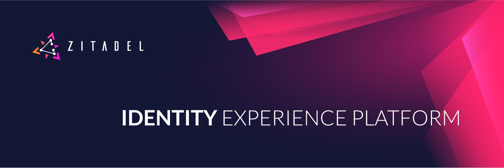

# ZITADEL

**[🏡 website](https://zitadel.ch) [💬 chat](https://zitadel.ch/chat) [📞 contact](https://zitadel.ch/contact/) [📋 guide](https://docs.zitadel.ch/docs/guides/overview) [🧑‍💻 api docs](https://docs.zitadel.ch/docs/apis/introduction) [❓user manuals](https://docs.zitadel.ch/docs/manuals/introduction)**

## What Is ZITADEL

**ZITADEL** is a "Cloud Native Identity and Access Management" solution built for the cloud era. ZITADEL uses a modern software stack consisting of [**Golang**](https://golang.org/), [**Angular**](https://angular.io/) and  [**CockroachDB**](https://www.cockroachlabs.com/) as sole storage and follows an event sourced pattern.

We built **ZITADEL** not only with the vision of becoming a great open source project but also as a superb platform to support developers building their applications, without need to handle secure user login and account management themselves.

## How Does It Work

We built **ZITADEL** around the idea that the IAM should be easy to deploy and scale. That's why we tried to reduce external systems as much as possible.
For example, **ZITADEL** is event sourced but it does not rely on a pub/sub system to function. Instead we built all the functionality right into one binary.
**ZITADEL** only needs [**Kubernetes**](https://kubernetes.io/) for orchestration and [**CockroachDB**](https://www.cockroachlabs.com/) as storage.

## Contributors

Made with [contrib.rocks](https://contrib.rocks).

## Run ZITADEL anywhere

### Self-hosted

You can run an automatically operated **ZITADEL** instance on a CNCF compliant Kubernetes cluster of your choice:

* [CRD Mode on an existing k8s cluster](https://docs.zitadel.ch/docs/guides/installation/crd)
* [GitOps Mode on an existing k8s cluster](https://docs.zitadel.ch/docs/guides/installation/gitops)
* [GitOps Mode on VM/bare-metal](https://docs.zitadel.ch/docs/guides/installation/managed-dedicated-instance)  using [ORBOS](https://docs.zitadel.ch/docs/guides/installation/orbos)

### Software-as-a-Service

* **ZITADEL Cloud:** [**ZITADEL.ch**](https://zitadel.ch) is our shared cloud service hosted in Switzerland. [Get started](https://docs.zitadel.ch/docs/guides/basics/get-started) and try the free tier, including already unlimited users and all necessary security features.
* **ZITADEL Dedicated:** We operate and support a dedicated instance of **ZITADEL** for you. [Get in touch!](https://zitadel.ch/contact/)

## Start using ZITADEL

### Quickstarts

See our [Documentation](https://docs.zitadel.ch/docs/quickstarts/introduction) to get started with ZITADEL quickly. Let us know, if you are missing a language or framework in the [Q&A](https://github.com/zitadel/zitadel/discussions/1717).

### Client libraries

| Language | Client | API | Machine auth (\*) | Auth check (\*\*) | Thanks to the maintainers |
|----------|--------|--------------|----------|---------|---------------------------|
| .NET     | [zitadel-net](https://github.com/caos/zitadel-net) | GRPC | ✔️ | ✔️ | [buehler 👑](https://github.com/buehler) |
| Dart     | [zitadel-dart](https://github.com/caos/zitadel-dart) | GRPC | ✔️ | | [buehler 👑](https://github.com/buehler) |
| Elixir   | [zitadel_api](https://github.com/jshmrtn/zitadel_api) | GRPC | ✔️ | ✔️ | [jshmrtn 🙏🏻](https://github.com/jshmrtn) |
| Go       | [zitadel-go](https://github.com/zitadel/zitadel-go) | GRPC | ✔️ | ✔️ | ZITADEL |
| Rust     | [zitadel-rust](https://crates.io/crates/zitadel) | GRPC | ✔️ | | [buehler 👑](https://github.com/buehler) |
| JVM      | ❌ | ❌ | ❌ | | Maybe you? |
| Python   | ❌ | ❌ | ❌ | | Maybe you? |
| Javascript | ❌ | ❌ | ❌ | | Maybe you? |

## Help and Documentation

* [Documentation](https://docs.zitadel.ch)
* [Say hello](https://zitadel.ch/contact/)
* [Join our Discord channel](https://discord.gg/erh5Brh7jE)

## How To Contribute

Details about how to contribute you can find in the [Contribution Guide](CONTRIBUTING.md)

## Security

See the policy [here](./SECURITY.md)

## Features of ZITADEL platform

* Authentication
  * OpenID Connect 1.0 Protocol (OP)
  * Username / Password
  * Machine-to-machine (JWT profile)
  * Passwordless with FIDO2
  * Multifactor authentication with OTP, U2F
  * Federation with OpenID Connect 1.0 Protocol (RP), OAuth 2.0 Protocol (RP)
  * Identity Brokering
* Identity & Access Management
  * B2C, B2B, B2E, M2M identities
  * Authorization via Role Based Access Control (RBAC)
  * Delegation of roles to other organizations for self-management
  * Management roles
  * User self-service workflows
  * User register workflow
* Strong audit trail for all IAM resources
* Privatelabeling
  * Custom branding
  * Custom texts
  * Hosted login
  * Personal profile
* Integration
  * API-first
  * Actions for custom code execution

## Showcase

### Passwordless Login

Use our login widget to allow easy and secure access to your applications and enjoy all the benefits of passwordless (FIDO 2 / WebAuthN):

* works on all modern platforms, devices, and browsers
* phishing resistant alternative
* requires only one gesture by the user
* easy [enrollment](https://docs.zitadel.ch/docs/manuals/user-factors) of the device during registration

### Admin Console

Use [Console](https://docs.zitadel.ch/docs/manuals/introduction) or our [APIs](https://docs.zitadel.ch/docs/apis/introduction) to setup organizations, projects and applications.

Register new applications

Delegate the right to assign roles to another organization

Customize login and console with your design  

## Other CAOS Projects

* [**OIDC for GO**](https://github.com/zitadel/oidc) - OpenID Connect SDK (client and server) for Go
* [**ZITADEL Tools**](https://github.com/zitadel/zitadel-tools) - Go tool to convert  key file to privately signed JWT

## Usage Data

ZITADEL components send errors and usage data to CAOS Ltd., so that we are able to identify code improvement potential. If you don't want to send this data or don't have an internet connection, pass the global flag `--disable-analytics` when using zitadelctl. For disabling ingestion for already-running components, execute the takeoff command again with the `--disable-analytics` flag.

We try to distinguishing the environments from which events come from. As environment identifier, we enrich the events by the domain you have configured in zitadel.yml, as soon as it's available. When it's not available and you passed the --gitops flag, we defer the environment identifier from your git repository URL.

Besides from errors that don't clearly come from misconfiguration or cli misuage, we send an inital event when any binary is started. This is a "<component> invoked" event along with the flags that are passed to it, except secret values of course.

We only ingest operational data. Your ZITADEL workload data from the IAM application itself is never sent anywhere unless you chose to integrate other systems yourself.

## License

See the exact licensing terms [here](./LICENSE)

Unless required by applicable law or agreed to in writing, software distributed under the License is distributed on an "AS IS" BASIS, WITHOUT WARRANTIES OR CONDITIONS OF ANY KIND, either express or implied. See the License for the specific language governing permissions and limitations under the License.
