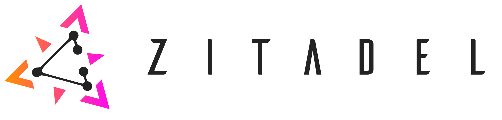

# ZITADEL

> This project is in alpha state. The API will continue breaking until version 1.0.0 is released

## What Is It

Zitadel is a Cloud Native IAM with a clear focus toward federated Authentication and Authorization. We @caos firmly believe that a modern IAM should be easy to deploy and operate even at cloudscale seizes. One thing zitadel that seperates zitadel even thurder from most other solutions is that it is built around the assumption that each operation should be reproducable at infinit lengt.

## How Does It Work

## Our Vision

- Create an IAM ...
  - where each operation is auditable over a long time period
  - which can be used as SaaS or a dedicated instace
  - with security features available by default and not hidden behind a paid tier
  - based and available on opensource librarys
  - designed to be a cloud-native application
  - that is easy to operate and scale scale
  - pricing....(some words to that)

## Quickstart

-> LINK docs

## How To Contribute

TBD

## Security

See the security policy [here](./SECURITY.md)
And our security practices -> LINK docs

## License

See the exact licensing terms [here](./LICENSE)

Unless required by applicable law or agreed to in writing, software distributed under the License is distributed on an "AS IS" BASIS, WITHOUT WARRANTIES OR CONDITIONS OF ANY KIND, either express or implied. See the License for the specific language governing permissions and limitations under the License.
