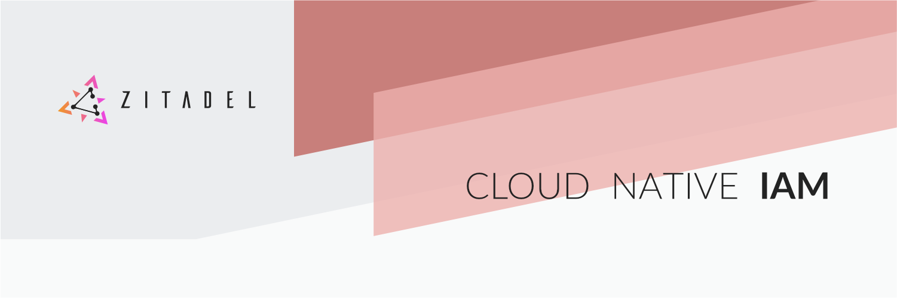

<a href="https://zitadel.ch#gh-dark-mode-only"></a>
<a href="https://zitadel.ch#gh-light-mode-only"></a>

# ZITADEL

**[🏡 website](https://zitadel.ch) [💬 chat](https://zitadel.ch/chat) [📞 contact](https://zitadel.ch/contact/) [📋 guide](https://docs.zitadel.ch/docs/guides/overview) [🧑‍💻 api docs](https://docs.zitadel.ch/docs/apis/introduction) [❓user manuals](https://docs.zitadel.ch/docs/manuals/introduction)**

[](https://github.com/caos/zitadel/releases/latest)
[](#license)
[](https://app.codecov.io/gh/caos/zitadel)
[](https://goreportcard.com/report/github.com/caos/zitadel)
[](https://zitadel.ch/chat)
[](https://twitter.com/zitadel)
<a href="https://www.certification.openid.net/plan-detail.html?public=true&plan=w3ddtJcy0tpHL"></a>

---

The identity and access management (IAM) solution with the **strongest change track** built for modern **global scale** cloud capabilities. Thanks to it's unique approach to store user **activities as events**, every change of an object can be traced

ZITADEL is more than just IAM. It's a superb open source TODO:plattform built for and from its community to handle **secure user login and account management** the simplest way possible.

Zitadel is [OpenID Connect](https://openid.net/connect) certified ([certification](https://www.certification.openid.net/plan-detail.html?public=true&plan=w3ddtJcy0tpHL)), [oauth 2.0](https://datatracker.ietf.org/doc/html/rfc6749) and [saml 2.0](https://datatracker.ietf.org/doc/html/rfc7522) compliant to keep your authentication implementation efforts as low as possible.

The modern software stack consisting of [**Golang**](https://golang.org/), [**Angular**](https://angular.io/) and [**CockroachDB**](https://www.cockroachlabs.com/) forms a solid basic framework to build the IAM you are looking for.

## Why?

- [API-first](https://docs.zitadel.ch/docs/apis/introduction)
- Strong audit trail thanks to [event sourcing](https://docs.zitadel.ch/docs/concepts/eventstore)
- Actions to react on events with custom code
- [Private labeling](https://docs.zitadel.ch/docs/guides/customization/branding) for a uniform user experience
- [cockroach database](https://www.cockroachlabs.com/) is the only dependency

### Authentication possibities

- Single Sign On (SSO)
- Passwordless with FIDO2
- Username / Password
- Multifactor authentication with OTP, U2F
- [Identity Brokering](https://docs.zitadel.ch/docs/guides/authentication/identity-brokering)
- [Machine-to-machine (JWT profile)](https://docs.zitadel.ch/docs/guides/authentication/serviceusers)

### Access Management possibilities

- Role Based Access Control (RBAC)
- Delegate role management to third-parties

### Identity Management possibilities

- Self-registration including verification
- User self service
- [Service Accounts](https://docs.zitadel.ch/docs/guides/authentication/serviceusers)

## Getting started

Run it locally or [create your organisation within seconds online](https://accounts.zitadel.ch/register/org) for free, no credit card required.

If you want to integrate ZITADEL in your app check out the [clients section](###client-libraries)

Locally it is recommended to run ZITADEL and the database using docker but you can also run the executable.

### Run with docker compose

Simply clone the repo and execute the following command in the cloned folder:

```bash
COMPOSE_DOCKER_CLI_BUILD=1 DOCKER_BUILDKIT=1 docker compose -f ./build/local/docker-compose.yml up
```

### Run on your machine

<!-- TODO: download/install zitadel  -->

<!-- TODO: add basic start-with-init command -->
<!-- TODO: insecure, should we write logs to a file? -->
<!-- TODO: what will be printed? is it possible to open the browser and show the login screen? -->

First of all you need to start the cockroach database [using their guide to start a cluster](https://www.cockroachlabs.com/docs/v21.2/start-a-local-cluster)

After the database is up and running you can start ZITADEL:

```bash
zitadel start-with-init
```

### Client libraries

<!-- TODO: check other libraries -->

| Language | Client | API | Machine auth (\*) | Auth check (\*\*) | Thanks to the maintainers |
|----------|--------|--------------|----------|---------|---------------------------|
| .NET       | [zitadel-net](https://github.com/caos/zitadel-net) | ✔️ | ✔️ | ✔️ | [buehler 👑](https://github.com/buehler) |
| Dart       | [zitadel-dart](https://github.com/caos/zitadel-dart) | ✔️ | ✔️ | | [buehler 👑](https://github.com/buehler) |
| Elixir     | [zitadel_api](https://github.com/jshmrtn/zitadel_api) | ✔️ | ✔️ | ✔️ | [jshmrtn 🙏🏻](https://github.com/jshmrtn) |
| Go         | [zitadel-go](https://github.com/caos/zitadel-go) | ✔️ | ✔️ | ✔️ | ZITADEL |
| Rust       | [zitadel-rust](https://crates.io/crates/zitadel) | ✔️ | ✔️ | | [buehler 👑](https://github.com/buehler) |

<!-- TODO: api grpc / rest -->

(\*) Automatically authenticate service accounts with [JWT Profile](https://docs.zitadel.ch/docs/apis/openidoauth/grant-types#json-web-token-jwt-profile).  
(\*\*) Automatically check if the access token is valid and claims match

### Quick starts

To start developing your app as fast as possible check out our [quick start guides](https://docs.zitadel.ch/docs/quickstarts/introduction) where we describe basic examples in many languages.

If your preferred language is missing please let us know [here](https://github.com/caos/zitadel/discussions/1717)

## Help and Documentation

- Visit our [docs page](https://docs.zitadel.ch) for more detailed documentation
- Join the community on [Discord](https://zitadel.ch/chat)
- Get [in touch with us](https://zitadel.ch/contact/) through different channels

## Contribute

Details about how to contribute you can find in the [Contribution Guide](CONTRIBUTING.md)

## Security

See the policy [here](./SECURITY.md)

## License

See the exact licensing terms [here](./LICENSE)

Unless required by applicable law or agreed to in writing, software distributed under the License is distributed on an "AS IS" BASIS, WITHOUT WARRANTIES OR CONDITIONS OF ANY KIND, either express or implied. See the License for the specific language governing permissions and limitations under the License.

## Other CAOS Projects

- [**OIDC for GO**](https://github.com/caos/oidc) - OpenID Connect certified SDK (client and server) for Go
- [**ZITADEL Tools**](https://github.com/caos/zitadel-tools) - Go tool to convert  key file to privately signed JWT
- [**ORBOS**](https://github.com/caos/orbos/) - GitOps everything

## Usage data

ZITADEL components send errors and usage data to CAOS Ltd., so that we are able to identify code improvement potential. If you don't want to send this data or don't have an internet connection, add the following lines to your custom configuration:

```yaml
TODO: add proper configuration
```

Besides from errors that don't clearly come from misconfiguration or cli misuage, we send an inital event when any binary is started. This is a " invoked" event along with the flags that are passed to it, except secret values of course.

We only ingest operational data. Your ZITADEL workload data from the IAM application itself is never sent anywhere unless you chose to integrate other systems yourself.
