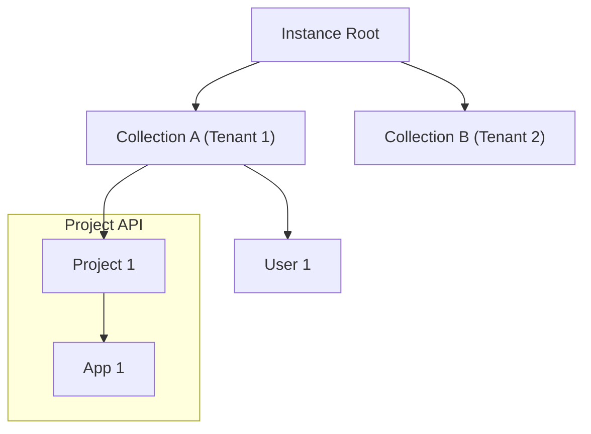
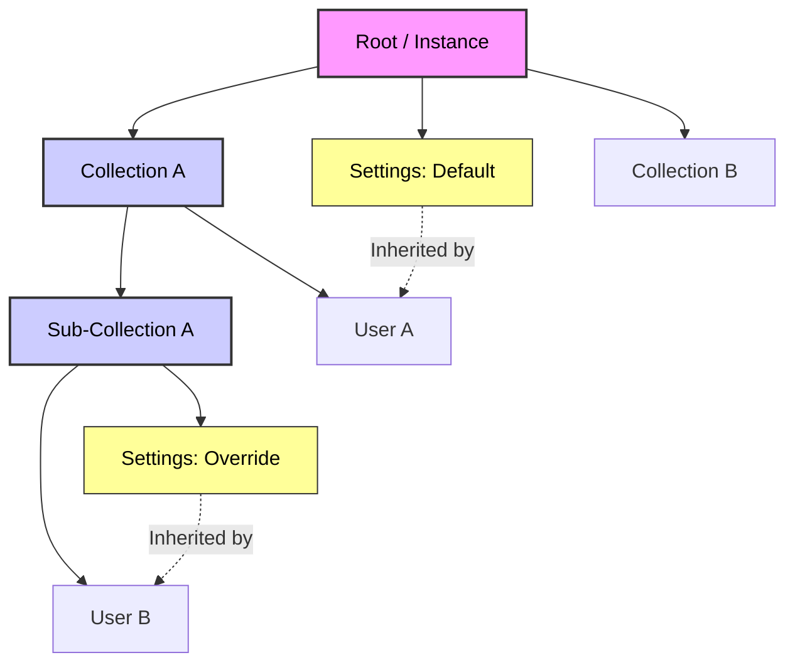
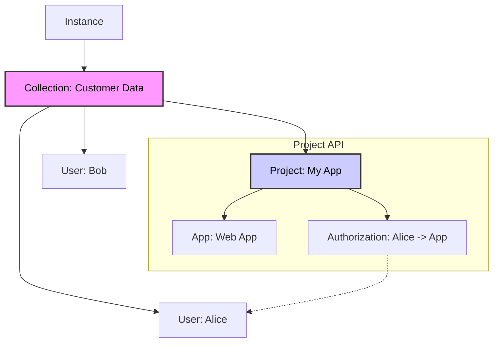
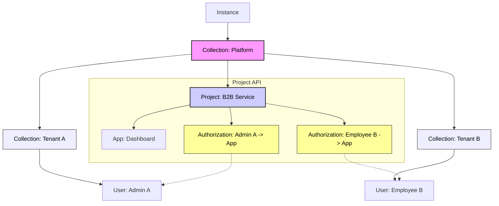

# Project Aether: API Architecture Reimplementation

This document outlines **Project Aether**, a major reimplementation of the ZITADEL API architecture designed to significantly enhance support for Business-to-Business (B2B) scenarios. The core goal is to provide a more flexible, granular, and scalable authorization system that can model complex real-world relationships.

## Architectural Shift: From Organizations to Collections

To achieve this flexibility, we are moving away from the rigid "Organization" model as the primary container. Instead, we are introducing a more versatile **Collection-based architecture**. This shift allows for:

- **Dynamic Hierarchies**: Modeling complex structures where users might work across multiple contexts or companies.
- **Granular Control**: Defining permissions and settings at any level of the hierarchy.
- **Simplified Management**: Decoupling resources from mandatory containers, allowing for smoother data portability and reorganization.
- **Reduced Overhead**: Simpler use cases require significantly less setup and configuration, as the dependency on a mandatory organization structure is removed.
- **Service Consolidation**: Addressing the issue of unmanageable service count in v2 by consolidating related services (e.g., Project Service handling all project resources like apps, authorizations, and project roles).

While this involves the elimination of the traditional "Organization" entity, the focus is on the **new capabilities** this change enables.

## Key Concepts for B2B Scenarios

The new architecture introduces several key mechanisms to create robust and flexible B2B scenarios:

### Flexible Resource Grouping (Collections)

- **Collections** serve as the main grouping point for resources within a specific context (e.g., a "Tenant" in B2B).
- Resources are associated with a single collection but can be reorganized easily.
- Projects, Users, and Settings can be created without a mandatory top-level organization context.

### Implementation of the Collection Concept

- Each "Collection" will become the main grouping point for resources within a specific context (the logical "tenant" for B2B).
- A resource can only be associated with a single collection.

#### Hierarchy Example



### Collections and Hierarchy

- Collections can consist of multiple layers that are between the root node and the leaf nodes (resources)
- Introducing an additional layer requires customers to restructure the relationship of resources
- The hierarchy within a project is kept (project contains multiple applications, …)
- Collection API allows to do tree transformations (moving subelements of collection like `setParent`).
- Specific APIs like `UserService` allow to do single resource changes.
- No resource of a specific type can be a child of a same type node (e.g., no user is a descendant of another user, no setting a descendant of another setting).

### Settings Inheritance

- Settings are applied to the nearest collection / root node and all of its subelements.



### Tree Transformation & Portability

One of the key advantages of this architecture is the ability to move resources (like Projects) between Collections without breaking their internal configuration or access controls.

- **Encapsulation**: When a Project is moved to a new parent Collection, all its child resources—including **Authorizations**, Applications, and **Project Roles**—move with it.
- **Global Identity References**: Since Authorizations link to Users via stable IDs, the link between a User and the Project remains valid even if the Project's location changes.
- **Policy Adaptation**: While the internal setup (who has access) is preserved, the Project will automatically adopt the **inherited settings** (e.g., branding, security policies) of its new parent Collection. This ensures that the Project complies with the policies of its new "tenant" or context immediately upon moving.

These changes aim to make ZITADEL a lighter, more flexible, and inherently suitable solution for modeling the complex interactions required by modern B2B scenarios, placing the authorization system at the center of the access strategy.

### API Scoping and Service Consolidation

To better align API services with practical use cases and reduce fragmentation, we are reconsidering the scoping of services.

- **Service Consolidation**: Services will be consolidated to handle related resources together. For example, the `App` service will be eliminated, and the `Project` service will handle all operations for a project, including its sub-resources like applications, **Project Roles**, and **Authorizations**.
- **Sub-resource Fetching (`extend: true`)**: When fetching a resource, an optional parameter `extend: true` can be used to return all its sub-resources in the response. This reduces the need for multiple API calls.
- **Rule Integration**: If `get()` is used within the rule language to load a resource, it will automatically load the resource with `extend: true` (or equivalent behavior), ensuring that all necessary sub-data is available for evaluation without additional queries.

#### Authorization (Managed via Project API)

To manage access rights effectively, we introduce a dedicated **Authorization** resource. Consistent with our service consolidation strategy, this is **not a separate API service** but is managed directly through the **Project Service**.

- **Management**: Authorizations are created and managed via the Project API (e.g., `ProjectService.AddAuthorization`, `ProjectService.ListAuthorizations`).
- **Structure**: The Authorization is defined as a child resource of the Project it protects (e.g., `Collection/Project/Authorization`).
- **Purpose**: It explicitly links a **User** to a **Project**, defining the specific **Roles** or **Rules** that apply to that user within the context of the project.
- **UI Representation**: In the Console, this is represented as the **"Authorizations"** tab within the Project view. This provides an intuitive way for project administrators to see and manage who has access to their project.
- **User-Centric View**: While authorizations are stored under projects, a user-centric view (e.g., "My Access") can be generated by querying all authorizations associated with a specific user ID.
- **OIDC Integration**: Since ZITADEL is an Identity and Access Management system, these Authorizations directly translate to **OIDC** flows.

  - **Application Access**: An Authorization grants a User access to the **Applications** (OIDC Clients) defined within that Project.
  - **Token Claims**: The **Project Roles** defined in the Authorization are reflected as **claims** in the OIDC tokens (ID Token, Access Token) issued for those applications, allowing applications to enforce permissions based on the user's authorized state.

##### Structure vs. Authorization

It is important to distinguish between the roles of the **Resource Tree** and **Authorizations**:

- **The Tree (Structure)**: Represents the **structuring of data** and the **inheritance of policies**. It defines the context (e.g., "Tenant A", "Production Environment") and ensures that resources inherit the correct settings (branding) from their parents. This structure is flexible and supports diverse scenarios like B2B (multi-tenancy) and B2C.
- **Authorizations (Access)**: Represent **explicit access grants** for Users to **Applications** (OIDC Clients) within a Project. They are portable links that define _who_ can access _what_ (via **Project Roles**), ensuring that users have the correct permissions when authenticating via OIDC.

#### Optional Implementation: User Schema

We introduce the concept of a **User Schema**, which is implemented as a setting that can be set as a sub-element of a collection.

- **Purpose**: It ensures that the API validates all siblings of the tree (e.g., users within that collection) according to a defined JSON Schema.
- **Mechanism**: When a User Schema setting is applied to a collection, any user creation or update within that collection (and its sub-collections, subject to inheritance rules) must validate against the provided schema.
- **Validation Enforcement**:
  - If a User Schema is created but existing user data is not valid, the schema creation might fail or warn (depending on implementation specifics, but strict validation is preferred).
  - If a schema is already in place and a user is added or updated with data that violates the schema, the **API operation will fail**, preventing the creation or update of the invalid user data.
- **Flexibility**: This allows for flexible, tenant-specific user data validation without enforcing a rigid global schema.

### Use Case Examples

To illustrate the flexibility of this architecture, here are examples for B2C and B2B scenarios.

#### B2C Scenario (Simple)

In a B2C scenario, the structure is flat. A single Collection holds the Users (customers) and the Project (application).



#### B2B Scenario (Multi-Tenant)

In a B2B scenario, a "Platform" Collection holds the shared Project. Sub-Collections represent Tenants, containing their specific Users. Authorizations within the Project link Tenant Users to the Application.



### Rule Language Design

We propose implementing an **Attribute-Based Access Control (ABAC)** or **Relationship-Based Access Control (ReBAC)** system to replace Instance-, Organization- and Project-level roles. This system leverages the **Common Expression Language (CEL)** for flexible and secure permission definitions.

#### Core Concepts

- **Definition of Rules**: Permissions are tied to a new **Rule** concept associated with collections.
- **Elimination of Members**: The concept of "members" is eliminated. Access is now strictly defined by **Rules**, replacing traditional membership roles with granular permission definitions.
- **Rules as part of Collections**: Rules are defined under a collection. They apply to the same collection and all its sub-elements.
- **Tree Transformation**: If the tree is transformed (e.g., a collection is moved), the rules move with it, maintaining the security context.
- **Session-Based Access**: The rule system is fundamentally designed to access sessions that are bound to a single user. From this session context, connections are made to establish access rights.
- **Delegated Permission Management**: The mechanism for permission delegation is implicitly built into the hierarchy (data tree), maintaining separation of duties and data isolation between different collections.

#### User-Resource Relationships (ReBAC)

We introduce the ability to define and query direct relationships between Sessions and Resources based on **data attributes** (e.g., "Session X has factors.user.id of X"). This allows for extremely granular modeling of B2B permissions without storing explicit membership links.

For example, a rule can grant access if the user's `collectionId` matches the `collectionId` field on a resource, effectively creating a computed "same-tenant" relationship.

```cel
// ReBAC Example: Access granted based on data relationship (collectionId)
allow read: if resource.collectionId == session.user.collectionId;
```

#### Syntax (CEL)

To provide a flexible and secure way to define permissions, we use a **custom DSL** that embeds **Common Expression Language (CEL)** for the condition logic.

- **Structure**: The rule definition (`allow <operation>: ...`) is a custom domain-specific language.
- **Condition Logic**: The condition after `if` is a standard **CEL expression**.
- **Syntax**: `allow <operation>: if <condition>;`
- **Focus**: The focus is on the resource being accessed and the session context, rather than matching the collection structure path.
- **Variables**: Variables can be defined to simplify rules and reuse values (e.g., `let user_id = session.factors.user.id;`).

#### Example: Session and Resource Validation

The following example demonstrates a rule that allows `read` and `write` access if the session belongs to a specific user ID AND the resource being accessed is of type "User".

```cel
// Allow read/write if the session's user collectionId matches the resource's collectionId
// AND the resource type is 'User'

allow read, write: if session.user.collectionId == resource.collectionId && resource.type == "User";
```

#### Example: Variables

Variables can be defined at the beginning of a rule block to make expressions cleaner and more readable.

```cel
// Define the authCollectionId variable for reuse
let authCollectionId = session.user.collectionId;

// Allow read/write if the authCollectionId matches the resource's collectionId
allow read, write: if authCollectionId == resource.collectionId;
```

#### Example: Session Factors

Rules can access detailed user information from the session factors. For example, allowing write access if the current user has the first name "Lisa".

```cel
// Allow write access if the current user's firstname is "Lisa"

allow write: if session.factors.user.firstname == "Lisa";
```

#### Example: Complex Resource Filtering

Rules can also enforce more complex constraints on the resource attributes.

```cel
// Allow read access if the resource is public OR the user is an admin
// AND the resource is not flagged as sensitive

allow read: if (resource.is_public == true || session.roles.exists(r, r == "admin")) &&
               resource.sensitivity_level < 3;
```

This approach allows for powerful, expression-based security rules that are familiar to developers and efficient to evaluate.

#### Data Loading and Querying

The rule language supports loading and querying other resources, similar to Firestore's capabilities. These are implemented as **custom CEL extension functions**. This is essential for validating conditions based on data that is not present in the current session or the immediate resource being accessed.

> **Implementation Note:** Using the `google/cel-go` library, these custom functions are mapped directly to Go backend methods, allowing secure execution of database queries or logic within the rule evaluation.

```cel
// Define the user variable by loading the user resource using the session's user ID
let user = get("users", session.factors.user.id);

// Allow access if the user has an 'active' status
allow read: if user.status == "active";
```

```cel
// Ensure the user exists in the system before allowing the operation

exists("users", session.factors.user.id)
```

#### Write Permissions & State Validation

For write operations, it is often necessary to validate the **incoming data** (future state) against the **existing data** (current state) or to enforce specific state transitions.

- **Operations**: We support granular write operations: `create`, `update`, and `delete`.
- **`request` Object**: Represents the incoming request context, including the `request.resource` which holds the **future state** of the resource (the data being written).
- **`resource` Object**: Represents the **current state** of the resource as it exists in the database (null for `create`).

##### Example: Restrict Creation by Resource Type

Allow users to create only specific types of resources, such as "Project".

```cel
// Allow creation ONLY if the resource type is 'Project'
allow create: if request.resource.type == "Project";
```

##### Example: Field Immutability (Update)

System fields like `id` and `creation_date` are automatically protected by the API. However, you can use rules to enforce immutability on custom business fields, such as `currency`.

```cel
// Allow update ONLY if the currency field remains unchanged
allow update: if request.resource.currency == resource.currency;
```

##### Example: State Transitions

Enforce a specific workflow, such as allowing a status change to 'published' only if the current status is 'draft'.

```cel
// Allow update if the status is not changing OR
// if it is changing from 'draft' to 'published'
allow update: if request.resource.status == resource.status ||
                 (resource.status == "draft" && request.resource.status == "published");
```

### UI Concept (Console Reimplementation)

The ZITADEL Console will be reimagined as a Next.js application to support this new architecture, focusing on a resource-centric view and intuitive collection management.

#### Resource View

- **Side Navigation**: The side navigation will list all available **Resource Types** (e.g., Users, Projects, Applications, Actions). This provides a flat, type-based entry point to data.
- **Resource List**: Clicking a resource type displays a list of all resources of that type that the current user has access to.

#### Collection Context and Filtering

- **Collection Filter**: A global dropdown or filter mechanism allows users to narrow down the view to a specific collection context.
- **Domain Concatenation**: The collection filter displays collections using a concatenated domain format (e.g., `collectionA.collectionB`) to clearly represent the hierarchy and path.
- **Combined Filtering**: Users can filter resources based on:
  - **Collection**: Scoping the list to a specific part of the hierarchy.
  - **Resource Attributes**: Filtering by specific properties of the resource (e.g., status, type, name).

#### Additional UI Considerations

- **Rule Editor**: A dedicated UI for defining and testing CEL security rules, potentially with syntax highlighting and validation.
- **Schema Editor**: An interface for defining and managing User Schemas within collections.
- **Inheritance Visualization**: Visual cues to show which settings are inherited from parent collections versus defined locally.
