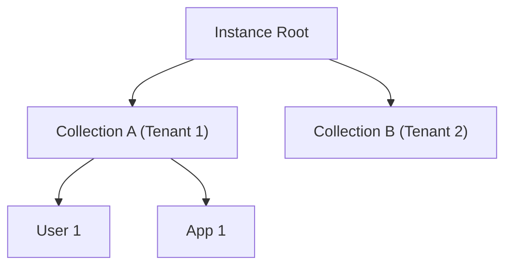
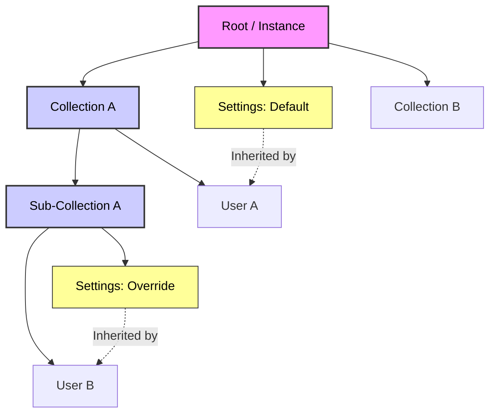
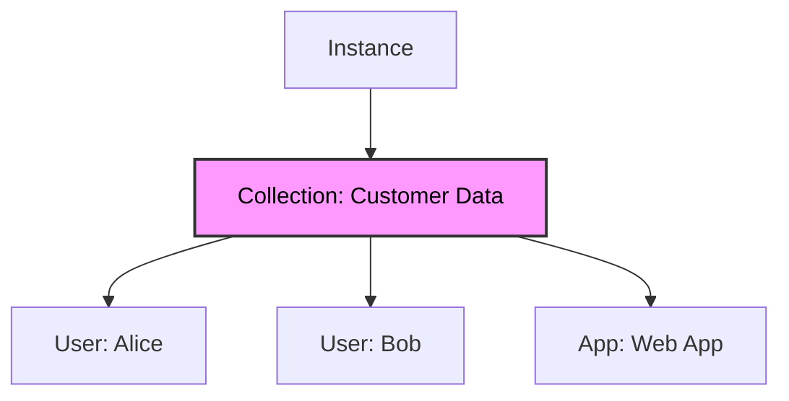
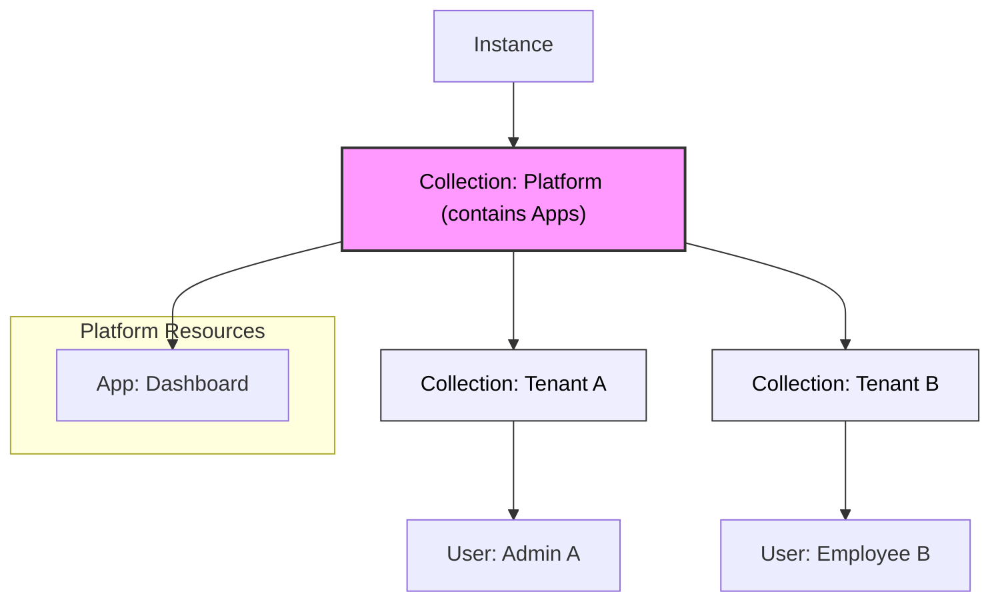

# Project Aether: API Architecture Reimplementation

This document outlines **Project Aether**, a major reimplementation of the ZITADEL API architecture designed to significantly enhance support for Business-to-Business (B2B) scenarios. The core goal is to provide a more flexible, granular, and scalable authorization system that can model complex real-world relationships.

## Architectural Shift: From Organizations to Collections

To achieve this flexibility, we are moving away from the rigid "Organization" model as the primary container. Instead, we are introducing a more versatile **Collection-based architecture**. This shift allows for:

- **Dynamic Hierarchies**: Modeling complex structures where users might work across multiple contexts or companies.
- **Granular Control**: Defining permissions and settings at any level of the hierarchy.
- **Simplified Management**: Decoupling resources from mandatory containers, allowing for smoother data portability and reorganization.
- **Reduced Overhead**: Simpler use cases require significantly less setup and configuration, as the dependency on a mandatory organization structure is removed.
- **Service Consolidation**: Addressing the issue of unmanageable service count in v2 by consolidating related services (e.g., Project Service handling all project resources like apps, authorizations, and project roles).

While this involves the elimination of the traditional "Organization" entity, the focus is on the **new capabilities** this change enables.

## Key Concepts for B2B Scenarios

The new architecture introduces several key mechanisms to create robust and flexible B2B scenarios:

### Flexible Resource Grouping (Collections)

- **Collections** serve as the main grouping point for resources within a specific context (e.g., a "Tenant" in B2B).
- Resources are associated with a single collection but can be reorganized easily.
- Projects, Users, and Settings can be created without a mandatory top-level organization context.

### Implementation of the Collection Concept

- Each "Collection" will become the main grouping point for resources within a specific context (the logical "tenant" for B2B).
- A resource can only be associated with a single collection.

#### Hierarchy Example



### Collections and Hierarchy

- Collections can consist of multiple layers that are between the root node and the leaf nodes (resources)
- Introducing an additional layer requires customers to restructure the relationship of resources
- The hierarchy within a collection is flexible (collection contains multiple applications, users, etc.)
  > **Note:** We have **removed the Project resource**. Collections now serve as the container for Applications. If you need to group applications (e.g., "My Project"), simply create a sub-collection for them.
- Collection API allows to do tree transformations (moving subelements of collection like `setParent`).
- Specific APIs like `UserService` allow to do single resource changes.
- No resource of a specific type can be a child of a same type node (e.g., no user is a descendant of another user, no setting a descendant of another setting).

### Settings Inheritance

- Settings are applied to the nearest collection / root node and all of its subelements.



### Tree Transformation & Portability

One of the key advantages of this architecture is the ability to move resources (like Applications) between Collections without breaking their internal configuration or access controls.

- **Encapsulation**: When an Application is moved to a new parent Collection, all its child resources—including **Authorizations** and **Application Roles**—move with it.
- **Global Identity References**: Since Authorizations link to Users via stable IDs, the link between a User and the Application remains valid even if the Application's location changes.
- **Policy Adaptation**: While the internal setup (who has access) is preserved, the Application will automatically adopt the **inherited settings** (e.g., branding, security policies) of its new parent Collection. This ensures that the Application complies with the policies of its new "tenant" or context immediately upon moving.

These changes aim to make ZITADEL a lighter, more flexible, and inherently suitable solution for modeling the complex interactions required by modern B2B scenarios, placing the authorization system at the center of the access strategy.

### API Scoping and Service Consolidation

To better align API services with practical use cases and reduce fragmentation, we are reconsidering the scoping of services.

- **Service Consolidation**: Services will be consolidated. The `Project` service is removed. Applications are managed directly under Collections.
- **Sub-resource Fetching (`extend: true`)**: When fetching a resource, an optional parameter `extend: true` can be used to return all its sub-resources in the response. This reduces the need for multiple API calls.
- **Rule Integration**: If `get()` is used within the rule language to load a resource, it will automatically load the resource with `extend: true` (or equivalent behavior), ensuring that all necessary sub-data is available for evaluation without additional queries.

#### Unified Access Policy (Permissions & Authorizations)

To simplify management, we combine **Management API Permissions** and **App Authorizations** into a single **Access Policy** attached to a **Collection**.

- **Single Source of Truth**: One policy file defines both _who can manage the collection_ and _what roles users have in apps_ within that collection.
- **Collection-Based**: The policy applies to the Collection and all its resources (including Apps).
- **Structure**: The policy file has two distinct sections:
  1.  `permissions`: CEL rules for Management API access (`allow read`, `allow write`).
  2.  `authorizations`: CEL logic for mapping attributes to OIDC roles/claims.

##### 1. Permissions (Management API)

Controls access to the ZITADEL API (e.g., creating users, updating settings).

```cel
permissions {
  // Allow read/write if the session's user belongs to this collection
  allow read, write: if session.user.collection_id == resource.collection_id;
}
```

##### 2. Authorizations (App Roles)

Maps user attributes to OIDC roles for Applications contained in this Collection.

```cel
authorizations {
  // Map attributes to roles
  "admin": user.username == "max@zitadel.com",
  "viewer": user.metadata.level == "employee"
}
```

> **API Design Note:** This unified policy will be managed via a single endpoint, e.g., `/collections/{id}/policy`.

#### Schema Enforcement via Permissions

Instead of a dedicated User Schema resource, the **Permission System** itself is used to enforce data schemas and validation rules.

- **Mechanism**: `create` and `update` rules can inspect the `request.resource` to ensure it adheres to required formats, types, and constraints.
- **Flexibility**: This allows for arbitrarily complex validation logic (e.g., regex checks, conditional fields) expressed directly in CEL.

```cel
// Enforce schema for User creation
allow create: if request.resource.type == "User" &&
                 has(request.resource.data.email) &&
                 request.resource.data.email.matches('^.+@example\\.com$') &&
                 request.resource.data.age >= 18;
```

### Use Case Examples

To illustrate the flexibility of this architecture, here are examples for B2C and B2B scenarios.

#### B2C Scenario (Simple)

In a B2C scenario, the structure is flat. A single Collection holds the Users (customers) and the Application.



#### B2B Scenario (Multi-Tenant)

#### B2B Scenario (Multi-Tenant)

In a B2B scenario, a "Platform" Collection holds the shared Applications. Sub-Collections represent Tenants, containing their specific Users. Access is determined by the Platform Collection's policy.



- **Granular Control**: Access is defined by **Rules** (`read`, `write`), replacing traditional static roles for API management.

#### Syntax (CEL)

To provide a flexible and secure way to define permissions, we use a **custom DSL** that embeds **Common Expression Language (CEL)** for the condition logic.

- **Structure**: `allow <operation>: if <condition>;` or `<operation>: <condition>;`
- **Condition Logic**: The condition after `if` is a standard **CEL expression**.
- **Variables**: `session`, `resource`, `request` (for writes).

#### Example: Session and Resource Validation

The following example demonstrates a rule that allows `read` and `write` access if the session belongs to a specific user ID AND the resource being accessed is of type "User".

```cel
// Allow read/write if the session's user collectionId matches the resource's collectionId
// AND the resource type is 'User'

allow read, write: if session.user.collectionId == resource.collectionId && resource.type == "User";

// or short form

read, write: session.user.collectionId == resource.collectionId && resource.type == "User";
```

#### Write Permissions & State Validation

For write operations, it is often necessary to validate the **incoming data** (future state) against the **existing data** (current state).

- **`request.resource`**: Represents the **future state** of the resource (the data being written).
- **`resource`**: Represents the **current state** of the resource (null for `create`).

```cel
// Allow update ONLY if the currency field remains unchanged
allow update: if request.resource.currency == resource.currency;
```

#### Data Loading and Querying

The rule language supports loading and querying other resources, similar to Firestore's capabilities. These are implemented as **custom CEL extension functions**. This is essential for validating conditions based on data that is not present in the current session or the immediate resource being accessed.

> **Implementation Note:** Using the `google/cel-go` library, these custom functions are mapped directly to Go backend methods, allowing secure execution of database queries or logic within the rule evaluation.

```cel
// Define the user variable by loading the user resource using the session's user ID
let user = get("users", session.factors.user.id);

// Allow access if the user has an 'active' status
allow read: if user.status == "active";
```

```cel
// Ensure the user exists in the system before allowing the operation

exists("users", session.factors.user.id)
```

#### Write Permissions & State Validation

For write operations, it is often necessary to validate the **incoming data** (future state) against the **existing data** (current state) or to enforce specific state transitions.

- **Operations**: We support granular write operations: `create`, `update`, and `delete`.
- **`request` Object**: Represents the incoming request context, including the `request.resource` which holds the **future state** of the resource (the data being written).
- **`resource` Object**: Represents the **current state** of the resource as it exists in the database (null for `create`).

##### Example: Restrict Creation by Resource Type

Allow users to create only specific types of resources, such as "Project".

```cel
// Allow creation ONLY if the resource type is 'Project'
allow create: if request.resource.type == "Project";
```

> **Note (Optional Syntax):** You can also use a `match` expression to wrap conditions for a specific resource type to avoid repetition:
>
> ```cel
> match Project {
>   allow create: if true;
>   allow delete: if resource.status == "archived";
> }
> ```

##### Example: Field Immutability (Update)

System fields like `id` and `creation_date` are automatically protected by the API. However, you can use rules to enforce immutability on custom business fields, such as `currency`.

```cel
// Allow update ONLY if the currency field remains unchanged
allow update: if request.resource.currency == resource.currency;
```

##### Example: State Transitions

Enforce a specific workflow, such as allowing a status change to 'published' only if the current status is 'draft'.

```cel
// Allow update if the status is not changing OR
// if it is changing from 'draft' to 'published'
allow update: if request.resource.status == resource.status ||
                 (resource.status == "draft" && request.resource.status == "published");
```

### Flexible API Filtering (Optional)

To support the dynamic nature of the new architecture and future extensibility, we propose adopting a **flexible filtering syntax** for API list and search operations, conceptually similar to Stripe's API or a subset of CEL.

- **Problem**: Traditional APIs often require versioning every single filter parameter (e.g., `filter_by_name`, `filter_by_status`). This becomes unmanageable with custom schemas and dynamic extensions.
- **Solution**: A unified `filter` or `query` parameter that accepts a structured expression string.
- **Benefit**: This avoids breaking changes when new fields are added and allows clients to construct complex queries (e.g., `status == "active" && created_at > "2024-01-01"`) without requiring backend code changes for each new filter combination.

### UI Concept (Console Reimplementation)

The ZITADEL Console will be reimagined as a Next.js application to support this new architecture, focusing on a resource-centric view and intuitive collection management.

#### Resource View

- **Side Navigation**: The side navigation will list all available **Resource Types** (e.g., Users, Projects, Applications, Actions). This provides a flat, type-based entry point to data.
- **Resource List**: Clicking a resource type displays a list of all resources of that type that the current user has access to.

#### Collection Context and Filtering

- **Collection Filter**: A global dropdown or filter mechanism allows users to narrow down the view to a specific collection context.
- **Domain Concatenation**: The collection filter displays collections using a concatenated domain format (e.g., `collectionA.collectionB`) to clearly represent the hierarchy and path.
- **Combined Filtering**: Users can filter resources based on:
  - **Collection**: Scoping the list to a specific part of the hierarchy.
  - **Resource Attributes**: Filtering by specific properties of the resource (e.g., status, type, name).

#### Additional UI Considerations

- **Rule Editor**: A dedicated UI for defining and testing CEL security rules, potentially with syntax highlighting and validation.
- **Schema Editor**: An interface for defining and managing User Schemas within collections.
- **Inheritance Visualization**: Visual cues to show which settings are inherited from parent collections versus defined locally.

### API Design for Policy Management

We recommend managing the Unified Access Policy as a **sub-resource** of the Collection.

#### Rationale

1.  **Unified Management**: A single endpoint to manage both API permissions and App authorizations.
2.  **Payload Size**: Keeps the Collection resource light.

#### Proposed Endpoints

**Collection Access Policy**

- `GET /collections/{id}/policy`: Retrieve the current policy (permissions + authorizations).
- `PUT /collections/{id}/policy`: Update the policy.
  - Body: `{"permissions": "...", "authorizations": "..."}` or a combined CEL file.
