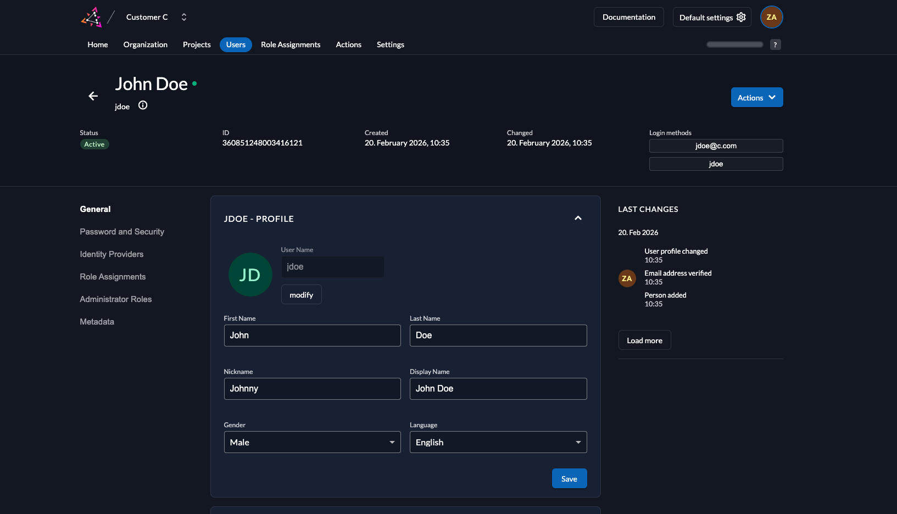
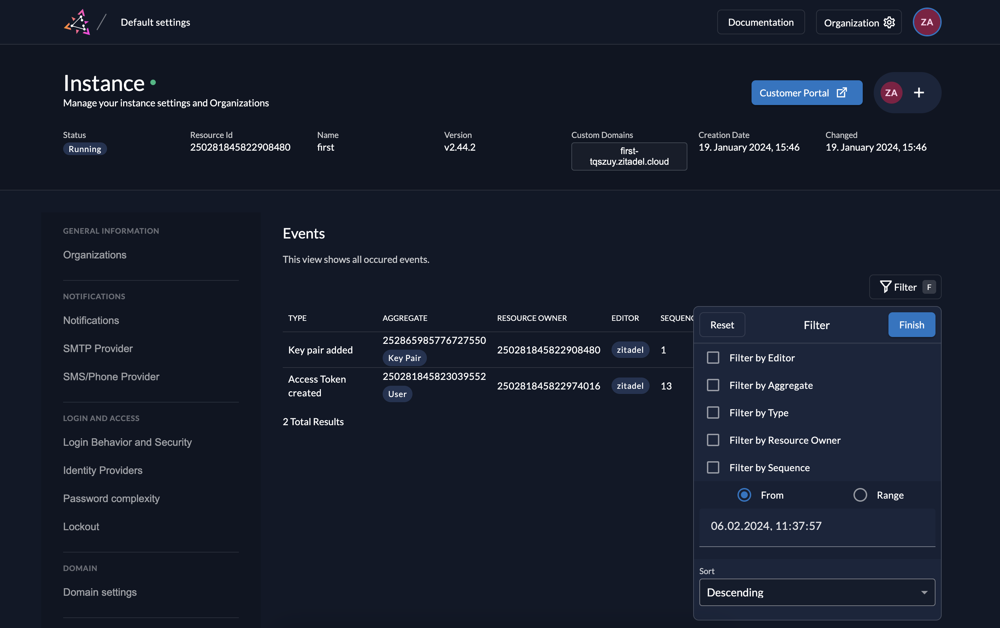

ZITADEL provides you with a built-in audit trail to track all changes and events over an unlimited period of time.
Most other solutions replace a historical record and track changes in a separate log when information is updated.
ZITADEL only ever appends data in an [Eventstore](/concepts/eventstore/overview), keeping all historical record.
The audit trail itself is identical to the state, since ZITADEL calculates the state from all the past changes.

This form of audit log has several benefits over storing classic audit logs.
You can view past data in-context of the whole system at a single point in time.
Reviewing a past state of the application can be important when tracing an incident that happened months back. Moreover, the eventstore provides a truly complete and clean audit log.

<Callout title="Future Plans">
There will be three major areas for future development on the audit data

- [Metrics](https://github.com/zitadel/zitadel/issues/4458) and [standard reports](https://github.com/zitadel/zitadel/discussions/2162#discussioncomment-1153259)
- [Feedback loop](https://github.com/zitadel/zitadel/issues/5102) and threat detection
- Forensics and replay of events

</Callout>

## Accessing the Audit Log

### Last changes of an object

You can check the last changes of most objects in the [Console](/guides/manage/console/console-overview).
In the following screenshot you can see an example of last changes on a [user](/guides/manage/console/users-overview).
The same view is available on several other objects such as organization or project.

### Event View

Administrators can see all events across an instance and filter them directly in [Console](/guides/manage/console/console-overview).
Go to your default settings and then click on the Tab **Events** to open the Event Viewer or browse to $CUSTOM_DOMAIN/ui/console/events

### Event API

Since everything that is available in Management Console can also be called with our APIs, you can access all events and audit data through our APIs:

- [Event API Guide](/guides/integrate/zitadel-apis/event-api)
- [API Documentation](/reference/api/admin)

Access to the API is possible with a [Service Account](/guides/integrate/service-accounts/authenticate-service-accounts), allowing you to integrate the events with your own business logic.

## Using logs in external systems

You can use the events from the audit log in external systems such as a SOC/SIEM solution.

Follow our guide on how to [integrate ZITADEL with external systems for streaming events and audit logs](/guides/integrate/external-audit-log).
