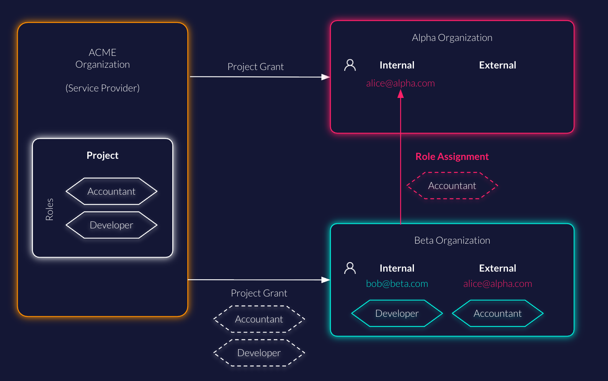

ZITADEL's external user role assignment is a feature that allows you to grant access to projects within your organization to users from other organizations.
This is useful in scenarios where you want to collaborate with external users without needing them to be part of your organization.
By using external user role assignments, you can streamline collaboration with external users while maintaining control over access to your projects within ZITADEL.

## Where to store users

### Consumer Identity Management (CIAM) / Business-to-Consumer (B2C)

You might typically store all users in a single ZITADEL [organization](../structure/organizations) for managing customer accounts.
We recommend creating a second organization for your own team that also contains all the projects and applications that will be [granted](../structure/granted_projects) to the first organization with the B2C customer accounts.
Instead of duplicating user accounts for your team members in the B2C organization, you can create external user role assignments on the B2C organization.

### Multitenancy / Business-to-Business (B2B)

ZITADEL allows you to create separate [organizations](../structure/organizations) for each of your business partners or tenants.
There might be cases where users from one organization need access to projects from another organization.
You can create a role assignment for an external user that allows the inviting organization to manage the roles for the external user.

## Project Grants vs. Role Assignments

Project Grants are used to delegate access management of an entire project (or specific roles of the project) to another organization.

Role assignments provide a more granular approach, allowing specific users from external organizations to access your projects.

## Alternative to multiple user accounts

A user account is always unique across a ZITADEL instance.
In some use cases, external user role assignments are a simple way to allow users access to multiple tenants.

## References

* [API reference to create authorization (role assignment)](/reference/api/authorization/zitadel.authorization.v2.AuthorizationService.CreateAuthorization)
* [How to manage role assignments through ZITADEL's console](/guides/manage/console/roles#role-assignments)
* [More about multi-tenancy with ZITADEL](https://zitadel.com/blog/multi-tenancy-with-organizations)
