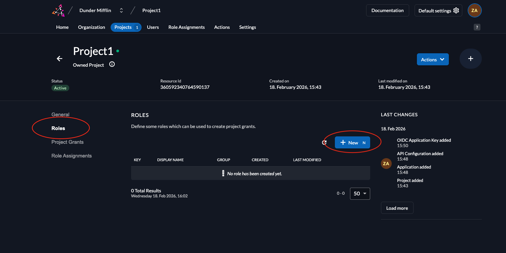
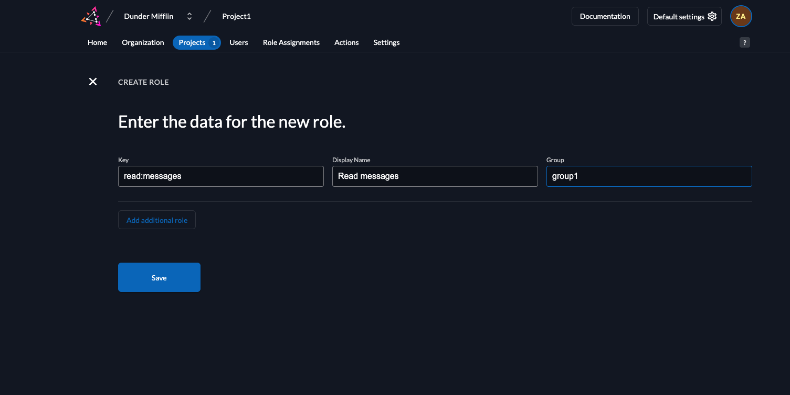
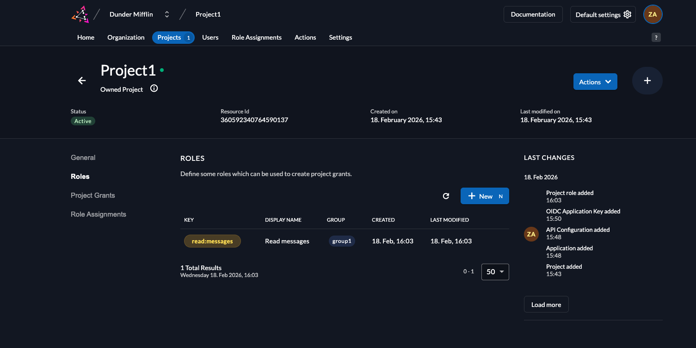
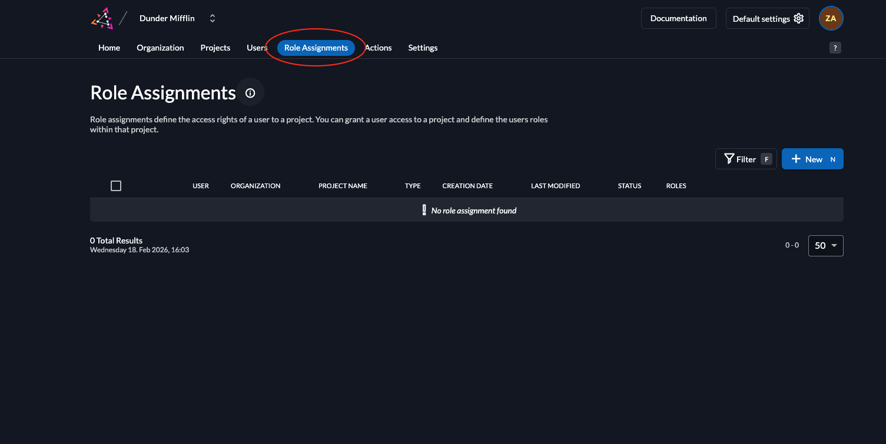
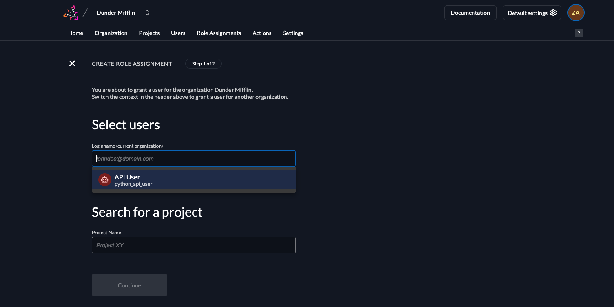
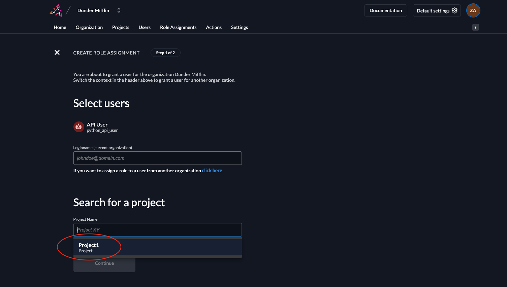
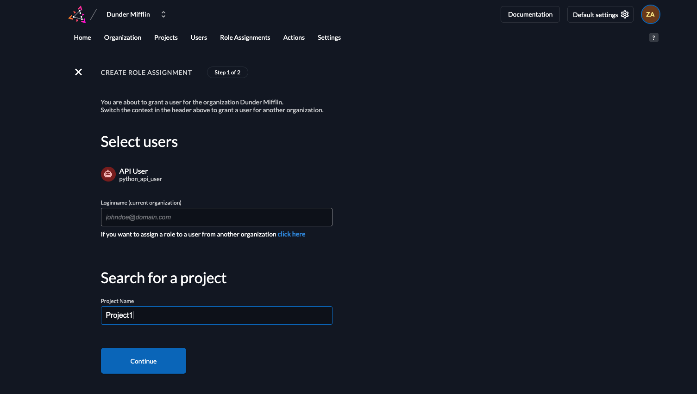
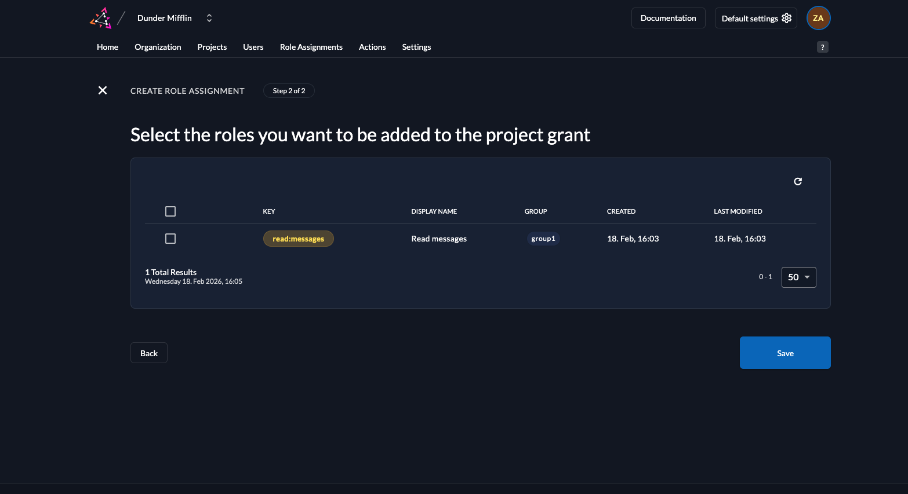
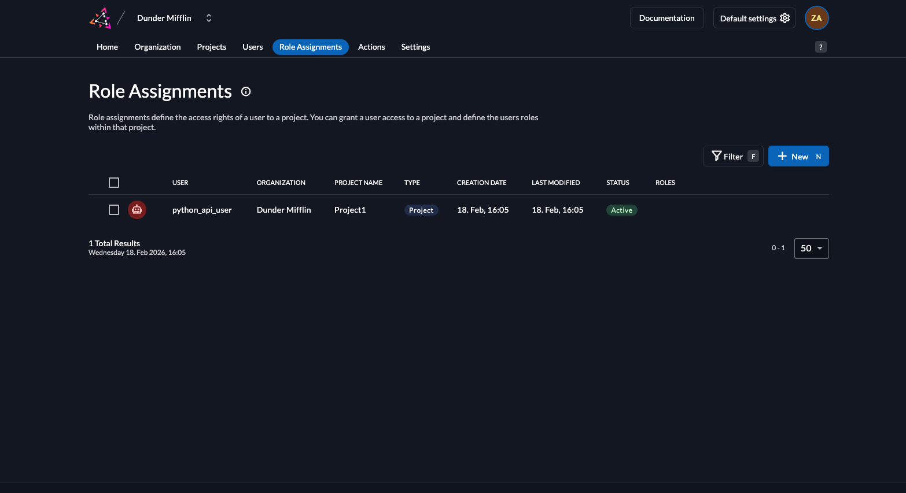

In order to access this route, you must create the role `read:messages` in your ZITADEL project and also assign a role to the service account you created by adding the role to the user. Follow these steps to do so:

1. Go to your project and select **Roles**. Click **New**.

2. Add the `read:messages` role as shown below and click **Save**.

3. You will see the created role listed.

4. To assign this role to a user, click on **Role Assignments**.

5. Select the user you want to assign the role to.

6. Select the project where this role assignment is applicable.

7. Click **Continue**.

8. Select the role **read:messages** and click **Save**.

9. You will now see the service account has been assigned the role **read:messages**.

