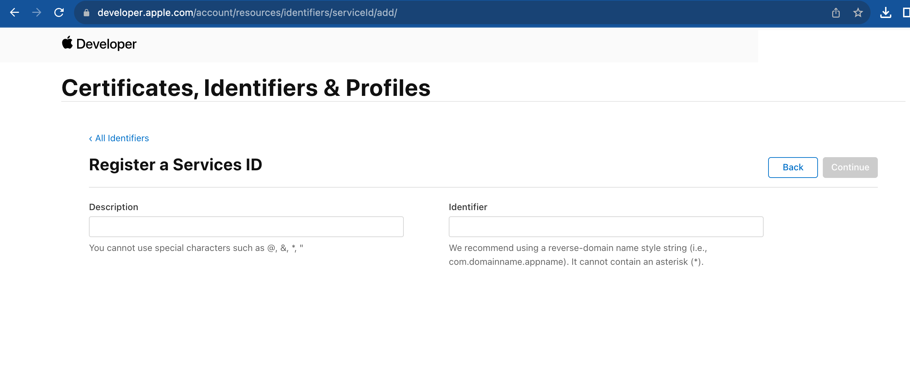
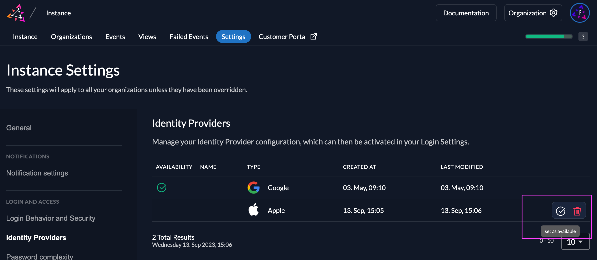
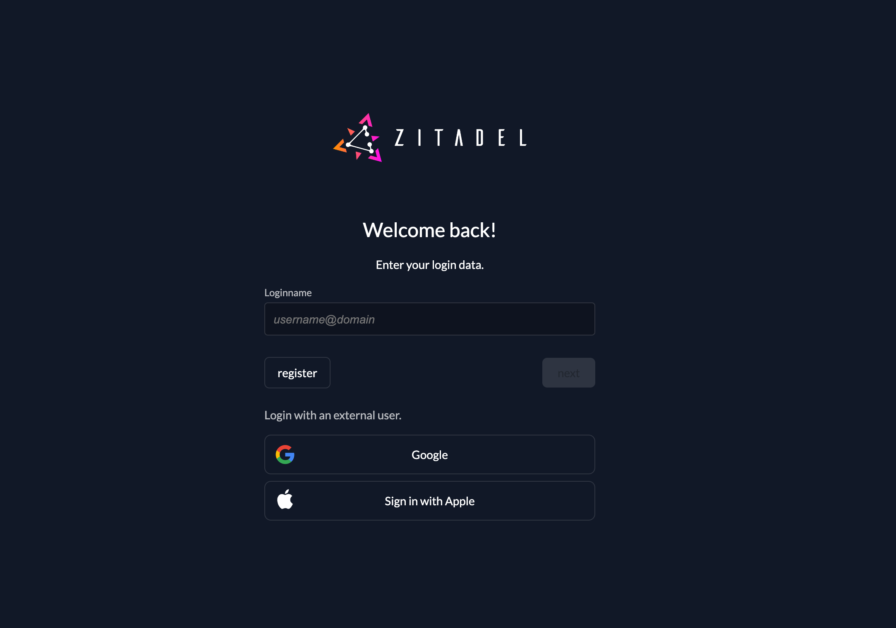

import GeneralConfigDescription from './_general_config_description.mdx';
import Intro from './_intro.mdx';
import CustomLoginPolicy from './_custom_login_policy.mdx';
import IDPsOverview from './_idps_overview.mdx';
import Activate from './_activate.mdx';
import TestSetup from './_test_setup.mdx';

<Intro components={props.components}  provider="Apple"/>

## Open the Apple Identity Provider Template

<IDPsOverview components={props.components}  templates="Apple"/>

Click on the ZITADEL Callback URL to copy it to your clipboard.
You will have to paste it in the Apple service later.

## Apple Configuration

### Register a new App

1. Go to the Identifiers of your Apple Developer Account
2. Click the add button "+" on the top left
3. Choose App IDs and click "continue"
4. Add a description and a unique identifier
5. Enable "Sign in with Apple" and click "continue"

### Register a new service

1. Go to the Identifiers of your Apple Developer Account: [https://developer.apple.com/account/resources/identifiers/list](https://developer.apple.com/account/resources/identifiers/list)
2. Click the add button "+" on the top left
3. Choose Services IDs and click "continue"
4. Add a description and a unique identifier and click "register"
5. Select your registered service from the list and enable sign in with Apple, then click "configure"
6. Choose the previously created App in the Primary App ID List
7. Add your Custom Domain in the domains and subdomains field
 - Example domain for `https://acme-gzoe4x.zitadel.cloud` would look like this:  `acme-gzoe4x.zitadel.cloud`
8. [Paste the ZITADEL Callback URL you copied before](#open-the-apple-identity-provider-template) to the Return URLs

### Register a new key

1. Go to the keys list of your Apple Developer Account: [https://developer.apple.com/account/resources/authkeys/list](https://developer.apple.com/account/resources/authkeys/list)
2. Click the add button "+" on the top left
3. Give your key a name
4. Enable "Sign in with Apple" and click configure
5. Choose your app from the list
6. Register the key and download it

## ZITADEL Setup

Go back [to the Apple provider template you opened before in ZITADEL](#open-the-apple-identity-provider-template).

1. Add the Client ID, this is [the identifier of the service you created in your Apple Account](#register-a-new-service)
2. Fill the Team ID, you can find it when you log in to your Apple Developer account, in your membership
3. Enter the [Key ID and upload the Private Key you created before](#register-a-new-key)

You can optionally configure the following settings.
A useful default will be filled if you don't change anything.

**Scopes**: The scopes define which scopes will be sent to the provider, `name` and `email` are prefilled. This information will be taken to create/update the user within ZITADEL.

<GeneralConfigDescription components={props.components}  provider_account="Apple account" />

### Activate IdP

<Activate components={props.components} />

### Ensure your Login Policy allows External IDPs

<CustomLoginPolicy components={props.components} />

## Test the setup

<TestSetup components={props.components}  loginscreen="your Apple login"/>

