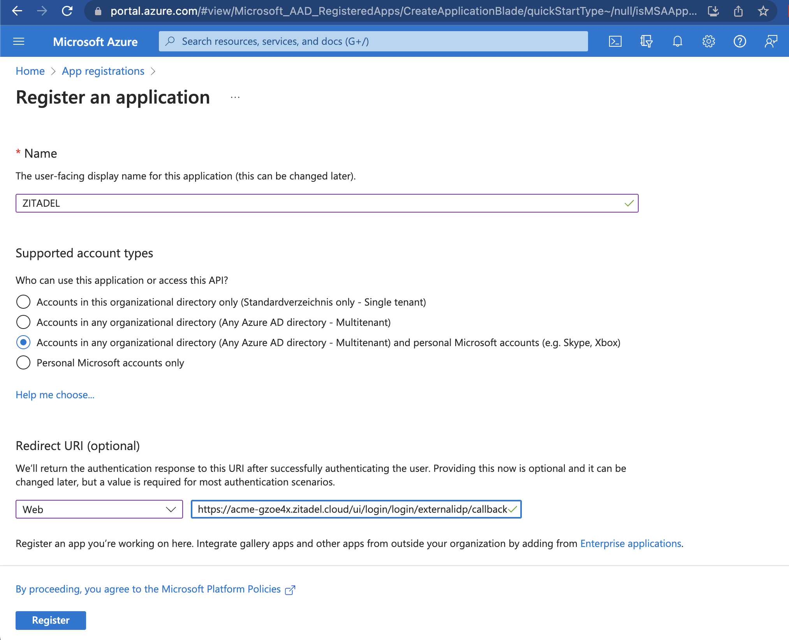
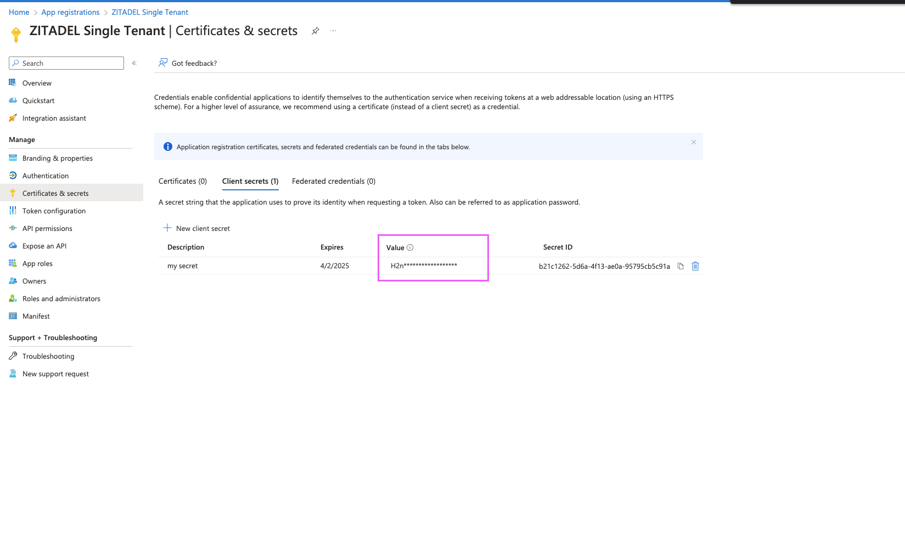

import GeneralConfigDescription from './_general_config_description.mdx';
import Intro from './_intro.mdx';
import CustomLoginPolicy from './_custom_login_policy.mdx';
import IDPsOverview from './_idps_overview.mdx';
import TestSetup from './_test_setup.mdx';
import Activate from './_activate.mdx';

<Intro components={props.components}  provider="Entra ID (former Azure Active Directory)"/>

## Open the Microsoft Identity Provider Template

<IDPsOverview components={props.components}  templates="Microsoft"/>

Click on the ZITADEL Callback URL to copy it to your clipboard.
You will have to paste it in the Entra ID Client later.

## Entra ID Configuration

You need to have access to an Entra ID Tenant. If you do not yet have one follow [this guide from Microsoft](https://docs.microsoft.com/en-us/azure/active-directory/develop/quickstart-create-new-tenant) to create one for free.

### Register a new application

1. Browse to the [App registration menus create dialog](https://portal.azure.com/#view/Microsoft_AAD_RegisteredApps/CreateApplicationBlade/quickStartType~/null/isMSAApp~/false) to create a new app.
2. Give the application a name and choose who should be able to log in (Single-Tenant, Multi-Tenant, Personal Accounts, etc.) This setting will also have an impact on how to configure the provider later on in ZITADEL.
3. Choose "Web" in the redirect uri field and [paste the ZITADEL Callback URL you copied before](#open-the-microsoft-identity-provider-template).
4. Save the Application (client) ID and the Directory (tenant) ID from the detail page
5. Register the application

### Add client secret

Generate a new client secret to authenticate your user.

1. Click on client credentials on the detail page of the application or use the menu "Certificates & secrets"
2. Click on "+ New client secret" and enter a description and an expiry date, add the secret afterward
3. Copy the value of the secret. You will not be able to see the value again after some time

### Token settings

To allow ZITADEL to get the information from the authenticating user you have to configure what kind of optional claims should be returned in the token.

1. Click on Token settings in the side menu
2. Click on "+ Add optional claim"
3. Add email, family_name (last name of the user), given_name (first name of the user) and preferred_username to the id token

### API permissions

To be able to get all the information that ZITADEL needs, you have to configure the correct permissions.

1. Go to "API permissions" in the side menu
2. Make sure the permissions include "Microsoft Graph": email, profile and User.Read
3. The "Other permissions granted" should include "Microsoft Graph: openid"

## ZITADEL Setup

Go back [to the Microsoft provider template you opened before in ZITADEL](#open-the-microsoft-identity-provider-template).
Add the [client ID and secret created before on your Entra ID application](#add-client-secret).

You can optionally configure the following settings.
A useful default will be filled if you don't change anything.

**Scopes**: The scopes define which scopes will be sent to the provider, `openid`, `profile`, and `email` are prefilled.
This information will be taken to create/update the user within ZITADEL. Make sure to also add `User.Read`. ZITADEL ensures that at least `openid` and `User.Read` scopes are always sent.

**Email Verified**: Entra ID doesn't send the email verified claim in the users token, if you don't enable this setting.
The user is then created with an unverified email, which results in an email verification message.
If you want to avoid that, make sure to enable "Email verified".
In that case, the user is created with a verified email address.

**Tenant Type**: Configure the tenant type according to what you have chosen in the settings of your Entra ID application previously.
- Common: Choose common if you want all Microsoft accounts being able to log in.
In this case, configure "Accounts in any organizational directory and personal Microsoft accounts" in your Entra ID App.
- Organizations: Choose organization if you have Entra ID Tenants and no personal accounts. (You have configured either "Accounts in this organization" or "Accounts in any organizational directory" on your Azure APP)
- Consumers: Choose this if you want to allow public accounts. (In your Entra ID App you have configured "Personal Microsoft accounts only")

**Tenant ID**: If you have selected *Tenant ID* as *Tenant Type*, you have to enter the *Directory (Tenant) ID* into the *Tenant ID* field, copied previously from the Azure App settings.

<GeneralConfigDescription components={props.components}  provider_account="Microsoft account" />

### Activate IdP

<Activate components={props.components} />

### Ensure your Login Policy allows External IDPs

<CustomLoginPolicy components={props.components} />

## Test the setup

<TestSetup components={props.components}  loginscreen="your Microsoft login"/>

