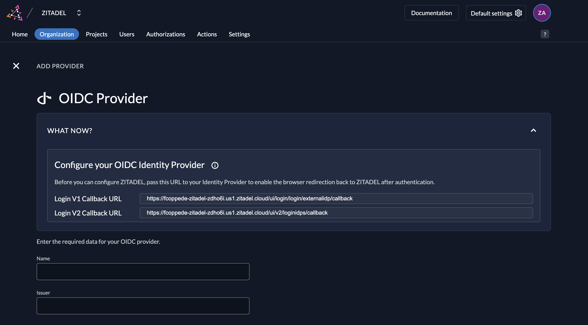
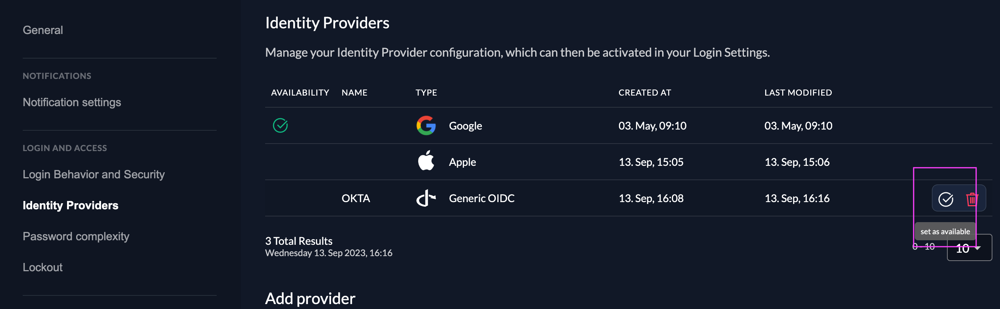

import GeneralConfigDescription from './_general_config_description.mdx';
import Intro from './_intro.mdx';
import CustomLoginPolicy from './_custom_login_policy.mdx';
import IDPsOverview from './_idps_overview.mdx';
import Activate from './_activate.mdx';
import PrefillAction from './_prefill_action.mdx';
import TestSetup from './_test_setup.mdx';

<Intro components={props.components} provider="your OIDC Provider"/>

## Open the Generic OIDC Provider Template

<IDPsOverview components={props.components} templates="Generic OIDC"/>

Click on the ZITADEL Callback URL to copy it to your clipboard.
You will have to paste this URL in your external OIDC provider's application settings later.

## OIDC Provider Configuration

### Register a new client/application

1. Log in to your external OIDC Provider's dashboard or management console.
2. Navigate to the applications, clients, or integrations section (name may vary depending on your provider).
3. Create a new application and select "OIDC" or "OpenID Connect" as the type.
4. Set a name for the application.
5. [Paste the ZITADEL Callback URL you copied before](#open-the-generic-oidc-provider-template) into the "redirect URIs" or "sign-in redirect URIs" field.
6. Save or copy the generated **Client ID** and **Client Secret**.

> The exact steps and terminology may vary for each provider. Refer to your provider's documentation if you don't see these options.

## ZITADEL Setup

1. Return to [the Generic OIDC Provider template in ZITADEL](#open-the-generic-oidc-provider-template).
2. Enter the **Client ID** and **Client Secret** from your OIDC provider's application.
3. Give the provider a name (e.g., "My OIDC Provider"). This name will appear as a button on the ZITADEL login screen.
4. Enter the **Issuer URL** of your OIDC provider (e.g., `https://your-provider.example.com`).

You can optionally configure the following settings. ZITADEL provides sensible defaults if you leave these unchanged.

**Scopes**: The scopes define which information ZITADEL will request from the provider. `openid`, `profile`, and `email` are pre-filled.
This information is used to create or update the user within ZITADEL.
ZITADEL ensures that at least the `openid` scope is always sent.

**Use PKCE**: If enabled, Proof Key for Code Exchange (PKCE) will be used to secure the authorization code flow in addition to the client secret.

<GeneralConfigDescription components={props.components} provider_account="OIDC provider account" />

### Activate IdP

<Activate components={props.components} />

### Ensure your Login Policy allows External IDPs

<CustomLoginPolicy components={props.components} />

## Test the setup

<TestSetup components={props.components} loginscreen="your OIDC provider login"/>
