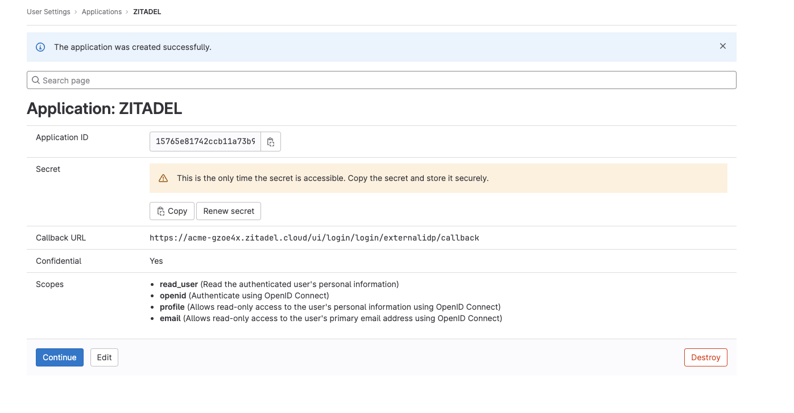
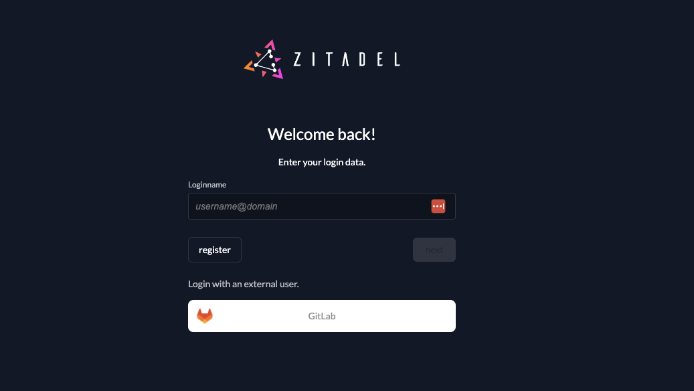
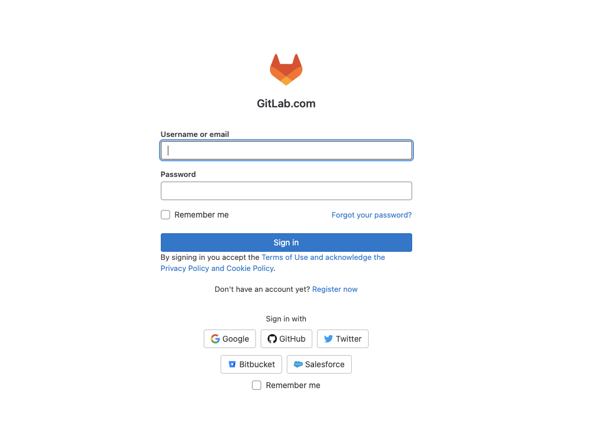

import GeneralConfigDescription from './_general_config_description.mdx';
import Intro from './_intro.mdx';
import CustomLoginPolicy from './_custom_login_policy.mdx';
import IDPsOverview from './_idps_overview.mdx';
import Activate from './_activate.mdx';
import TestSetup from './_test_setup.mdx';
import UnlinkedOAuth from './_unlinked_oauth.mdx';
import PrefillAction from './_prefill_action.mdx';

<Intro components={props.components}  provider="GitLab"/>

## Open the GitLab Identity Provider Template

<IDPsOverview components={props.components}  templates="GitLab or GitLab Self Hosted"/>

Click on the ZITADEL Callback URL to copy it to your clipboard.
You will have to paste it to the GitLab Application later.


## GitLab Configuration

### Register a new application

1. Login to [gitlab.com](https://gitlab.com) or to your GitLab self-hosted instance
2. Select [Edit Profile](https://gitlab.com/-/profile)
3. Click on [Applications](https://gitlab.com/-/profile/applications) in the side navigation
4. Fill in the application name
5. [Paste the ZITADEL Callback URL you copied before](#open-the-gitlab-identity-provider-template) to the Redirect URI field.


### Client ID and secret

After clicking "Save application", you will see the detail page of the application you have just created.
To be able to connect GitLab to ZITADEL you will need a client ID and a client secret.
Save the ID and the Secret, you will not be able to copy the secret again, if you lose it you have to generate a new one.



## ZITADEL Setup

Go back [to the GitLab provider template you opened before in ZITADEL](#open-the-gitlab-identity-provider-template).
Add the [client ID and secret you created before when you registered your GitLab application](#client-id-and-secret).

You can optionally configure the following settings.
A useful default will be filled if you don't change anything.

**Scopes**: The scopes define which scopes will be sent to the provider, `openid`, `profile`, and `email` are prefilled.
This information will be taken to create/update the user within ZITADEL.
ZITADEL ensures that at least the `openid`-scope is always sent.

<GeneralConfigDescription components={props.components}  provider_account="GitLab account" />

### Activate IdP

<Activate components={props.components} />


### Ensure your Login Policy allows External IDPs

<CustomLoginPolicy components={props.components} />

## Test the setup

<TestSetup components={props.components}  loginscreen="your GitLab login"/>





<UnlinkedOAuth components={props.components}  provider="GitLab"/>


## Optional: Add ZITADEL action to autofill userdata

<PrefillAction components={props.components}  fields="firstname and lastname" provider="GitLab"/>

```js reference
https://github.com/zitadel/actions/blob/main/examples/gitlab_identity_provider.js
```
