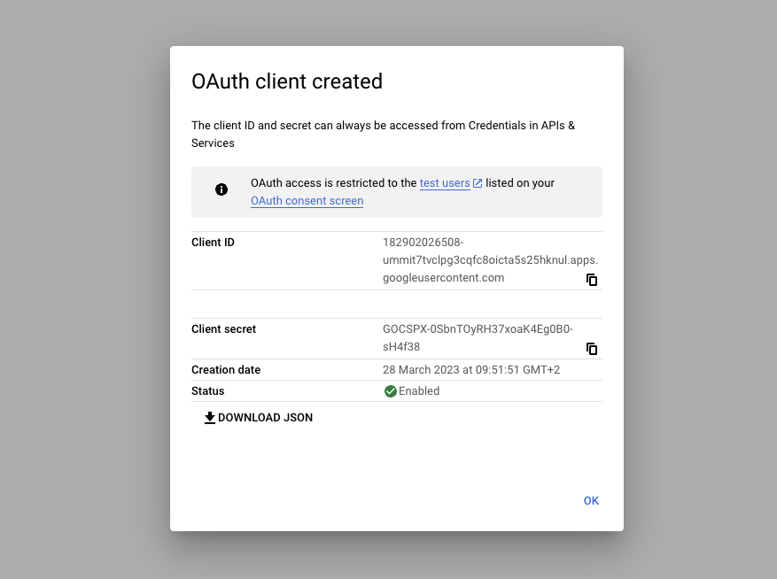
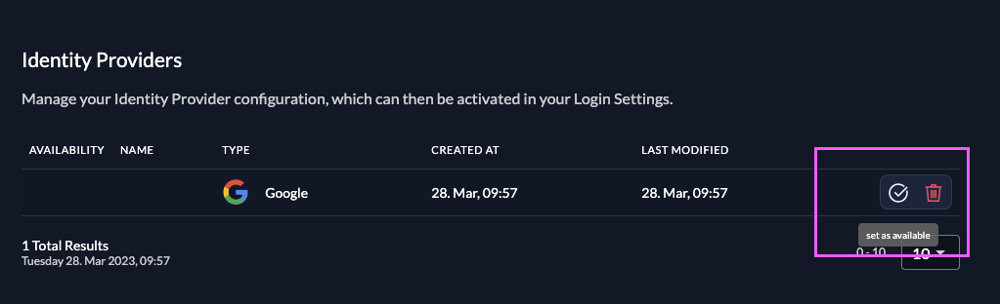

import GeneralConfigDescription from './_general_config_description.mdx';
import Intro from './_intro.mdx';
import CustomLoginPolicy from './_custom_login_policy.mdx';
import IDPsOverview from './_idps_overview.mdx';
import Activate from './_activate.mdx';
import TestSetup from './_test_setup.mdx';
import { ResponsivePlayer } from "@/components/player";

<Intro components={props.components}  provider="Google"/>

<ResponsivePlayer  controls url='https://www.youtube.com/watch?v=wg-ee-EnHdE' />

## Open the Google Identity Provider Template

<IDPsOverview components={props.components}  templates="Google"/>

Click on the ZITADEL Callback URL to copy it to your clipboard.
You will have to paste it in the Google Cloud Platform later.

## Google Configuration

### Register a new application

1. Go to the Google Cloud Platform and choose your project: [https://console.cloud.google.com/apis/credentials](https://console.cloud.google.com/apis/credentials)
2. Click on "+ CREATE CREDENTIALS" and choose "OAuth client ID"
3. Choose "Web application" as application type and give a name
4. [Paste the ZITADEL Callback URL you copied before](#open-the-google-identity-provider-template) into the authorized redirect URIs

### Client ID and secret

You will need the Client ID and Client secret to configure the Google Identity Provider in ZITADEL.

## ZITADEL Setup

Go back [to the Google provider template you opened before in ZITADEL](#open-the-google-identity-provider-template).
Add the [client ID and secret created before on your Google App](#client-id-and-client-secret).

You can optionally configure the following settings.
A useful default will be filled if you don't change anything.

**Scopes**: The scopes define which scopes will be sent to the provider, `openid`, `profile`, and `email` are prefilled.
This information will be taken to create/update the user within ZITADEL.
ZITADEL ensures that at least the `openid`-scope is always sent.

<GeneralConfigDescription components={props.components}  provider_account="Google account" />

### Activate IdP

<Activate components={props.components} />

### Ensure your Login Policy allows External IDPs

<CustomLoginPolicy components={props.components} />

## Test the setup

<TestSetup components={props.components}  loginscreen="your Google login"/>

