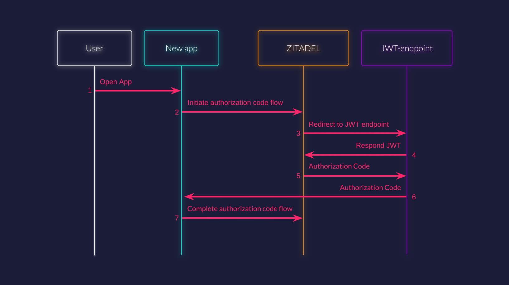

## In simple terms

A **JWT Identity Provider (JWT IdP)** allows ZITADEL to accept a JSON Web Token (JWT) issued and signed by an external
system as proof that a user has already been authenticated elsewhere. In this flow, ZITADEL does not perform
authentication itself, but relies on the trustworthiness and validity of the provided JWT.

## When should I use JWT IdP?

Use JWT IdP if:
- You have an existing application, gateway, Web Application Firewall (WAF),... that authenticates users and is able to
  generate a JWT for them.
- You want users to access new applications via ZITADEL without re-authentication, effectively reusing an existing session.
- You want to enable silent single sign-on (SSO) between legacy and new apps.
- You wish to federate authentication with a system that can't act as a full OpenID Connect provider, but can issue JWTs.

Do **not** use JWT IdP if:
- You need ZITADEL to interactively authenticate users (e.g., password-based logins).
- There is no secure way to transfer or validate the JWT.

---

## Configuring a JWT as an Identity Provider in ZITADEL

Configuring JWT IdP enables ZITADEL to accept a JWT generated by an external authentication system, such as your WAF or
a legacy app. The typical setup involves obtaining the JWT from the user's previously established session.

To configure JWT IdP in ZITADEL, you need to provide the following parameters.

### JWT endpoint

Where ZITADEL redirects users to retrieve the JWT.

*Example: `https://apps.test.com/existing/auth-new`*

### Keys Endpoint

Where ZITADEl fetches the public keys for signature validation of the JWT's. This endpoint should return the keys in
the format specified in [RFC7517](https://datatracker.ietf.org/doc/html/rfc7517).

*Example: `https://issuer.test.internal/keys`*

### Issuer

The party who issued the token. This is used to validate the `iss` claim in the JWT.

*Example: `https://issuer.test.internal`*

### Header name

The name of the header in which the JWT will be sent in the proxy request to Zitadel.

---

## Authentication using JWT IdP

The authentication flow with JWT IdP looks like this:



### Step-by-Step Process

#### 1. User accesses new app (Browser)

The user visits the new application, possibly via a link from the existing app. If no session is found, the new app
initiates an OIDC login via ZITADEL. The user than either selects the JWT IdP in the ZITADEL UI the application uses a
[custom scope](/apis/openidoauth/scopes#reserved-scopes) to pre-select the JWT IdP in the OIDC Authorization Request.

#### 2. ZITADEL redirects to the JWT Endpoint (Browser)

ZITADEL redirects the user's browser to the configured JWT Endpoint. Redirecting the browser ensures that any existing
session cookies for the previous app/WAF are available, letting the WAF determine the authenticated user and issue the
appropriate JWT.

#### 3. User is authenticated in your app

The WAF/gateway authenticates the user either by using an existing session on it's side or by requiring the user to
enter credentials.

#### 4. Your app forwards the token to ZITADEL

The app generates a JWT which it sends to ZITADEL. ZITADEL sends some query parameters in the request from step 3. These
parameters should be included in the request to ZITADEL. They ensure the request is authentic. An example for this is
listed below.

Don't forget to:
- Forward all the query parameters
- Add the JWT in the header

<Callout type="warning" title="ZITADEL callback url is different for login V1 and V2">

Callback for login V1: `https://accounts.test.com/ui/login/login/jwt/authorize`

Callback for login V2: `https://accounts.test.com/idps/jwt`

</Callout>

Example proxy server:

```js
export default {
  async fetch(request, env, ctx) {
    // 1. Obtain the JWT for the current session (implementation will vary)
    const jwt = await getJwtForCurrentSession(request, env);

    // 2. Prepare the ZITADEL endpoint URL and copy all query params
    const userUrl = new URL(request.url);
    // Important: The ZITADEL_JWT_IDP_ENDPOINT should be your ZITADEL custom domain plus "/idps/jwt"
    // For example: https://accounts.test.com/idps/jwt
    const zitadelUrl = new URL(env.ZITADEL_JWT_IDP_ENDPOINT);
    userUrl.searchParams.forEach((v, k) => zitadelUrl.searchParams.set(k, v));

    // 3. Proxy request, attaching JWT in the configured HTTP header
    const zitadelReq = new Request(zitadelUrl.toString(), {
      method: "GET",
      headers: {
        "x-custom-tkn": jwt, // Use header name as set in ZITADEL JWT IdP settings
        "Accept": request.headers.get("Accept") || "*/*",
      },
      redirect: "manual",
    });

    // 4. Send to ZITADEL and relay its response to the browser
    const zitadelResp = await fetch(zitadelReq);
    return new Response(zitadelResp.body, {
      status: zitadelResp.status,
      headers: zitadelResp.headers,
    });
  }
}
```
*Replace `getJwtForCurrentSession` with your logic for retrieving/creating a JWT from the user's WAF session.
Note: `env.ZITADEL_JWT_IDP_ENDPOINT` should be set to the custom domain of your ZITADEL instance
with the `/idps/jwt` path, e.g. `https://accounts.test.com/idps/jwt`.*

#### 5. ZITADEL receives and validates the JWT (Server-side)

ZITADEL extracts the JWT from the configured HTTP header and verifies that:
- The **signature** matches using keys from the Keys Endpoint.
- The `issuer` (`iss` claim) matches the configured issuer.
- The JWT is **not expired** using the `exp` claim.

<Callout type="info">
- ZITADEL **does not** re-authenticate the user.
- ZITADEL **does not** issue this JWT.
- ZITADEL only verifies authenticity and validity.
- The JWT is treated as an external ID token, similar to third-party IdPs.
</Callout>

#### 6. Login completes (Browser)

ZITADEL finishes the OIDC flow and the browser is redirected to the application’s callback endpoint. The new app
exchanges the code for tokens, and the user is now logged in.

---

## Use-cases

### Legacy app in internal network

You have an existing application which exists in an internal network which handles its own user authentication. A new
application is built using ZITADEL but the userbase of the existing application needs to be able to open the new
application from within the existing one without creating a new account or having to sign in.

- Existing application: `apps.test.com/existing/`
- Existing internal auth service: `issuer.test.internal`
- New application: `new.test.com`
- ZITADEL Login UI: `accounts.test.com`

#### What needs to happen:

- Add a link in the existing application which directs the user to `new.test.com`.
- Create an application on the domain of the existing application which serves the jwt and keys endpoints.
  - JWT endpoint: `apps.test.com/existing/auth-new`
  - Keys endpoint: `issuer.test.internal/keys`
- Configure the jwt endpoint to send the JWT in the specified header
  - Header name: `x-custom-tkn`
- Configure the jwt idp in ZITADEL with the parameters above
  - JWT endpoint: `apps.test.com/existing/auth-new`
  - Keys endpoint: `issuer.test.internal/keys`
  - Header name: `x-custom-tkn`
  - Issuer: `issuer.test.internal`

#### Result flow

1. User opens existing app
2. User authenticates against existing idp
3. User clicks on link to new app
4. User is redirected to ZITADEl
5. ZITADEL redirects to JWT endpoint
6. JWT endpoint creates JWT from existing session (using cookie)
7. JWT endpoint forwards request with JWT to ZITADEL
8. ZITADEL responds with authorization code
9. New app can exchange authorization code with access-token

## Clarifications and best practices

### Why must the JWT Endpoint be on the same domain as the existing app?

This ensures browser sessions (cookies) are correctly sent and recognized by the WAF or app, so the right JWT can be
generated.

### Why are cookies sent automatically?

Browsers automatically include relevant cookies when redirecting within the same domain, enabling server-side
authentication seamlessly.

### Why send the JWT in a header, not as a parameter?

HTTP headers are more secure for transmitting sensitive tokens, prevent them from being exposed in URLs or logs, and
avoid user tampering.
