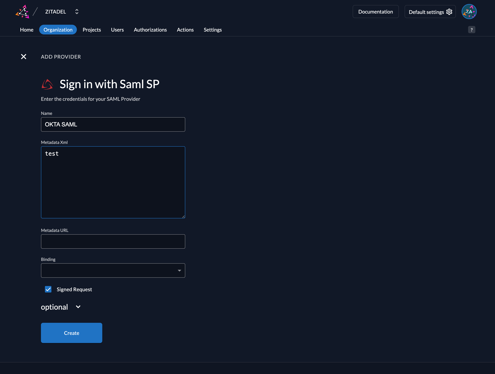
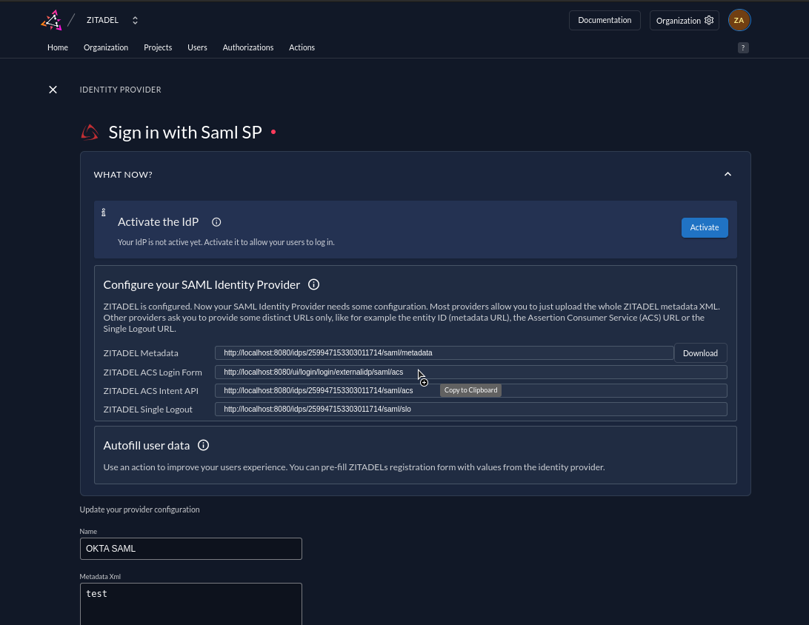
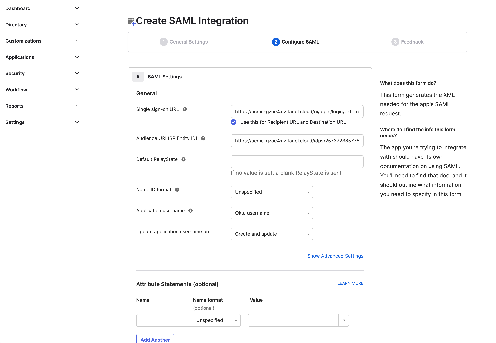
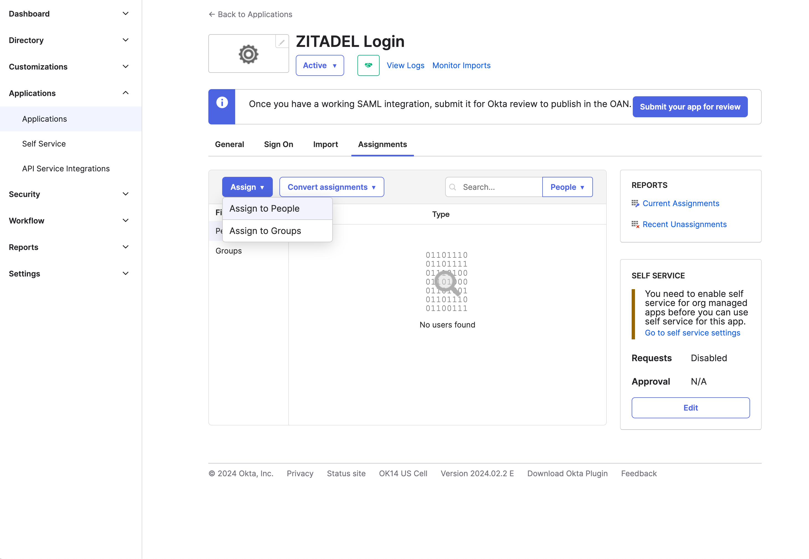
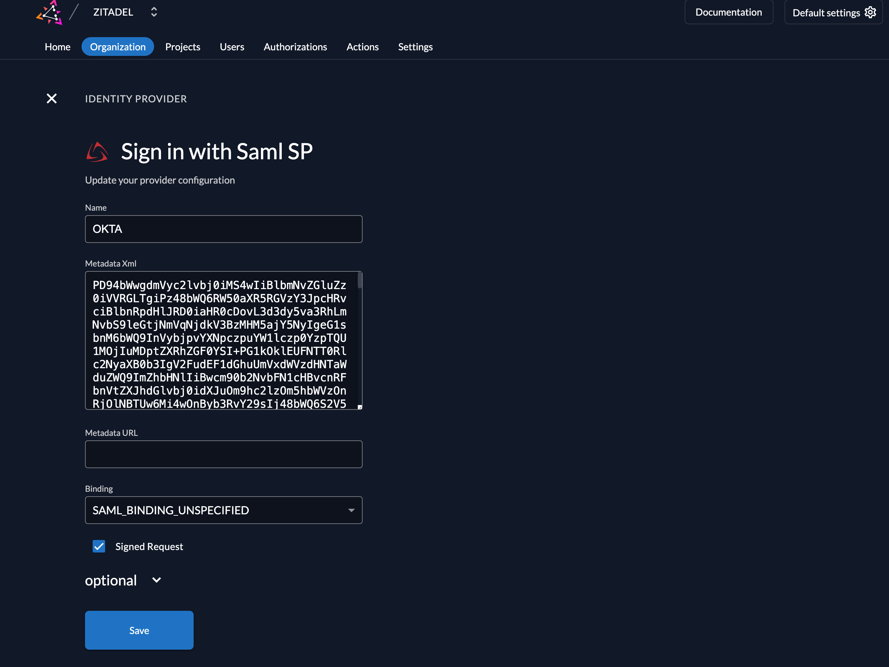
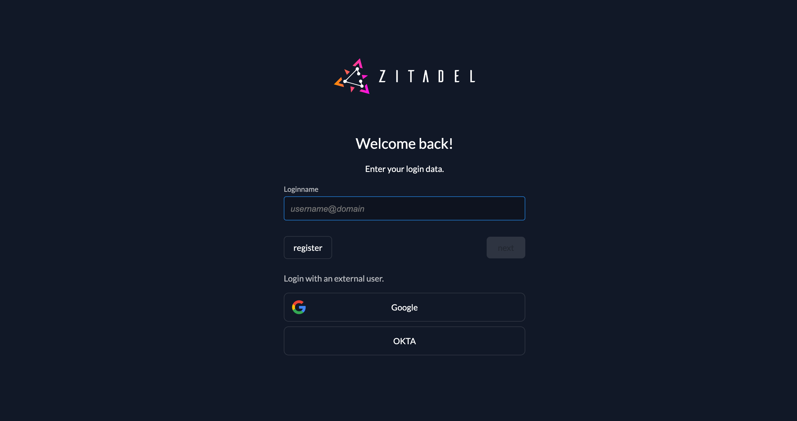
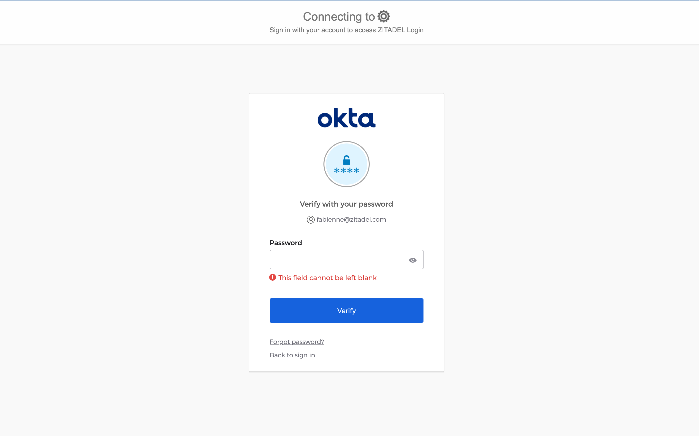

import GeneralConfigDescription from './_general_config_description.mdx';
import Intro from './_intro.mdx';
import CustomLoginPolicy from './_custom_login_policy.mdx';
import IDPsOverview from './_idps_overview.mdx';
import Activate from './_activate.mdx';
import PrefillAction from './_prefill_action.mdx';
import TestSetup from './_test_setup.mdx';

<Intro components={props.components}  provider="OKTA"/>

## ZITADEL Setup

### Go to the IdP Providers Overview

<IDPsOverview components={props.components}  templates="SAML"/>

### Create a new SAML Provider

To be able to create the application in OKTA we need the provider id from ZITADEL.
1. Create a new SAML Provider with a name and a random text in the Metadata Xml field.
We will fill that as soon as we have done the settings in OKTA.
2. Save Configuration

As an alternative you can add the SAML identity provider through the API, either on the default settings or on a specific organization:
- [Add Default SAML Identity Provider](/reference/api/admin/zitadel.admin.v1.AdminService.AddSAMLProvider)
- [Add SAML Identity Provider on Organization](/reference/api/management/zitadel.management.v1.ManagementService.AddSAMLProvider)



After you created the SAML Provider in ZITADEL, you can copy the URLs you need to configure in your OKTA application.



## OKTA Configuration

### Register a new client

1. Log in to your OKTA Account and go to the applications list: `OKTA-DOMAIN/admin/apps/active`
2. Click on "Create App Integration" and choose "SAML 2.0"
3. Give the application a name
4. Click on the ZITADEL URLs that your SAML IDP shows since you created it in ZITADEL and paste them accordingly:
- **Single sign-on URL**: Paste the *ZITADEL ACS Login Form URL*.
- **Audience URI (SP Entity ID)**: Paste the *ZITADEL Metadata URL*
5. Save the settings
6. Copy the metadata URL from the details



### Add Attribute Statements

To send the user data from OKTA to ZITADEL you have to add some attribute mappings in your SAML Settings
You can define the name by yourself, just ensure you use the same later on in the ZITADEL Action we will add.

Add the following three mappings:

| Name         | Name format | Value          |
| ------------ | ----------- |--------------- |
| givenname    | Basic       | user.firstName |
| surname      | Basic       | user.lastName  |
| emailaddress | Basic       | user.email     |


### Assign Users to Application

To allow users to authenticate with that app go to the "Assign" Tab.
1. Click the Assign Button
2. Choose Assign To People
3. Select the users you like to be able to authenticate



## Finish ZITADEL Setup

You are now finished with the settings in OKTA and you can switch back to your identity provider settings in ZITADEL.

### Add Metadata Xml

Add [the metadata URL you have saved before from OKTA](#register-a-new-client) to the Metadata URL.
As soon as you have saved the provider, and you have a look at the detail you should now see the Metadata Xml field filled.

If you prefer changing the settings through the API you can update the SAML provider on the default settings or a specific organization:
- [Update Default SAML Identity Provider](/reference/api/admin/zitadel.admin.v1.AdminService.UpdateSAMLProvider)
- [Update SAML Identity Provider on Organization](/reference/api/management/zitadel.management.v1.ManagementService.UpdateSAMLProvider)



You can also fill the optional fields if needed:

<GeneralConfigDescription components={props.components}  provider_account="OKTA account" />

### Activate IdP

<Activate components={props.components} />


### Ensure your Login Policy allows External IDPs

<CustomLoginPolicy components={props.components} />

## Test the setup

<TestSetup components={props.components}  loginscreen="your OKTA login"/>





### Add Action to map user attributes

<PrefillAction components={props.components}  fields="username, firstname, lastname, email and email verified" provider="OKTA"/>

```js reference
https://github.com/zitadel/actions/blob/main/examples/okta_saml_prefil_register_form.js
```
