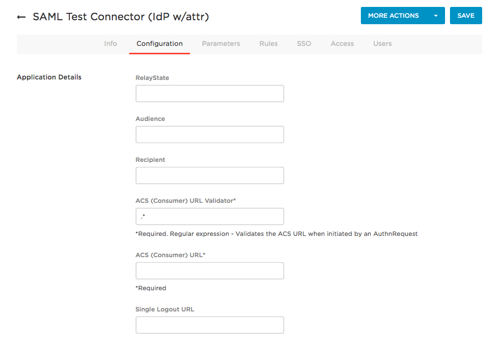
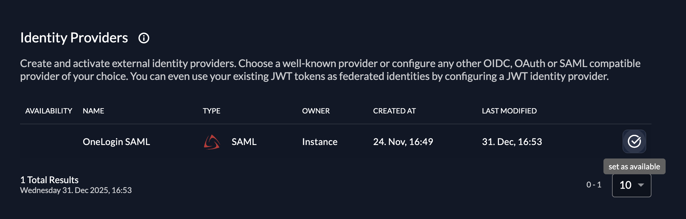

import GeneralConfigDescription from './_general_config_description.mdx';
import Intro from './_intro.mdx';
import CustomLoginPolicy from './_custom_login_policy.mdx';
import IDPsOverview from './_idps_overview.mdx';
import Activate from './_activate.mdx';
import TestSetup from './_test_setup.mdx';

<Intro components={props.components} provider="OneLogin"/>

## OneLogin SAML settings

You need access to a OneLogin admin portal with permission to create and configure SAML applications.

We’ll first configure OneLogin sufficiently to **export IdP metadata**, which we then import into ZITADEL.
After the ZITADEL SAML provider exists, we’ll return to OneLogin and finish the SAML settings using the ZITADEL URLs.

### Create a new SAML application for ZITADEL

1. Sign in to the **OneLogin admin portal**.
2. Go to **Applications > Applications** (or **Apps > Add Apps**, depending on your UI).
3. Click **Add App**.
4. In **Find Applications**, search for:
   - **SAML Test Connector (IdP w/ attr)** (recommended), or
   - **SAML Custom Connector (Advanced)** if you prefer a more generic connector.
5. Select the connector and set:
   - **Display Name** – for example: `ZITADEL SAML`.
   - Any optional icon or description you like.
6. Click **Save** to create the application.


### Export OneLogin IdP metadata

Now export OneLogin IdP metadata so ZITADEL can trust OneLogin as an identity provider.

1. In the OneLogin admin portal, open the **ZITADEL SAML** application.
2. To export the full metadata XML:
   - In the top-right corner, open the **More Actions** menu.
   - Select **SAML Metadata** to download the metadata XML file.
3. Alternatively, you can copy the **Issuer URL**, open it in a browser, and save the XML response.
   This URL often serves as an IdP metadata endpoint.

Keep either:

- the **IdP Metadata URL** (Issuer URL that returns XML), or
- the **IdP metadata XML file**,

ready for the ZITADEL setup steps.

## ZITADEL settings

### Go to the IdP providers overview

<IDPsOverview components={props.components} templates="SAML"/>

### Create a new SAML Service Provider

The SAML provider template has everything you need preconfigured.
Add the metadata XML or the URL to the metadata which is accessible by your ZITADEL instance.
All the necessary settings are contained in the metadata which has to be exchanged between the Service Provider and the Identity Provider.

<GeneralConfigDescription components={props.components} provider_account="OneLogin" />


After saving, open the newly created **OneLogin SAML provider** in ZITADEL.
In the details view you will find the **ZITADEL Service Provider** URLs, such as:

- **ZITADEL Metadata URL**
- **ZITADEL ACS Login Form URL** (for Login V1 and standard login flows)
- **ZITADEL Single Logout URL**
- **ZITADEL ACS Intent API URL** (for Login V2 and programmatic SAML flows)

For a typical browser-based login using the ZITADEL hosted login V2 you will use the:

- **ZITADEL ACS Intent API URL**, and
- **ZITADEL Metadata URL**.

You’ll need these URLs in the next step when finishing the OneLogin configuration.

### Complete OneLogin configuration with ZITADEL URLs

Now that ZITADEL is configured, return to OneLogin and finish the SAML configuration of the ZITADEL app.

1. In the OneLogin admin portal, open the **ZITADEL SAML** application.
2. Go to the **Settings** tab (or the section where SAML SP settings such as ACS and Audience are set up).
3. Fill in the SAML settings using the values from the ZITADEL SAML provider:

   - **ACS (Consumer) URL / SAML Consumer URL**
     Set this to the **ZITADEL ACS Intent API URL**.

   - **Recipient** (if present as a separate field)
     Set this to the **ZITADEL ACS Intent API URL** as well.

   - **Audience / SP Entity ID / SAML Audience**
     Set this to the **ZITADEL Metadata URL**.

   - **Single Logout URL** (optional but recommended)
     Set this to the **ZITADEL Single Logout URL**.

   - **ACS (Consumer) URL Validator** (if present)
     For testing, you can use a permissive value like `.*`, then tighten it later to match the exact ACS URL.



4. Save your changes.

> _Optional: Import ZITADEL SP metadata_
> Some OneLogin SAML connectors provide an **Upload Metadata** or **Upload metadata file** option.
> In that case you can:
> - Download the SP metadata XML from the **ZITADEL Metadata URL**, and
> - Upload the XML file in OneLogin instead of manually filling in ACS and Audience.
> This will automatically populate many of the SAML settings and certificates.

5. Assign users or groups to the **ZITADEL SAML** application in OneLogin (for example via the **Users** or **Access** tab), so they can use it for SSO.

### Configure SAML attributes in OneLogin

To provision users correctly in ZITADEL, configure which attributes OneLogin sends in the SAML assertion.

1. In the OneLogin admin portal, open the **ZITADEL SAML** application.
2. Go to the **Parameters** tab.
3. Add or edit parameters so that at least the following are sent and **included in the SAML assertion**:

   - `email` → mapped to the user’s email address (for example **Email**).
   - `firstName` → mapped to the user’s first name (for example **First Name**).
   - `lastName` → mapped to the user’s last name (for example **Last Name**).

4. Ensure the **NameID** is set to a unique identifier (commonly the user’s email address), if your OneLogin connector requires it.
5. Save your changes.

These attributes are later available in ZITADEL’s **IdP information** and can be mapped to ZITADEL user fields via Actions V2.

### Activate IdP

<Activate components={props.components} />



### Ensure your Login Policy allows External IdPs

<CustomLoginPolicy components={props.components} />

## Configure an action to autofill user data

### Required for Login V2

The creation of users in ZITADEL will fail if the required fields to create a user are not set.

**Actions V2** can be used to map the SAML attributes returned by the IdP to the required fields in ZITADEL.
See the [Actions V2 Response Manipulation](/guides/integrate/actions/testing-response-manipulation)
guide for more information on setting up a Target and an Execution. In short,

* Create an Actions V2 Target of type `REST Call`.
* Create an Execution of type `Response` on the method `/zitadel.user.v2.UserService/RetrieveIdentityProviderIntent`.

The following minimal example modifies the response of `/zitadel.user.v2.UserService/RetrieveIdentityProviderIntent` to set the required fields
for user creation. This is just an example, please adjust the attributes according to your IdP.

``` go
package main

import (
    "encoding/json"
    "io"
    "log"
    "net/http"

    "github.com/muhlemmer/gu"
    "github.com/zitadel/zitadel-go/v3/pkg/client/zitadel/user/v2"
    "google.golang.org/protobuf/encoding/protojson"
)

type contextResponse struct {
    Request  *retrieveIdentityProviderIntentRequestWrapper  `json:"request"`
    Response *retrieveIdentityProviderIntentResponseWrapper `json:"response"`
}

// RetrieveIdentityProviderIntentRequestWrapper necessary to marshal and unmarshal the JSON into the proto message correctly
type retrieveIdentityProviderIntentRequestWrapper struct {
    user.RetrieveIdentityProviderIntentRequest
}

func (r *retrieveIdentityProviderIntentRequestWrapper) MarshalJSON() ([]byte, error) {
    data, err := protojson.Marshal(r)
    if err != nil {
        return nil, err
    }
    return data, nil
}

func (r *retrieveIdentityProviderIntentRequestWrapper) UnmarshalJSON(data []byte) error {
    return protojson.Unmarshal(data, r)
}

// RetrieveIdentityProviderIntentResponseWrapper necessary to marshal and unmarshal the JSON into the proto message correctly
type retrieveIdentityProviderIntentResponseWrapper struct {
    user.RetrieveIdentityProviderIntentResponse
}

func (r *retrieveIdentityProviderIntentResponseWrapper) MarshalJSON() ([]byte, error) {
    data, err := protojson.Marshal(r)
    if err != nil {
        return nil, err
    }
    return data, nil
}

func (r *retrieveIdentityProviderIntentResponseWrapper) UnmarshalJSON(data []byte) error {
    return protojson.Unmarshal(data, r)
}

// call HandleFunc to read the response body, manipulate the content and return the response
func call(w http.ResponseWriter, req *http.Request) {
    // read the body content
    sentBody, err := io.ReadAll(req.Body)
    if err != nil {
        // if there was an error while reading the body return an error
        http.Error(w, "error", http.StatusInternalServerError)
        return
    }
    defer req.Body.Close()

    // read the response into the expected structure
    request := new(contextResponse)
    if err := json.Unmarshal(sentBody, request); err != nil {
        http.Error(w, "error", http.StatusInternalServerError)
        return
    }

    // build the response from the received response
    resp := request.Response
    // manipulate the received response to send back as response
    if err = manipulateResponse(resp); err != nil {
        http.Error(w, "error modifying response", http.StatusInternalServerError)
        return
    }

    // marshal the response into json
    data, err := json.Marshal(resp)
    if err != nil {
        // if there was an error while marshalling the json
        http.Error(w, "error marshaling response", http.StatusInternalServerError)
        return
    }

    // return the manipulated response
    w.Write(data)
}

type rawInformation struct {
    Attributes struct {
        Email     []string `json:"email"`
        FirstName []string `json:"firstName"`
        Id        []string `json:"id"`
        LastName  []string `json:"lastName"`
    } `json:"attributes"`
    Id string `json:"id"`
}

func manipulateResponse(resp *retrieveIdentityProviderIntentResponseWrapper) error {
    if resp == nil || resp.IdpInformation == nil || resp.IdpInformation.RawInformation == nil {
        log.Println("missing IdP/User information in the IdP response")
        return nil
    }
    // retrieve raw information from the IdP
    var rawInfoBytes []byte
    var err error
    if rawInfoBytes, err = resp.IdpInformation.RawInformation.MarshalJSON(); err != nil {
        return err
    }

    // NOTE: the raw information struct used here is just an example.
    // Please adapt this to your IdP.
    var rawInfo rawInformation
    if err = json.Unmarshal(rawInfoBytes, &rawInfo); err != nil {
        return err
    }

    if len(rawInfo.Attributes.Email) == 0 ||
        len(rawInfo.Attributes.FirstName) == 0 ||
        len(rawInfo.Attributes.Id) == 0 ||
        len(rawInfo.Attributes.LastName) == 0 {
        log.Println("missing required attributes in the IdP response")
        return nil
    }

    // to create a new user.
    if resp.AddHumanUser != nil {
        // set the required fields to create a new user in ZITADEL based on the information returned by the IdP
        resp.IdpInformation.UserName = rawInfo.Attributes.Email[0]

        resp.AddHumanUser.Profile = &user.SetHumanProfile{
            GivenName:  rawInfo.Attributes.FirstName[0],
            FamilyName: rawInfo.Attributes.LastName[0],
        }
        resp.AddHumanUser.Email = &user.SetHumanEmail{
            Email:        rawInfo.Attributes.Email[0],
            Verification: &user.SetHumanEmail_IsVerified{IsVerified: true},
        }
        resp.AddHumanUser.Username = gu.Ptr(rawInfo.Attributes.Email[0])
        resp.AddHumanUser.IdpLinks = []*user.IDPLink{
            {
                UserName: rawInfo.Attributes.Email[0],
            },
        }
    }
    return nil
}

func main() {
    // handle the HTTP call under "/call"
    http.HandleFunc("/call", call)

    // start an HTTP server with the before defined function to handle the endpoint under "http://localhost:8090"
    http.ListenAndServe(":8090", nil)
}
```

## Test the setup

<TestSetup components={props.components} loginscreen="your OneLogin login"/>


