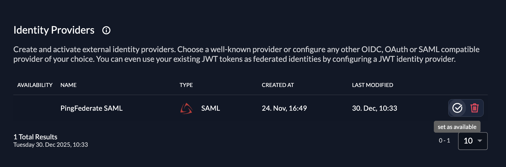

import GeneralConfigDescription from './_general_config_description.mdx';
import Intro from './_intro.mdx';
import CustomLoginPolicy from './_custom_login_policy.mdx';
import IDPsOverview from './_idps_overview.mdx';
import Activate from './_activate.mdx';
import TestSetup from './_test_setup.mdx';

<Intro components={props.components} provider="PingFederate"/>

## PingFederate SAML settings

You need access to a PingFederate administrative console with permission to create **SP Connections**.

We’ll first configure PingFederate sufficiently to **export IdP metadata**, which we then import into ZITADEL.
After the ZITADEL SAML provider exists, we’ll return to PingFederate and finish the SP settings using the ZITADEL URLs.

### Create a new SP Connection for ZITADEL

1. Sign in to the **PingFederate admin console**.
2. Go to **Applications > SP Connections**.
3. Select **Create New** (or **Add Connection**).
4. When asked how to create the connection, choose **Manually Configure Connection** (do not import metadata yet).
5. On the **Connection Type** screen, choose:
   - **Browser SSO** as the connection type.
   - **SAML 2.0** as the protocol.
6. On **General Settings**:
   - Set a **Connection Name**, for example: `ZITADEL SAML`.
   - Optionally set an ID or description to identify the connection.

### Configure Browser SSO

1. In the new connection wizard, go to **Browser SSO**.
2. Make sure **SAML 2.0** Browser SSO is enabled for this connection.
3. Proceed to **Assertion Creation**:
   - Keep the default **NameID** attribute.
   - Add additional attributes you want to send to ZITADEL (you need at least `email`, `given_name` (first name of the user), `family_name` (last name of the user), and you can send optional attributes like `display_name`).
4. In **Attribute Mapping**, map the contract attributes to your directory/user store fields.

### Export PingFederate IdP metadata

Now export IdP metadata for this connection so ZITADEL can trust PingFederate.

1. In PingFederate, go to **System > Protocol Metadata > Metadata Export**.
2. Select **SAML 2.0**.
3. Set the **Role** to **IdP** (Identity Provider).
4. Choose to generate **connection-specific metadata** and select the SP Connection you created for ZITADEL.
5. Choose a transfer method:
   - **Metadata URL** – PingFederate publishes metadata at a URL you can copy; or
   - **File download** – export the metadata as an XML file.

Keep either:

- the **Metadata URL**, or
- the **XML file** contents,

ready for the ZITADEL setup steps.

## ZITADEL settings

### Go to the IdP providers overview

<IDPsOverview components={props.components} templates="SAML"/>

### Create a new SAML Service Provider

The SAML provider template has everything you need preconfigured.
Add the metadata.xml or the URL to the metadata which are accessible by your ZITADEL instance.
All the necessary settings are contained in the metadata which has to be exchanged by the ServiceProvider and the IdentityProvider.

<GeneralConfigDescription components={props.components} provider_account="PingFederate" />


After saving, open the newly created PingFederate SAML provider in ZITADEL.
In the details view you will find the **ZITADEL Service Provider** URLs, such as:

- **ZITADEL Metadata URL**
- **ZITADEL ACS Login Form URL** (for Login V1)
- **ZITADEL Single Logout URL**
- **ZITADEL ACS Intent API URL** (for Login V2 and programmatic SAML flows)

You’ll need these in the next step.

### Import ZITADEL metadata into PingFederate (recommended)

Now that ZITADEL is configured, you can let PingFederate **consume ZITADEL’s SP metadata URL**.
This allows PingFederate to:

- Auto-fill the ZITADEL **ACS URL**, **entity ID**, and **SLO URLs**.
- Import and keep up-to-date the **verification/encryption certificates** from the metadata.

#### Create a Partner Metadata URL for ZITADEL

1. In the PingFederate admin console, go to:
   **System > Protocol Metadata > Partner Metadata URLs**.
2. Click **Add New URL**.
3. On the **URL** tab:
   - **Name** – `ZITADEL SP Metadata` (or similar).
   - **URL** – paste the **ZITADEL Metadata URL** you copied from ZITADEL.
   - Keep **Validate Metadata Signature** enabled (recommended) unless you have a reason to disable it.
4. Click **Load Metadata**.
5. On the **Certificate Summary** tab, review the certificate information associated with the metadata.
6. On the **Summary** tab, click **Done**, then **Save**.

PingFederate can now use this metadata URL to configure and automatically update the SP connection.

### Import SP metadata into the ZITADEL SP Connection

With the partner metadata URL defined, apply it to your existing SP Connection for ZITADEL.

1. Go to **Applications > SP Connections**.
2. Edit the SP Connection you created for ZITADEL.
3. Go to the **Import Metadata** tab.
4. Select **URL**.
5. From the **Metadata URL** drop-down, select the **ZITADEL SP Metadata** entry you created.
   - If you don’t see it, click **Manage Partner Metadata URLs** and verify it exists and loads correctly.
6. Ensure **Enable Automatic Reloading** is checked if you want PingFederate to periodically refresh metadata (recommended).
7. Click **Load Metadata**.

PingFederate will:

- Read the SP metadata from ZITADEL,
- Populate the **ACS URL**, SLO URLs, and other protocol settings for the connection, and
- Import the SP’s **signing/encryption certificates** for signature verification and encryption.

You can review the updated values on:

- **Browser SSO > Protocol Settings** (ACS URL, bindings, SLO URLs), and
- **Credentials > Signature Verification / Encryption** (certificates imported from metadata).

If needed, you can still override specific settings manually, but using the metadata URL is the preferred way to keep endpoints and certificates in sync.

#### If you need to update the SP Connection with ZITADEL URLs

1. In PingFederate, open the **SP Connection** you created for ZITADEL.
2. Go to the **Browser SSO / Protocol Settings** (exact naming may vary by version).
3. Update the SP settings:

   - **Assertion Consumer Service (ACS) URL**
     Set this to the **ZITADEL ACS Intent API URL** from the SAML provider details.

   - **SP Entity ID / Audience / Partner Entity ID**
     Set this to the **ZITADEL Metadata URL**.

   - **Single Logout (optional)**
     If you want SAML Single Logout, configure PingFederate’s logout behavior to call the **ZITADEL Single Logout URL** using the appropriate binding (typically HTTP-Redirect).

4. Save and **activate** the connection changes in PingFederate.

### Activate IdP

<Activate components={props.components} />



### Ensure your Login Policy allows External IdPs

<CustomLoginPolicy components={props.components} />

## Configure an action to autofill user data

### Required for Login V2
The creation of users in ZITADEL will fail if the required fields to create a user are not set.

**Actions V2** can be used to map the SAML attributes returned by the IdP to the required fields in ZITADEL.
See the [Actions V2 Response Manipulation](/guides/integrate/actions/testing-response-manipulation)
guide for more information on setting up a Target and an Execution. In short,
* Create an Actions V2 Target of type `REST Call`
* Create an Execution of type `Response` on the method `/zitadel.user.v2.UserService/RetrieveIdentityProviderIntent`

The following minimal example modifies the response of `/zitadel.user.v2.UserService/RetrieveIdentityProviderIntent` to set the required fields
for user creation. This is just an example, please adjust the attributes according to your IdP.

``` go
package main

import (
	"encoding/json"
	"io"
	"log"
	"net/http"

	"github.com/muhlemmer/gu"
	"github.com/zitadel/zitadel-go/v3/pkg/client/zitadel/user/v2"
	"google.golang.org/protobuf/encoding/protojson"
)

type contextResponse struct {
	Request  *retrieveIdentityProviderIntentRequestWrapper  `json:"request"`
	Response *retrieveIdentityProviderIntentResponseWrapper `json:"response"`
}

// RetrieveIdentityProviderIntentRequestWrapper necessary to marshal and unmarshal the JSON into the proto message correctly
type retrieveIdentityProviderIntentRequestWrapper struct {
	user.RetrieveIdentityProviderIntentRequest
}

func (r *retrieveIdentityProviderIntentRequestWrapper) MarshalJSON() ([]byte, error) {
	data, err := protojson.Marshal(r)
	if err != nil {
		return nil, err
	}
	return data, nil
}

func (r *retrieveIdentityProviderIntentRequestWrapper) UnmarshalJSON(data []byte) error {
	return protojson.Unmarshal(data, r)
}

// RetrieveIdentityProviderIntentResponseWrapper necessary to marshal and unmarshal the JSON into the proto message correctly
type retrieveIdentityProviderIntentResponseWrapper struct {
	user.RetrieveIdentityProviderIntentResponse
}

func (r *retrieveIdentityProviderIntentResponseWrapper) MarshalJSON() ([]byte, error) {
	data, err := protojson.Marshal(r)
	if err != nil {
		return nil, err
	}
	return data, nil
}

func (r *retrieveIdentityProviderIntentResponseWrapper) UnmarshalJSON(data []byte) error {
	return protojson.Unmarshal(data, r)
}

// call HandleFunc to read the response body, manipulate the content and return the response
func call(w http.ResponseWriter, req *http.Request) {
	// read the body content
	sentBody, err := io.ReadAll(req.Body)
	if err != nil {
		// if there was an error while reading the body return an error
		http.Error(w, "error", http.StatusInternalServerError)
		return
	}
	defer req.Body.Close()

	// read the response into the expected structure
	request := new(contextResponse)
	if err := json.Unmarshal(sentBody, request); err != nil {
		http.Error(w, "error", http.StatusInternalServerError)
		return
	}

	// build the response from the received response
	resp := request.Response
	// manipulate the received response to send back as response
	if err = manipulateResponse(resp); err != nil {
		http.Error(w, "error modifying response", http.StatusInternalServerError)
		return
	}

	// marshal the response into json
	data, err := json.Marshal(resp)
	if err != nil {
		// if there was an error while marshalling the json
		http.Error(w, "error marshaling response", http.StatusInternalServerError)
		return
	}

	// return the manipulated response
	w.Write(data)
}

type rawInformation struct {
	Attributes struct {
		Email     []string `json:"email"`
		FirstName []string `json:"firstName"`
		Id        []string `json:"id"`
		LastName  []string `json:"lastName"`
	} `json:"attributes"`
	Id string `json:"id"`
}

func manipulateResponse(resp *retrieveIdentityProviderIntentResponseWrapper) error {
	if resp == nil || resp.IdpInformation == nil || resp.IdpInformation.RawInformation == nil {
		log.Println("missing IdP/User information in the IdP response")
		return nil
	}
	// retrieve raw information from the IdP
	var rawInfoBytes []byte
	var err error
	if rawInfoBytes, err = resp.IdpInformation.RawInformation.MarshalJSON(); err != nil {
		return err
	}

	// NOTE: the raw information struct used here is just an example.
	// Please adapt this to your IdP.
	var rawInfo rawInformation
	if err = json.Unmarshal(rawInfoBytes, &rawInfo); err != nil {
		return err
	}

	if len(rawInfo.Attributes.Email) == 0 ||
		len(rawInfo.Attributes.FirstName) == 0 ||
		len(rawInfo.Attributes.Id) == 0 ||
		len(rawInfo.Attributes.LastName) == 0 {
		log.Println("missing required attributes in the IdP response")
		return nil
	}

	// to create a new user.
	if resp.AddHumanUser != nil {
		// set the required fields to create a new user in Zitadel based on the information returned by the IdP
		resp.IdpInformation.UserName = rawInfo.Attributes.Email[0]

		resp.AddHumanUser.Profile = &user.SetHumanProfile{
			GivenName:  rawInfo.Attributes.FirstName[0],
			FamilyName: rawInfo.Attributes.LastName[0],
		}
		resp.AddHumanUser.Email = &user.SetHumanEmail{
			Email:        rawInfo.Attributes.Email[0],
			Verification: &user.SetHumanEmail_IsVerified{IsVerified: true},
		}
		resp.AddHumanUser.Username = gu.Ptr(rawInfo.Attributes.Email[0])
		resp.AddHumanUser.IdpLinks = []*user.IDPLink{
			{
				UserName: rawInfo.Attributes.Email[0],
			},
		}
	}
	return nil
}

func main() {
	// handle the HTTP call under "/call"
	http.HandleFunc("/call", call)

	// start an HTTP server with the before defined function to handle the endpoint under "http://localhost:8090"
	http.ListenAndServe(":8090", nil)
}

```

## Test the setup

<TestSetup components={props.components} loginscreen="your PingFederate login"/>


