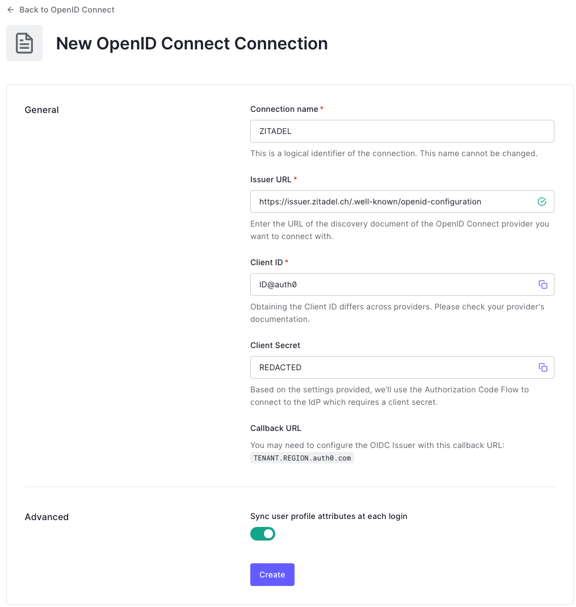
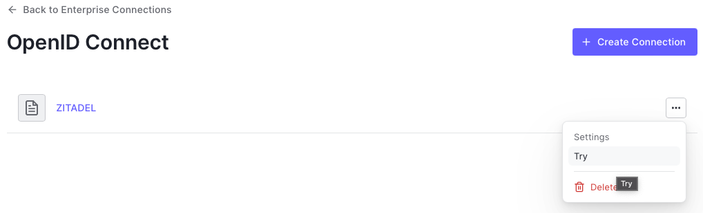

import CreateApp from "../application/_application.mdx";

This guide shows how to enable login with ZITADEL on Auth0.

It covers how to:

- create and configure the application in your project
- create and configure the connection in your Auth0 tenant

Prerequisites:

- existing ZITADEL Instance, if not present follow [this guide](/guides/start/quickstart)
- existing ZITADEL Organization, if not present follow [this guide](/guides/manage/console/organizations-overview)
- existing ZITADEL project, if not present follow the first 3 steps [here](/guides/manage/console/projects-overview)
- existing Auth0 tenant as described [here](https://auth0.com/docs/get-started/auth0-overview/create-tenants)

> We have to switch between ZITADEL and Auth0. If the headings begin with "ZITADEL" switch to the ZITADEL Management Console and if the headings start with "Auth0" please switch to the Auth0 GUI.

## **Auth0**: Create a new connection

In Authentication > Enterprise

1. Press the "+" button right to "OpenID Connect"
  
2. Set a connection name for example "ZITADEL"
3. The issuer url is `https://${CUSTOM_DOMAIN}/.well-known/openid-configuration`
4. Copy the callback URL (ending with `/login/callback`)

The settings should look like this:

Next we have to switch to the ZITADEL Management Console.

## **ZITADEL**: Create the application

First of all we create the application in your project.

<CreateApp components={props.components}  appType="web" authType="code" appName="Auth0" redirectURI="https://<TENANT>.<REGION>.auth0.com/login/callback"/>

## **Auth0**: Connect ZITADEL

1. Copy the client id from ZITADEL and paste it into the **Client ID** field
2. Copy the client secret from ZITADEL and paste it into the **Client Secret** field
   
3. click Create
4. To verify the connection go to the "Applications" tab and enable the Default App
   
5. Click "Back to OpenID Connect"
6. Click on the "..." button right to the newly created connection and click "Try"
   
7. ZITADEL should open on a new tab, and you can enter your login information
8. After you logged in you should see the following:
   
