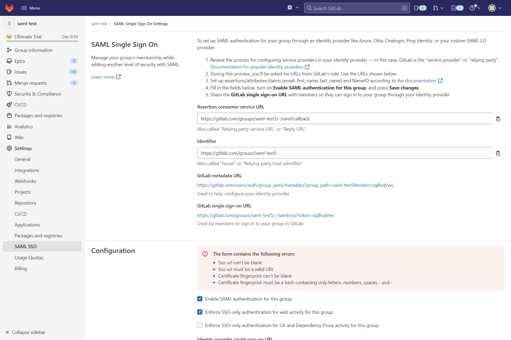
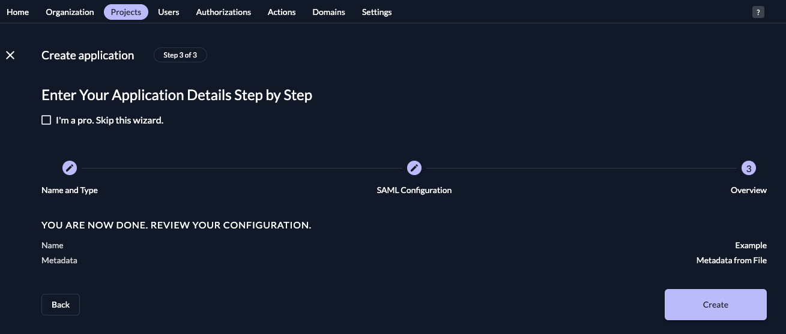
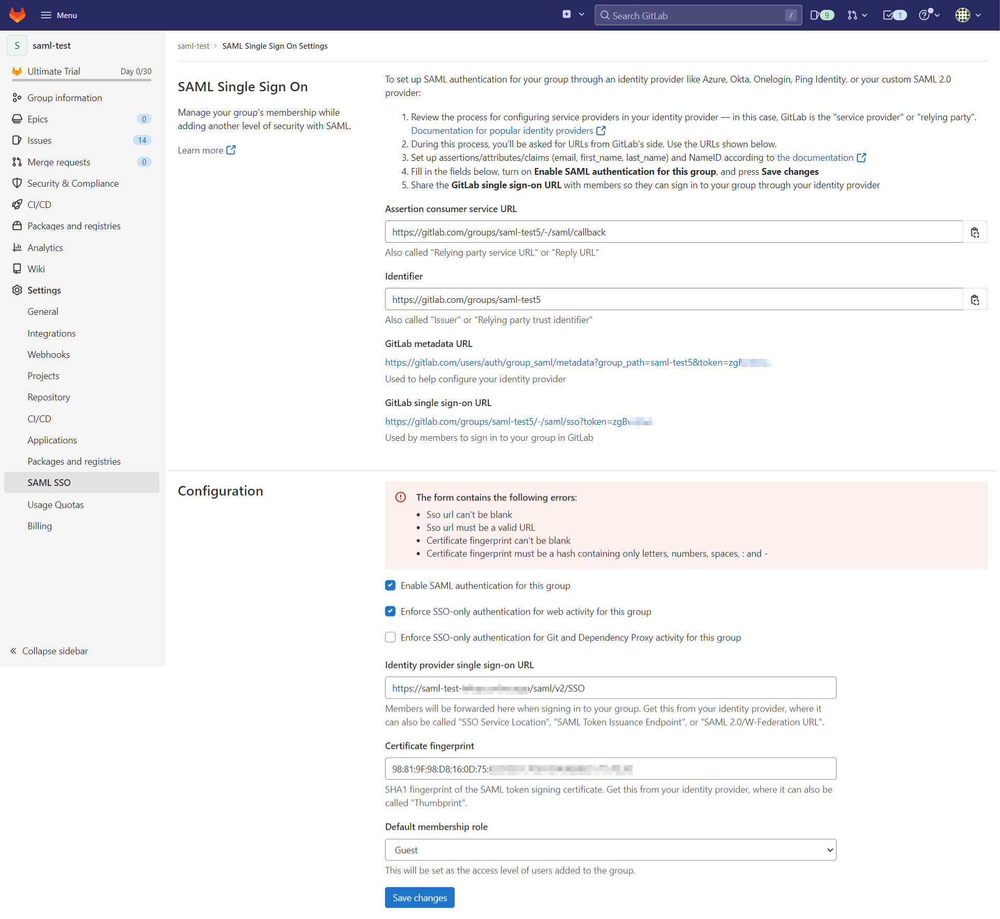

This guide shows how to enable login with ZITADEL on Gitlab.

It covers how to:

- create and configure the application in your project
- create and configure the connection in Gitlab SaaS

Prerequisites:

- existing ZITADEL Instance, if not present follow [this guide](/guides/start/quickstart)
- existing ZITADEL Organization, if not present follow [this guide](/guides/manage/console/organizations-overview)
- existing ZITADEL project, if not present follow the first 3 steps [here](/guides/manage/console/projects-overview)
- existing Gitlab SaaS Setup in the premium tier

> We have to switch between ZITADEL and Gitlab. If the headings begin with "ZITADEL" switch to the ZITADEL
> Management Console and
> if the headings start with "Gitlab" please switch to the Gitlab GUI.

## **Gitlab**: Create a new external identity provider

Please follow the instructions on [Gitlab docs](https://docs.gitlab.com/ee/user/group/saml_sso/index.html) to configure a SAML identity provider for SSO.
The following instructions give you a quick overview of the most important steps.

[Open the group](https://gitlab.com/dashboard/groups) to which you want to add the SSO settings.
Select on the menu Settings and then SAML SSO.
Copy `GitLab metadata URL` for the next step.

## **ZITADEL**: Create the application

In your existing project:

Press the "+"-button to add an application

Fill in a name for the application and chose the SAML type, then click "Continue".

Enter the URL from before, then click "Continue".

Check your application, if everything is correct, press "Create".

## **Gitlab**: Setup

Complete the setup as follows:

- `Identity provider single sign-on URL`: `${CUSTOM_DOMAIN}/saml/v2/SSO`
- `Certificate fingerprint`: You need to download the certificate from \{your_instance_domain}/saml/v2/certificate and create a SHA1 fingerprint

Save the changes.

## **Gitlab**: Verify SAML setup

Once you saved the changes, click on the button "Verify SAML settings".

You should be redirected to ZITADEL.
Login with your user.
After that you should be redirected back to GitLab and you can inspect the Response Output.

