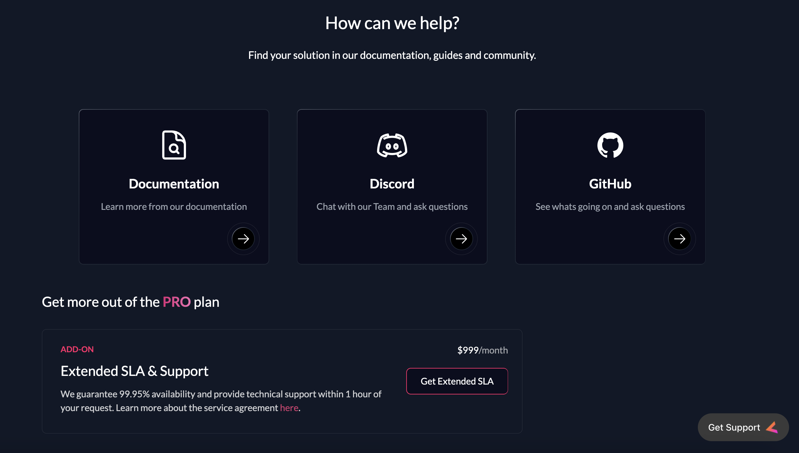
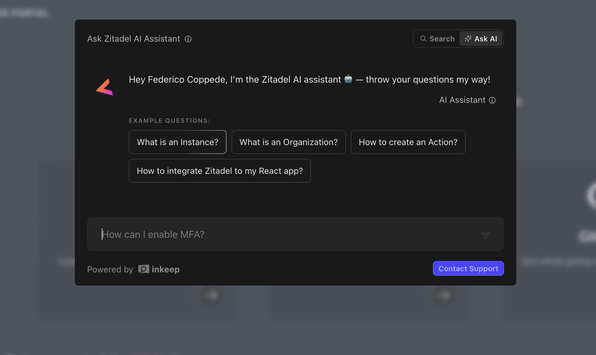
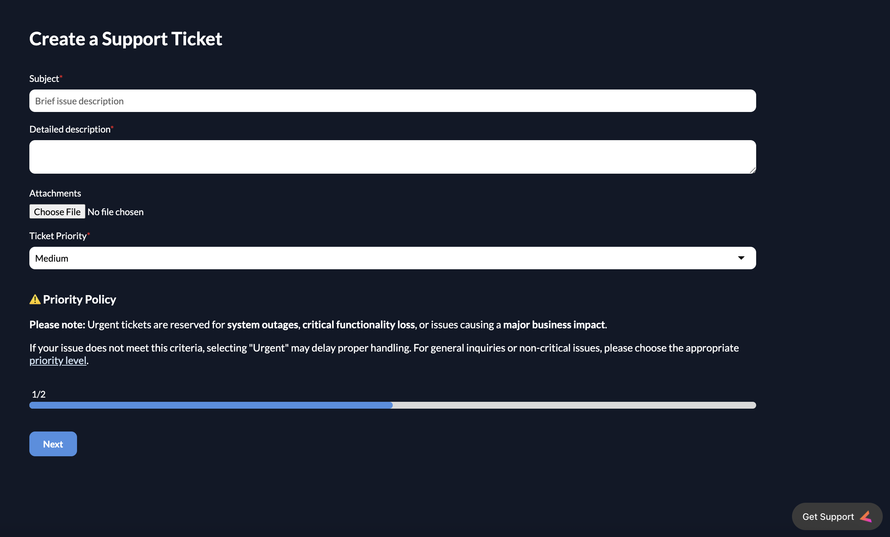
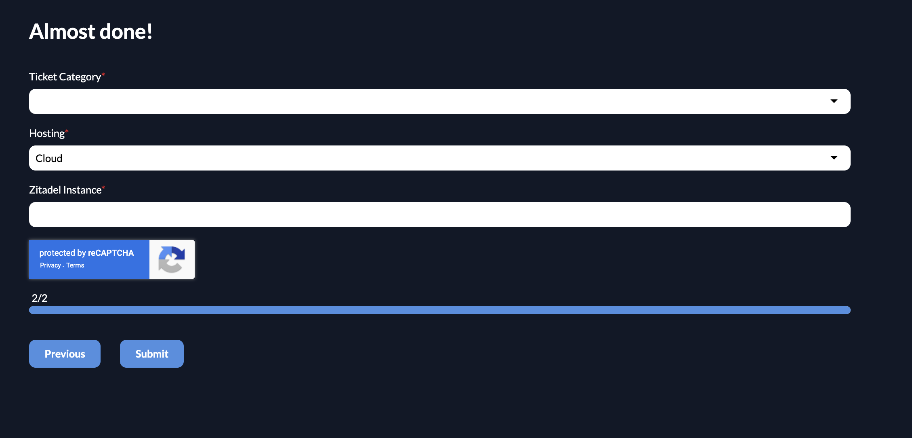
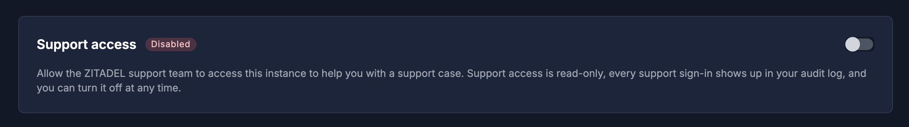

<Callout>
We describe our [support services](/legal/service-description/support-services) and information required in more detail in our legal section. Beware that not all features may be supported by your subscription and consult the [support states](https://help.zitadel.com/zitadel-support-states).
</Callout>

## General

We always recommend first having a look at our [documentation](https://zitadel.com/docs), [discord chat](https://zitadel.com/chat) and [GitHub repository](https://github.com/zitadel/zitadel). You can also ask our AI assistant for help before contacting Support.

## Support Request

Create a new support request with the following information:
- Subject
- Detailed description
- Attachments (Optional)
- Ticket Priority
- Ticket Category
- Hosting
- Affected Instance (Only for cloud instances)
- Database Version (Only for self-hosted instances)

After submitting the form, you will receive a confirmation email, and our team will be in touch with you shortly.

## Instance Access for Troubleshooting

To help troubleshoot issues, you can grant our support staff direct access to your instance to review logs, check settings, and provide configuration fixes. This feature is available exclusively to **Cloud customers on a Pro or Enterprise plan**.

Support access is disabled by default. When enabled, it creates a dedicated Identity Provider (IdP) that strictly limits access to ZITADEL support staff.

**How to enable support access:**
1. Navigate to the **Customer Portal** and go to **Instances**.
2. Select the instance that requires support.
3. Turn on the **Support access** toggle.

<Callout type="warning">
**Important:** You must manually disable the **Support access** toggle once the troubleshooting activity is complete to revoke staff access.
</Callout>

<Callout type="info">
If you have an active subscription, we recommend linking your GitHub and Discord accounts in the [customer portal support section](https://zitadel.com/admin/support). This helps us prioritize your GitHub issues and Discord threads more effectively.
</Callout>
