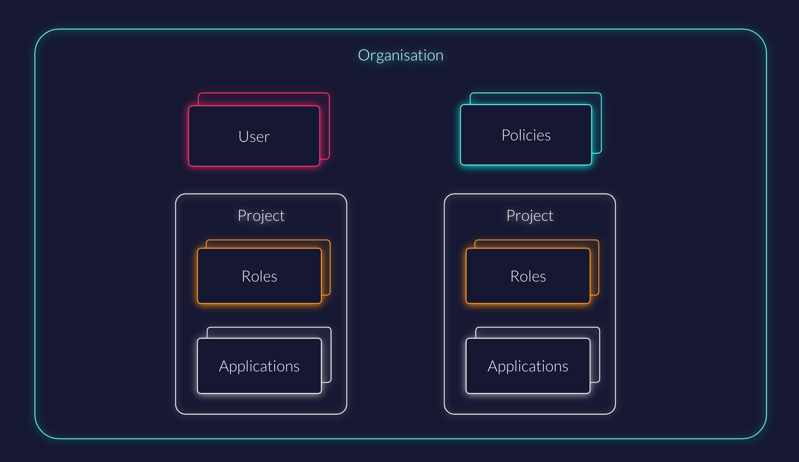

## Overview

ZITADEL is organized around the idea of multi-tenancy. An **Organization** is the vessel where your projects and users live. It is comparable to a tenant in a SaaS system or an organizational unit (OU) in a directory-based system.

Key characteristics of Organizations in ZITADEL include:

* **Multi-tenancy:** Multiple organizations can be managed within one [instance](/concepts/structure/instance).
* **Isolation:** Users and data from one organization are separated from others.
* **Delegation:** Organizations can grant each other rights to self-manage certain aspects of the IAM (e.g., roles for access management).

In a B2B use case, an organization typically represents a business partner who requires their own branding, specific access settings, or distinct federated login providers.



## Structure and Delegation

### Projects within Organizations
You can use **Projects** within your organization to manage the security context of closely related components, such as roles, grants, and authorizations for multiple applications. You can set up multiple projects within a single organization.

### Project Grants
ZITADEL allows you to give *other* organizations permission to manage certain aspects of a project within *your* organization.

For example, you could set up a project with roles that define access to your software, but allow a partner organization to allocate those roles to their own users independently. As a service provider, this allows you to establish a self-service culture for your business customers.


## Managing Organizations

### Create a new organization

To create a new organization, click on the organizations dropdown in the Management Console and select **New organization**.

You have two options regarding the initial administrator:
1.  **Current User:** Create the organization with your currently logged-in user as the organization manager. A membership for the new organization will be added to your account.
2.  **New Account:** Directly create a new account to manage the organization.


### Self-Service Registration
If you want to enable your customers to create organizations themselves, ZITADEL provides a built-in registration form at:
`https://$CUSTOM-DOMAIN/ui/login/register/org`

The customer simply fills in the organization name and contact details to get started.


### Default Organization
On the **Default settings** page (`${CUSTOM_DOMAIN}`/ui/console/orgs), you can designate a specific organization as the "Default".
* Click the **...** on the right-hand side of the table and select **Set as default organization**.
* The current default is marked by a "Default" label.

When no specific organization is selected (e.g., during an auth request or via [Domain Discovery](/guides/solution-scenarios/domain-discovery)), users are directed to this default organization for login and self-registration.

## Usernames and Domains

Each organization has its own pool of users, covering both users and service accounts. How these users authenticate depends on your domain settings.

### Login Name Formats
By default, if the setting **User Loginname must contain orgdomain** is **disabled**, usernames are unique across the entire instance.

If you require usernames to be scoped to the organization (common in multi-tenant setups), you can enable **User Loginname must contain orgdomain** in your [Domain settings](./default-settings#domain-settings). Login names will then follow the format:

`{username}@{domainname}.{zitadeldomain}`

**Example:**
If a user has the username `john.doe` in an organization with the domain `acme`, the generated login name is:
`john.doe@acme.zitadel.cloud`

### Custom Domain Names
You can verify your own domain names (e.g., `acme.ch`) to simplify the user experience. Once verified:
1.  ZITADEL generates additional login names for users.
2.  The user `john.doe` can log in via `john.doe@acme.ch` OR `john.doe@acme.zitadel.cloud`.

<Callout type="info">
Only one user with the username `john.doe` can exist within the organization `ACME`, regardless of which domain suffix they use to log in.
</Callout>

### Organization Domain
An organization can have multiple domain names, but only one is configured as the **Organization Domain**. The Organization Domain determines:
* Which login name is displayed to the user in the UI.
* What information is asserted in `access_tokens` (specifically the `preferred_username` claim).

<Callout type="caution">
Setting an Organization Domain affects users.
If a user `coyote` exists in the global organization with the login name `coyote@acme.ch`, and you subsequently verify `acme.ch` for a specific organization, the global user's login name will be replaced with `coyote@{randomvalue.tld}`. ZITADEL will notify users affected by this change.
</Callout>

## Domain Verification Guide

If the **validate Organization Domains** setting in [Domain Settings](./default-settings#domain-settings) is set to `true`, you must prove ownership of your domain via DNS or HTTP challenge.

<Callout type="info">
You can disable domain verification requirements in the [default settings](/guides/manage/console/default-settings#domain-settings) if you are running a self-hosted instance and do not require strict validation.
</Callout>

1.  Navigate to your **Organization Settings**.
2.  Select the menu entry **Organization Domains**.
3.  Click on the domain name you wish to verify. A dialog will appear offering DNS or HTTP challenge methods.


4.  **DNS Challenge Example:** Create a TXT record with your DNS provider using the value provided by ZITADEL.
    * [Cloudflare Guide](https://www.zoho.com/mail/help/adminconsole/cloudflare.html#alink1)
    * [Squarespace Guide](https://support.squarespace.com/hc/en-us/articles/205812388-Domain-verification-with-a-TXT-Record-alternative-method-)
    * [Name.com Guide](https://www.name.com/support/articles/115004972547-adding-a-txt-record)
    * [EasyDNS Guide](https://kb.easydns.com/knowledge/how-to-make-a-dns-entry/)

5.  Once verified, click **Verify**.
6.  (Optional) Click **Set as primary** to make this the default domain for user login names.

<Callout type="caution">
Do not delete the DNS verification record after success. ZITADEL re-checks domain ownership periodically.
</Callout>

## Organization Settings

Organizations can inherit settings from the instance defaults or override them with specific policies. Settings configured at the Organization level take priority over Default settings.

* [**Login Behavior and Access**](./default-settings#login-behavior-and-access): MFA options, passwordless authentication rules, and session lifetimes.
* [**Identity Providers**](./default-settings#identity-providers): Configure IDPs available specifically for this organization.
* [**Password Complexity**](./default-settings#password-complexity): Specific requirements for passwords (length, symbols, etc.).
* [**Lockout**](./default-settings#lockout): Max login attempts before an account is locked.
* [**Branding**](./default-settings#branding): Custom appearance for the login interface.
* [**Message Texts**](./default-settings#message-texts): Custom text and internationalization for emails.
* [**Login Interface Texts**](./default-settings#login-interface-texts): Custom text for the login UI.
* [**External Links**](./default-settings#external-links): Links to your specific Terms of Service, Privacy Policy, and Support.

### Applying Custom Branding
To apply a custom design (e.g., for a specific B2B customer):
1.  Navigate to the Organization settings.
2.  Configure the **Branding** section.
3.  Ensure the **Login Behavior** on your **Project** is configured to allow organization-specific branding. Read more about project branding [here](./projects-overview#branding).

### Triggering Organization Context
When a user begins the login process, ZITADEL automatically determines the user's organization based on their entered login name and redirects them to the appropriate organization context. Users cannot select their organization manually.

By default, the ZITADEL Login uses the instance default settings. To trigger the specific settings (and branding) of an organization, you must provide the organization scope in your authentication request:

```bash
urn:zitadel:iam:org:id:{id}
```

This value is a [reserved scope](/apis/openidoauth/scopes#reserved-scopes) within ZITADEL.
