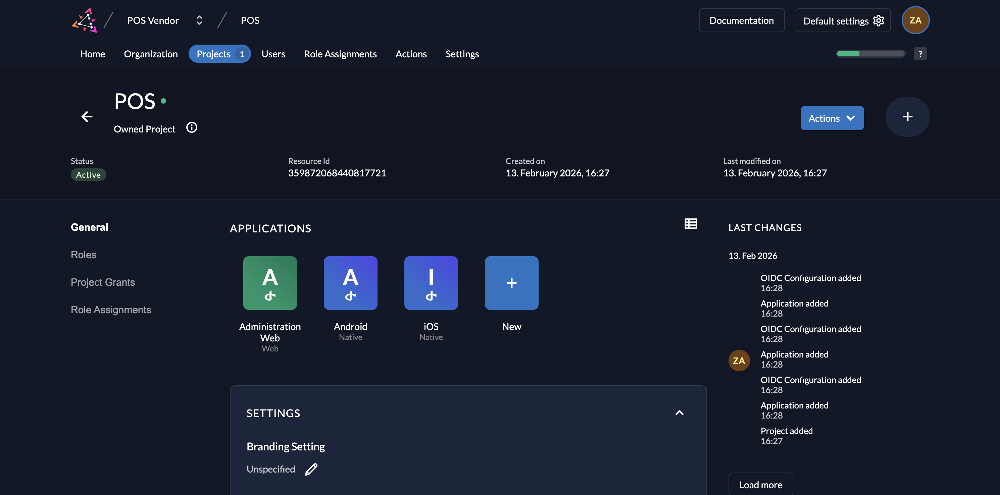
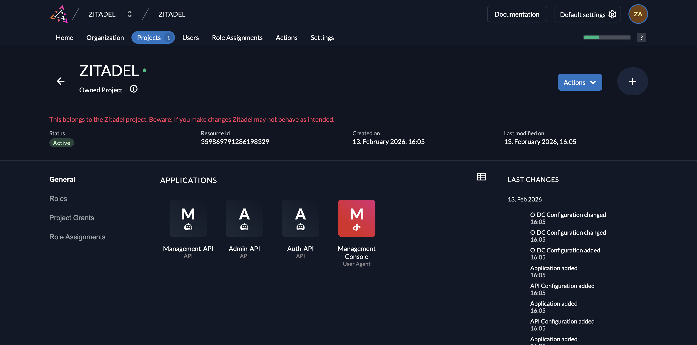

import ProjectDescription from "../../../concepts/structure/_project_description.mdx";

## What is a project?

<ProjectDescription components={props.components} name="ProjectDescription" />

A Project is the vessel that holds your Applications and Roles. It defines the security context for a specific software solution.

### Example Scenario
Imagine you are building a **Point of Sales (POS)** platform. In ZITADEL, you would create one Project (e.g., named `POS`).
* **Applications:** Your web portal for administration, your iOS app, and your Android app would all be defined as **Applications** within this single Project.
* **Roles:** You would create **Roles** (e.g., `admin`, `cashier`, `viewer`) inside this Project.
* **Role assignment:** All applications in this project share these roles, allowing you to create unified role assignments for your users across all platforms.

## Core Components

### Applications
Applications define the different clients (web apps, native mobile apps, server-side APIs) that share the same roles and security context.
At the moment, we support OIDC and almost every OAuth2 client. We'll be expanding this with SAML shortly.
Go to [Applications](./applications-overview) for more details.

### Roles
A role consists of different attributes, but only the **Key** is relevant to the role assignment and must be unique within the project.
* **Key:** The identifier used in code (e.g., `role.admin`).
* **Display Name:** A human-readable name for the UI.
* **Group:** Enables better handling in the ZITADEL Management Console (e.g., giving a user all roles of a specific group).

Read more about managing roles [here](./roles).

## The Default Project
When creating a new ZITADEL instance, you will find an automatically created project in the first organization.
This **Default Project** (named "ZITADEL") protects the ZITADEL Management Console and APIs.

<Callout type="caution">
We do not recommend changing any settings in the Default Project or using it for your own applications, as this could influence the behavior of ZITADEL itself.
</Callout>

## Create a Project

To create a project:
1.  Navigate to your Organization in the Console.
2.  Go to **Projects** (or visit `https://${CUSTOM_DOMAIN}.zitadel.cloud/ui/console/projects`).
3.  Click the **Create New Project** button.

4.  Enter your project name and continue.

## Granted Projects (B2B)

A powerful feature of ZITADEL is the ability to **Grant** a project to other organizations. This is essential for B2B scenarios where you sell your software to business partners.

* **The Concept:** You enable another organization to use your Project.
* **Delegation:** The granted organization can manage the role assignments of *their own users* for your project. They can assign the roles you defined to their employees without your intervention.
* **Isolation:** You can select specifically which roles are available to the granted organization. This allows you to restrict features (e.g., "Premium" roles) per customer.

Using the POS example above: You could grant the `POS` project to a partner organization. That partner can then log in with their own domain, use their own branding, and manage their own cashier users, all while using your underlying application structure.

### How to Grant a Project

1.  Navigate to the Project you want to share (e.g., `POS`).
2.  In the **Project Grants** section, click **New**.

3.  Enter the **Domain** of the partner organization you want to grant access to.
    * *Tip: If you don't know the domain, navigate to the Organization detail page to find it.*
4.  Search and select the organization.
5.  Select the **Roles** you want to grant to this organization and click **Save**.

## Project Settings

You can customize the behavior of your project, particularly regarding how login screens look and how tokens are issued.

### Branding
If you have different designs for your organizations (Private Labeling), you can define the login behavior on the project detail page.

| Setting                      | Description                                                                                                                                                                                               |
|:-----------------------------|:----------------------------------------------------------------------------------------------------------------------------------------------------------------------------------------------------------|
| **Unspecified**              | If nothing is specified, the system default settings will trigger.                                                                                                                                        |
| **Enforce project's policy** | This forces the branding of the organization that *owns* the project throughout the entire login process. Useful if you want your users to always see *your* brand, even if they belong to a partner org. |
| **Allow login user policy**  | The login starts with the project's branding. However, as soon as the user is identified (e.g., by entering their email), the branding switches to match the user's organization.                         |

In a B2B use case, you would typically use **Allow login user policy**. If you want to skip the detection step, you can preselect an organization using the [Organization Domain scope](/apis/openidoauth/scopes#reserved-scopes) (e.g., `urn:zitadel:iam:org:domain:primary:{domainname}`).

### Role Settings
You can configure strict security checks regarding roles during authentication.

* **Assert Roles on Authentication:** Role information is sent from the Userinfo endpoint (and in tokens, depending on app settings).
* **Check Role Assignment on Authentication:** Users are **only** allowed to log in if they have at least one role assigned for this project. If they have no roles, access is denied immediately.
* **Check for Project on Authentication:** Checks if the user's organization actually has a grant for this project. If not, the user cannot be authenticated.

### Roles in Tokens
If you want roles to appear directly inside your Access or ID Tokens (to avoid calling the Userinfo endpoint), you must enable this per application.

1.  Navigate to your **Application**.
2.  Open **Token Settings**.
3.  Check **Assert Roles on Authentication**.

You can learn more about Application and Token settings [here](./applications-overview).
