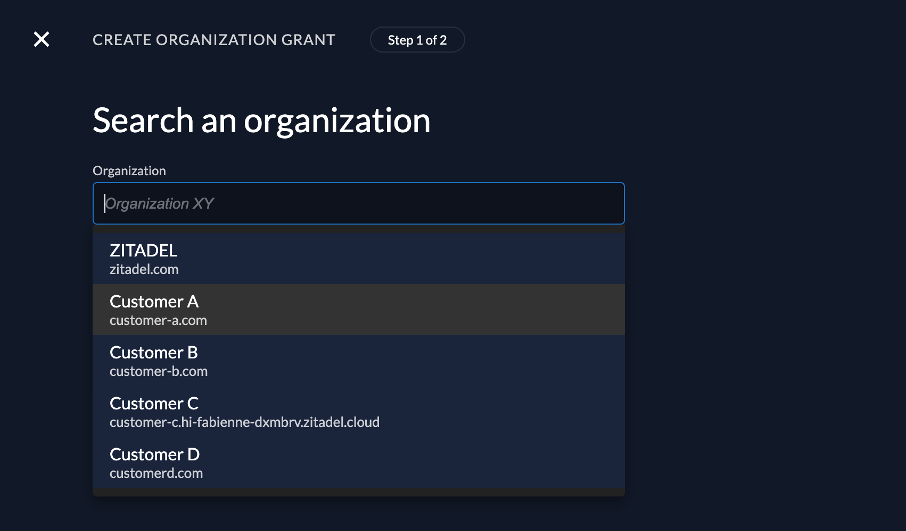

ZITADEL includes a management console that allows Administrators to configure all resources. All uses, including end-users, by default, view and manage their profile information.
In some use cases you want to prevent users from accessing the management console, this could be:
- User management is integrated into your own app
- Users login via SSO and should not be able to change their data in the Management Console
- Only administrators should be able to access Management Console to manage their users

At the moment it is not possible to simply disable the Management Console, but with the settings described in this guide, you can prevent users from accessing the Console.

## Self-hosted

If you are running ZITADEL self-hosted, we recommend restricting the access to ZITADEL Management Console via WAF/reverse-proxy for Non-Administrator users

## ZITADEL Cloud (and self-hosted)

### Default redirect url

One goal is to never send the end user to the ZITADEL management console.
This does make sense if you build your own user profile page within your application.
In that case you probably want to redirect the user to your own application, instead of to the console.

Read more about how to set the default redirect URI: [Settings - Default Redirect URI](/guides/manage/console/default-settings#default-redirect-uri)

### Restricting Management Console in default-project

With this workaround, you will limit users from accessing the [default-project](/guides/manage/console/projects-overview#the-default-project) if they are not explicitly granted to use this project.
When setting the "Check for Project on Authentication" setting on a project, only users of organizations with a grant to that project can access it.
By default, this setting is disabled, so all users can access the project.


Start by granting the organization of your administrators that should be able to access the Management Console, the [default project](/guides/manage/console/projects-overview#the-default-project):

1. Click on the default-project > Grants > New +
   

2. On the next screen select the organization to which you want to give the grant
  

3. You can skip the screen with the role selection and click save
4. Make sure the grant is in now in the overview and marked as active.

To avoid accidental lock-out, the [default project](/guides/manage/console/projects-overview#the-default-project) hides the checkbox "Check Project on Authentication" in the Management Console:


You need to use the [update project API call](/reference/api/management/zitadel.management.v1.ManagementService.UpdateProject) to set the settings on the project.

First, you need a user with administrator permissions to change the project settings in that organization.
This means either you add the manager to the organization or you use an administrator on the instance level with "IAM-OWNER" permissions.
After that create a Personal Access Token (PAT) for the administrator.

More detailed information about creating a PAT and administrator roles you can find [here](/guides/integrate/service-accounts/personal-access-token)

Then you have to send the following request:
```bash
curl -L -X PUT "https://${CUSTOM_DOMAIN}/management/v1/projects/${PROJECT_ID}" \
-H 'Content-Type: application/json' \
-H 'Accept: application/json' \
-H "Authorization: Bearer ${PAT}" \
--data-raw '{
  "name": "ZITADEL",
  "projectRoleAssertion": false,
  "projectRoleCheck": false,
  "hasProjectCheck": true,
  "privateLabelingSetting": "PRIVATE_LABELING_SETTING_UNSPECIFIED"
}'
```

Where
- `${CUSTOM_DOMAIN}` is your Custom Domain, f.e. mydemo.zitadel.cloud
- `${PAT}` is your service account's personal access token
- `${PROJECT_ID}` is the default-project's ID that can be found in Management Console see screenshot above

You should now be able to log in with users of the organization that have the grant (in this example users of the organization "Customer-A").
All other users should see the following error message after authentication:


