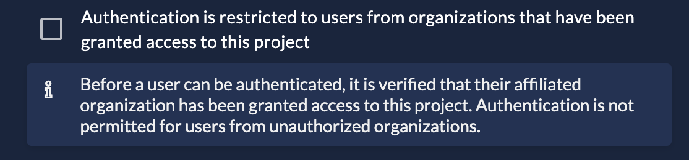
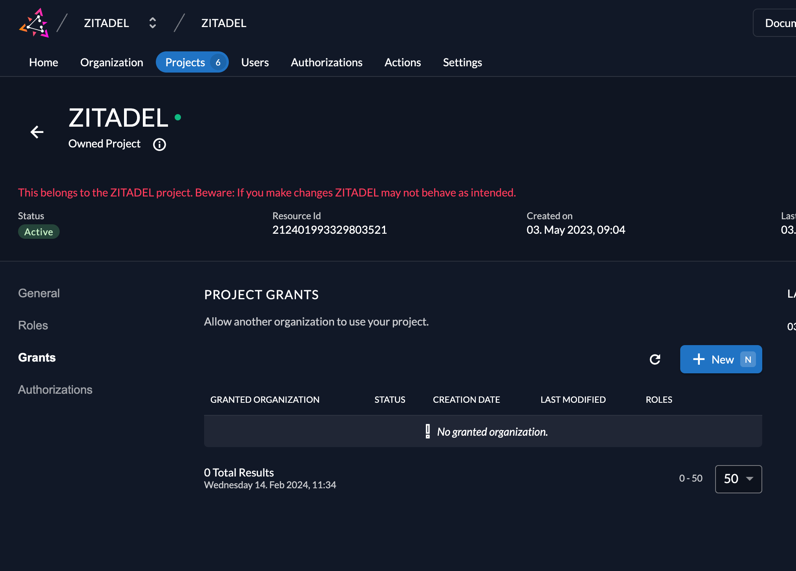
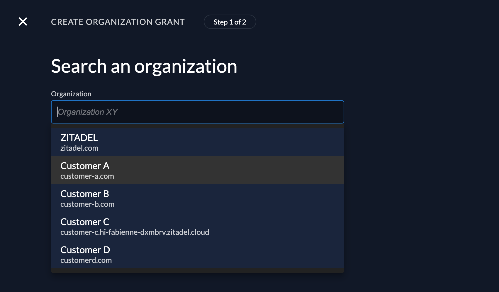
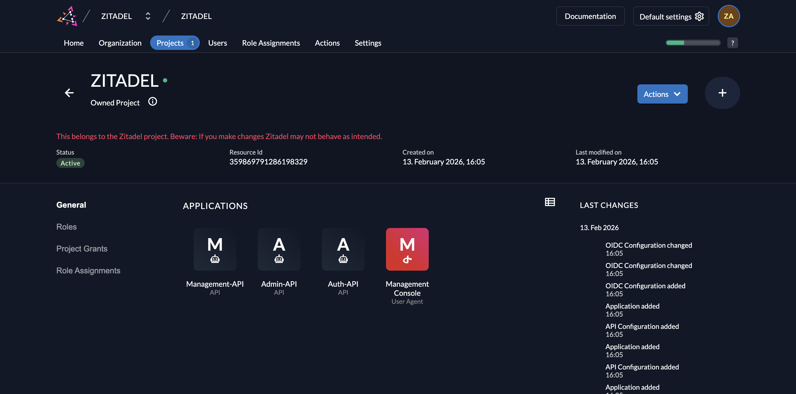
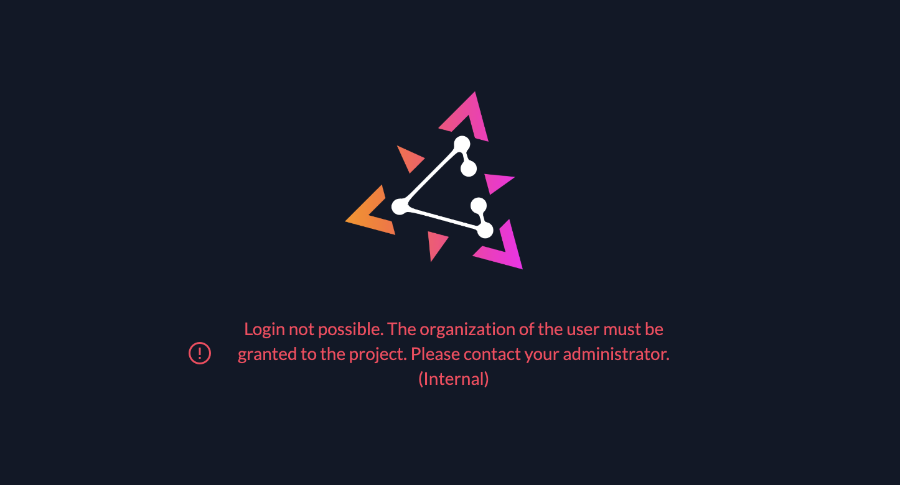

ZITADEL includes a Management Console that allows administrators to configure all resources. By default, all users, including end users, can view and manage their profile information.
In some cases, you may want to prevent users from accessing the Management Console. Common reasons include:
- User management is integrated into your own application.
- Users log in via SSO and should not be able to change their data in the Management Console.
- Only administrators should be able to access the Management Console to manage users.

While it is not currently possible to completely disable the Management Console, you can prevent users from accessing it by following the strategies described in this guide.

## Self-hosted

If you are running a self-hosted instance of ZITADEL, we recommend restricting access to the Management Console via a Web Application Firewall (WAF) or reverse proxy for non-administrator users.

## ZITADEL Cloud (and self-hosted)

### Default redirect URI

One goal is to never send the end user to the ZITADEL Management Console.
This is particularly useful if you have built your own user profile page within your application.
In such cases, you likely want to redirect users to your own application instead of the console.

Read more about how to set the default redirect URI: [Settings - Default Redirect URI](/guides/manage/console/default-settings#default-redirect-uri)

<PreventLockout />

### Restricting Management Console in default-project

With this workaround, you will limit users from accessing the [default-project](/guides/manage/console/projects-overview#the-default-project) if they are not explicitly granted access to it.
When enabling the "**Authentication is restricted to users from organizations that have been granted access to this project**" setting on a project, only users from organizations with a Project Grant for that project can access it.
By default, this setting is disabled, so all users can access the project.

<Callout type="info">
  Before a user can be authenticated, it is verified that their affiliated organization has been granted access to this project. Authentication is not permitted for users from unauthorized organizations.
</Callout>



Start by granting the organization of your administrators access to the ZITADEL project (default project):
<Steps>

  <Step>
    1. Go to the **ZITADEL** project, select **Project Grants**, and click **New**.
    
   </Step>

  <Step>
    Select the organization you want to grant access to.
    
  </Step>

  <Step>
    You can skip the role selection and click **Save**.
  </Step>

  <Step>
    Ensure the grant appears in the overview and is marked as **Active**.
  </Step>
</Steps>

To avoid accidental lockout, the [default project](/guides/manage/console/projects-overview#the-default-project) hides the "**Authentication is restricted to users from organizations that have been granted access to this project**" checkbox in the Management Console:


You need to use the [Update Project API](/reference/api/management/zitadel.management.v1.ManagementService.UpdateProject) to configure this setting on the project.

First, you need a user with administrator permissions to change the project settings in that organization.
This means either you add the Administrator to the organization or you use an administrator on the instance level with `IAM-OWNER` permissions.
After that, create a Personal Access Token (PAT) for the administrator.

More detailed information about creating a PAT and Administrator Roles can be found [here](/guides/integrate/service-accounts/personal-access-token).

Then, send the following request:
```bash
curl -L -X PUT "https://${CUSTOM_DOMAIN}/management/v1/projects/${PROJECT_ID}" \
-H 'Content-Type: application/json' \
-H 'Accept: application/json' \
-H "Authorization: Bearer ${PAT}" \
--data-raw '{
  "name": "ZITADEL",
  "projectRoleAssertion": false,
  "projectRoleCheck": false,
  "hasProjectCheck": true,
  "privateLabelingSetting": "PRIVATE_LABELING_SETTING_UNSPECIFIED"
}'
```

Where:
- `${CUSTOM_DOMAIN}` is your custom domain (e.g., `mydemo.zitadel.cloud`).
- `${PAT}` is the administrator's Personal Access Token.
- `${PROJECT_ID}` is the default project's ID, which can be found in the Management Console (see screenshot above).

<Callout type="info">
  You can also use the [V2 Update Project API](/reference/api/project/zitadel.project.v2.ProjectService.UpdateProject) to perform this action.
</Callout>

You should now be able to log in with users of the organization that have the Project Grant (in this example, users of the organization "Customer-A").
All other users should see the following error message after authentication:



