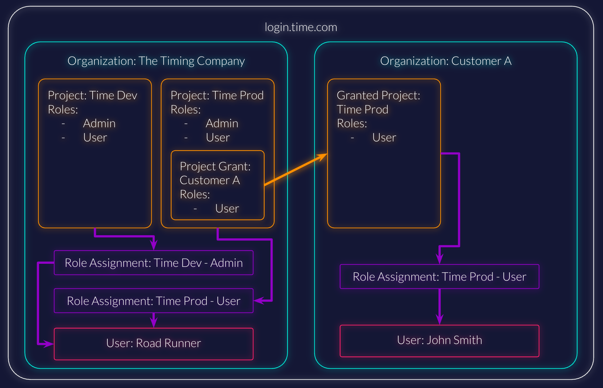

This is an example architecture for a typical SaaS product.
To illustrate it, a fictional organization and project is used.

## Example Case

The Timing Company has a product called Time.
They have two environments, the development and the production environment.
In this case Time uses authentication and authorizations from ZITADEL.
This means that the users and also their authorizations will be managed within ZITADEL.

## Organization

An organization is the ZITADEL resource that contains users, projects, applications, policies and so on.
The organization manages the projects and users.
You need at least one organization for your own company, in our case "The Timing Company."
Your next step is to create an organization for each of your customers.

## Project

The idea of projects is to have a vessel for all components who are closely related to each other.

In this use case, we would have two different projects, one each for the Development and Production environments.
Let us call them "Time Dev" and "Time Prod". These projects should be created in "The Timing Company" organization.

In the project you will configure all your roles and applications (clients and APIs).

### Project Settings

Enable the `check roles on authentication` setting on the project, if you want to restrict access to users that do not have the correct access for the project.

### Project Grant

To grant a customer permission to a project, a project grant to the customer's organization is needed (search the granted organization by its domain).
It is also possible to delegate only specific roles of the project to a certain customer.
As soon as a project grant exists, the customer will see the project in the granted projects section of their organization and will be able to assign roles to their own users to the given project.

## Role Assignments

To give a user permission to a project, a role assignment is needed.
All organizations that own projects or received a grant can assign roles to users to have access to projects.
It is also possible to assign roles to users outside the own company if the exact login name of the user is known.

## Project Login

There are some different use cases how the login should behave and look like:

1. Restrict Organization

With the Organization Domain scope the organization will be restricted to the requested domain, this means only users of the requested organization will be able to log in.
The private labeling (branding) and the login policy of the requested organization will be set automatically.

<Callout>
More about the [Scopes](/apis/openidoauth/scopes)
</Callout>

2. Show private labeling (branding) of the project organization

You can configure on project-level which branding should be shown to users.
In the default the design of the instance will be shown, but as soon as the user is identified, the policy of the users organization (if specified) will be triggered.
If the setting is set to `Ensure Project Resource Owner Setting`, the private labeling of the project organization will always be triggered.
The last possibility is to show the private labeling of the project organization, and as soon as the user is identified, the user organization settings will be triggered.
For this the Allow User Resource Owner Setting should be set.
<Callout>
More about [Private Labeling](/guides/manage/customize/branding)
</Callout>
