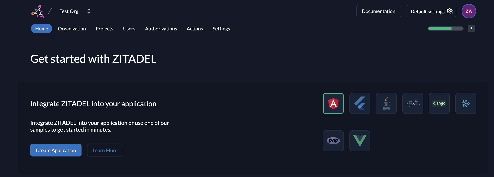

import { Frameworks } from "@/components/frameworks";

You can integrate Zitadel quickly into your application and be up and running within minutes.
To achieve your goals as fast as possible, we provide you with SDKs, Example Repositories and Guides.

The SDKs and integration depend on the framework and language you are using.

## Choose an integration lane

For most new integrations, follow this route first:

1. Start with [OIDC](/guides/integrate/login/oidc) for standards-based user login.
2. Add the [Session API](/guides/integrate/login-ui) when you need embedded or fully custom login UX.
3. Stage [SAML](/guides/integrate/login/saml) and [federation management](/guides/integrate/identity-providers/introduction) only when enterprise requirements demand them.

| Lane | Use it for | Start here | Suggested stage |
| :--- | :--- | :--- | :--- |
| OIDC + Session-first (recommended) | Most web/mobile apps, hosted login, and custom embedded login | [Authentication options](/guides/integrate/login/login-users), [OIDC](/guides/integrate/login/oidc), [Login UI / Session API](/guides/integrate/login-ui) | Stage 1 |
| SAML protocol integration | Existing enterprise SAML service providers and SSO migrations | [SAML guide](/guides/integrate/login/saml) | Stage 2 |
| Federation management | Connecting external IdPs (B2B/B2E) and managing social/enterprise federation | [Identity providers](/guides/integrate/identity-providers/introduction) | Stage 2-3 |
| Admin and events APIs | Provisioning, automation, operations, and audit/event export | [Access ZITADEL APIs](/guides/integrate/zitadel-apis/access-zitadel-apis), [Event API](/guides/integrate/zitadel-apis/event-api) | Stage 2-3 |

<Callout>
In addition to our officially maintained examples, we also list community-contributed implementations.
These examples are provided by external developers and are not maintained by us.
While we believe they can be valuable resources and showcase diverse approaches, we cannot guarantee their completeness, functionality, or continued support.
If you encounter issues with a community-contributed example, please contact the respective maintainers directly.
We provide this list for informational purposes and to foster community engagement, but we do not assume responsibility for these external implementations.
</Callout>

## Clients

<Frameworks filter={(framework) => framework.client === true } />

## SDKs

<Frameworks filter={(framework) => framework.sdk === true } />

## Official JavaScript SDK packages

For JavaScript/TypeScript integrations, ZITADEL provides official SDK packages that cover frontend frameworks and server adapters:

Canonical lane taxonomy is `auth/*`, `api/*`, and `actions/*`, plus root/core primitives.

- `@zitadel/zitadel-js`: framework-agnostic core helpers (OIDC/PKCE primitives, transport/client factories, token helpers, webhook verification).
- `@zitadel/react`: React context/hooks/components for auth state composition in browser apps.
- `@zitadel/nextjs`: Next.js App Router helpers for OIDC login (`auth/oidc`), custom Login UI/session flows (`auth/session`), v2 API access (`api`), and Actions v2 webhooks (`actions/webhook`, `webhook` compatibility alias).
- `@zitadel/angular`: Angular provider/guard/interceptor-oriented SDK surface for browser integrations.

### SPA boundary guidance (React/Angular/Vue/etc.)

For SPAs, keep UI concerns in the browser and move sensitive auth/API steps to a server or BFF:

- **Browser app:** route guards, login button UX, non-sensitive session display.
- **Server/BFF:** callback handling, authorization code exchange side effects, confidential credentials, token introspection, webhook verification, and management API calls.

In-repo official SDK example scope is currently Next.js-only:

- Next.js SDK example app: `examples/nextjs`
- Next.js SDK playground: `tests/nextjs-sdk-playground`

Use-case guides:

- [Build your own Login UI](/guides/integrate/login-ui/login-app)
- [Access ZITADEL APIs](/guides/integrate/zitadel-apis/access-zitadel-apis)
- [Verify Actions payload integrity](/guides/integrate/actions/testing-request-signature)

## Resources

<Frameworks filter={(framework) => framework.client === false || framework.client == null} />

To further streamline your setup, simply visit the management console in Zitadel where you can select one of the languages or frameworks. This will allow you to instantly set up the settings for that specific sample in Zitadel, ensuring you have everything you need to get started right away.



To begin configuring login for any of these samples, start [here](/guides/manage/console/console-overview).

## OIDC Libraries

OIDC is a standard for authentication and most languages and frameworks do provide a OIDC library which can be easily integrated to your application.
If we do not provide a specific example, SDK or guide, we strongly recommend using existing authentication libraries for your
language or framework instead of building your own.
Certified libraries have undergone rigorous testing and validation to ensure high security and reliability.
There are many recommended libraries available, this saves time and ensures that users' data is well-protected.

You might want to check out the following links to find a good library:

- [awesome-auth](https://github.com/casbin/awesome-auth)
- [OpenID General References](https://openid.net/developers/libraries/)
- [OpenID certified developer tools](https://openid.net/certified-open-id-developer-tools/)

## Other example applications

- [B2B customer portal](https://github.com/zitadel/zitadel-nextjs-b2b): Showcase the use of personal access tokens in a B2B environment. Uses Next.js Framework.
- [Frontend with backend API](https://github.com/zitadel/example-quote-generator-app): A simple web application using a React front-end and a Python back-end API, both secured using Zitadel
- [Introspection](https://github.com/zitadel/examples-api-access-and-token-introspection): Python examples for securing an API and invoking it as a service account
- [Fine-grained authorization](https://github.com/zitadel/example-fine-grained-authorization): Leverage actions, custom metadata, and claims for attribute-based access control

Search for the "example" tag in our repository to [explore all examples](https://github.com/search?q=topic%3Aexamples+org%3Azitadel&type=repositories).

## Missing SDK

Is your language/framework missing? Fear not, you can generate your gRPC API Client with ease.

1. Make sure to install [buf](https://buf.build/docs/installation/)
2. Create a `buf.gen.yaml` and configure the [plugins](https://buf.build/plugins) you need
3. Run `buf generate https://github.com/zitadel/zitadel#format=git,tag=v2.23.1` (change the versions to your needs)

Let us make an example with Ruby. Any other supported language by buf will work as well. Consult
the [buf plugin registry](https://buf.build/plugins) for more ideas.

### Example with Ruby

With gRPC, we usually need to generate the client stub and the messages/types. This is why we need two plugins.
The plugin `grpc/ruby` generates the client stub and the plugin `protocolbuffers/ruby` takes care of the messages/types.

```yaml
version: v1
plugins:
  - plugin: buf.build/grpc/ruby
    out: gen
  - plugin: buf.build/protocolbuffers/ruby
    out: gen
```

If you now run `buf generate https://github.com/zitadel/zitadel#format=git,tag=v2.23.1` in the folder where
your `buf.gen.yaml` is located you should see the folder `gen` appear.

If you run `ls -la gen/zitadel/` you should see something like this:

```bash
ffo@ffo-pc:~/git/zitadel/ruby$ ls -la gen/zitadel/
total 704
drwxr-xr-x 2 ffo ffo   4096 Apr 11 16:49 .
drwxr-xr-x 3 ffo ffo   4096 Apr 11 16:49 ..
-rw-r--r-- 1 ffo ffo   4397 Apr 11 16:49 action_pb.rb
-rw-r--r-- 1 ffo ffo 141097 Apr 11 16:49 admin_pb.rb
-rw-r--r-- 1 ffo ffo  25151 Apr 11 16:49 admin_services_pb.rb
-rw-r--r-- 1 ffo ffo   6537 Apr 11 16:49 app_pb.rb
-rw-r--r-- 1 ffo ffo   1134 Apr 11 16:49 auth_n_key_pb.rb
-rw-r--r-- 1 ffo ffo  32881 Apr 11 16:49 auth_pb.rb
-rw-r--r-- 1 ffo ffo   6896 Apr 11 16:49 auth_services_pb.rb
-rw-r--r-- 1 ffo ffo   1571 Apr 11 16:49 change_pb.rb
-rw-r--r-- 1 ffo ffo   2488 Apr 11 16:49 event_pb.rb
-rw-r--r-- 1 ffo ffo  14782 Apr 11 16:49 idp_pb.rb
-rw-r--r-- 1 ffo ffo   5031 Apr 11 16:49 instance_pb.rb
-rw-r--r-- 1 ffo ffo 223348 Apr 11 16:49 management_pb.rb
-rw-r--r-- 1 ffo ffo  44402 Apr 11 16:49 management_services_pb.rb
-rw-r--r-- 1 ffo ffo   3020 Apr 11 16:49 member_pb.rb
-rw-r--r-- 1 ffo ffo    855 Apr 11 16:49 message_pb.rb
-rw-r--r-- 1 ffo ffo   1445 Apr 11 16:49 metadata_pb.rb
-rw-r--r-- 1 ffo ffo   2370 Apr 11 16:49 object_pb.rb
-rw-r--r-- 1 ffo ffo    621 Apr 11 16:49 options_pb.rb
-rw-r--r-- 1 ffo ffo   4425 Apr 11 16:49 org_pb.rb
-rw-r--r-- 1 ffo ffo   8538 Apr 11 16:49 policy_pb.rb
-rw-r--r-- 1 ffo ffo   8223 Apr 11 16:49 project_pb.rb
-rw-r--r-- 1 ffo ffo   1022 Apr 11 16:49 quota_pb.rb
-rw-r--r-- 1 ffo ffo   5872 Apr 11 16:49 settings_pb.rb
-rw-r--r-- 1 ffo ffo  20985 Apr 11 16:49 system_pb.rb
-rw-r--r-- 1 ffo ffo   4784 Apr 11 16:49 system_services_pb.rb
-rw-r--r-- 1 ffo ffo  28759 Apr 11 16:49 text_pb.rb
-rw-r--r-- 1 ffo ffo  24170 Apr 11 16:49 user_pb.rb
-rw-r--r-- 1 ffo ffo  13568 Apr 11 16:49 v1_pb.rb
```

Import these files into your project to start interacting with Zitadel's APIs.
