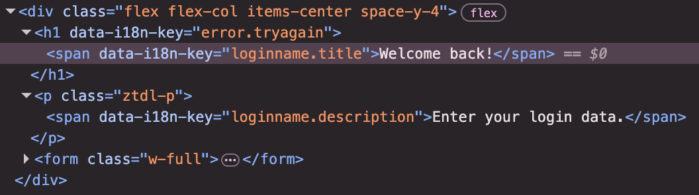

# ZITADEL Login Application

A Next.js-based login application implementing ZITADEL's authentication flow with comprehensive multi-factor authentication support.

## Quick Start

### Prerequisites

- Node.js 18+ and pnpm
- ZITADEL instance running (can be local or remote)

## Developing Your Own ZITADEL Login UI

We think the easiest path of getting up and running, is the following:

1. Fork and clone this repository
2. Rename the file .github/dependabot.example.yml to .github/dependabot.yml so you don't miss version and security updates.
3. [Run the ZITADEL Cloud login UI locally](#development-setup)
4. Make changes to the code and see the effects live on your local machine
5. Study the rest of this README.md and get familiar and comfortable with how everything works.
6. Decide on a way of how you want to build and run your login UI.
   You can reuse ZITADEL Clouds way.
   But if you need more freedom, you can also import the packages you need into your self built application.

The `@zitadel/client` package is using [@connectrpc/connect](https://github.com/connectrpc/connect-es#readme).

You can read the [contribution guide](/CONTRIBUTING.md) on how to contribute.
Questions can be raised in our [Discord channel](https://discord.gg/erh5Brh7jE) or as
a [GitHub issue](https://github.com/zitadel/typescript/issues).

### Development Setup

1. **Install dependencies:**

   ```bash
   pnpm install
   ```

2. **Set environment variables:**
   Create a `.env.local` file in the `apps/login` directory:

   ```env
   # Required: ZITADEL API endpoint
   ZITADEL_API_URL=https://your-zitadel-instance.com
   # For local development:
   # ZITADEL_API_URL=http://localhost:8080

   # Required: Service user token for API authentication
   ZITADEL_SERVICE_USER_TOKEN="your-service-user-token"

   # Optional: Enable email verification check
   EMAIL_VERIFICATION=true

   # Optional: Enable debug mode (prevents auto-redirect from root)
   DEBUG=true

   # Optional: Custom port (default: 3000)
   PORT=3001

   # Optional: Base path for the application (useful for reverse proxies)
   NEXT_PUBLIC_BASE_PATH=/ui/v2/login
   ```

3. **Run the development server:**

   ```bash
   # From project root
   pnpm dev

   # Or specifically for login app
   cd apps/login
   pnpm dev
   ```

4. **Access the application:**
   - Local: `http://localhost:3000`
   - The app will auto-redirect to `/loginname` unless `DEBUG=true`

### Production Build

```bash
# Build the application
pnpm build

# Start production server
pnpm start
```

### Testing

```bash
# Run unit tests
pnpm test

# Run unit tests in watch mode (for development)
pnpm test:watch

# Run unit tests with coverage
pnpm test:coverage

# From project root, run login app tests specifically
pnpm --filter=@zitadel/login test
```

## Application Architecture

This login application is implemented as a **state machine** with multiple pages handling different authentication steps. Each page represents a state in the authentication flow, with transitions based on user actions and system policies.

### Custom translations

The new login uses the [SettingsApi](https://zitadel.com/docs/apis/resources/settings_service_v2/settings-service-get-hosted-login-translation) to load custom translations.
Translations can be overriden at both the instance and organization levels.
To find the keys more easily, you can inspect the HTML and search for a `data-i18n-key` attribute, or look at the defaults in `/apps/login/locales/[locale].ts`.


## Complete Login Flow Diagram


## MFA Enforcement Logic

The MFA enforcement is controlled by the `isSessionValid()` function and `checkMFAFactors()` helper:

### Key Decision Points

| Condition                                | Result                | Next Action                    |
| ---------------------------------------- | --------------------- | ------------------------------ |
| IDP authenticated                        | Bypass all MFA        | Complete authentication        |
| Passkey verified (userVerified=true)     | Bypass additional MFA | Complete authentication        |
| `forceMfa` or `forceMfaLocalOnly` = true | Enforce MFA           | Check available methods        |
| MFA not required by policy               | Skip MFA validation   | Complete authentication        |
| Single MFA method available              | Auto-route            | Direct to specific method page |
| Multiple MFA methods                     | User choice           | Show MFA selection page        |
| No methods + MFA forced                  | Setup required        | Force MFA setup                |
| No methods + MFA optional                | Setup optional        | Allow skip with lifetime       |

### MFA Method Routing

| Available Method | Route                  | Description              |
| ---------------- | ---------------------- | ------------------------ |
| TOTP only        | `/otp/time-based`      | Time-based authenticator |
| SMS only         | `/otp/sms`             | SMS verification         |
| Email only       | `/otp/email`           | Email verification       |
| U2F only         | `/u2f`                 | Hardware security key    |
| Multiple methods | `/mfa`                 | User selection page      |
| None (forced)    | `/mfa/set?force=true`  | Required setup           |
| None (optional)  | `/mfa/set?force=false` | Optional setup with skip |

### Session Validation Rules

```typescript
// From /lib/session.ts - isSessionValid()
const isValid =
  sessionNotExpired && (validPassword || validPasskey || validIDP) && mfaRequirementsMet && emailVerifiedIfRequired;
```

#### MFA Requirements Logic:

1. **IDP Bypass**: If `session.factors.intent.verifiedAt` exists → Skip all MFA checks
2. **Policy Check**: Get `forceMfa` or `forceMfaLocalOnly` from login settings
3. **Method Check**: If MFA required → verify at least one configured method is verified
4. **Verification**: Check verification timestamps for: TOTP, OTP_EMAIL, OTP_SMS, U2F

## Page Responsibilities

### Core Authentication Pages

- **`/loginname`**: Username/email input, user discovery, IDP options
- **`/password`**: Password verification, reset password option
- **`/passkey`**: WebAuthn/passkey authentication

### MFA Pages

- **`/mfa`**: MFA method selection (when multiple methods available)
- **`/otp/[method]`**: OTP verification (time-based, SMS, email)
- **`/u2f`**: U2F/WebAuthn second factor verification
- **`/mfa/set`**: MFA setup/registration flow

### Account Management

- **`/accounts`**: Multiple session selection
- **`/register`**: New user registration
- **`/signedin`**: Post-authentication success page

### Utility Pages

- **`/verify`**: Email/phone verification
- **`/device`**: Device authorization flow
- **`/logout`**: Session termination

## Configuration

### Environment Variables

| Variable                     | Description                        | Default | Required |
| ---------------------------- | ---------------------------------- | ------- | -------- |
| `ZITADEL_API_URL`            | ZITADEL API endpoint               | -       | ✅       |
| `ZITADEL_SERVICE_USER_TOKEN` | Service user token for API auth    | -       | ✅       |
| `EMAIL_VERIFICATION`         | Enforce email verification         | `false` | ❌       |
| `DEBUG`                      | Enable debug mode                  | `false` | ❌       |
| `PORT`                       | Custom port for the application    | `3000`  | ❌       |
| `NEXT_PUBLIC_BASE_PATH`      | Base path for reverse proxy setups | -       | ❌       |

### Login Settings (from ZITADEL)

Key settings that affect the flow:

- `forceMfa`: Require MFA for all users
- `forceMfaLocalOnly`: Require MFA for non-IDP users
- `ignoreUnknownUsernames`: Show generic errors
- `allowRegister`: Enable registration
- `allowExternalIdp`: Enable IDP login
- `mfaInitSkipLifetime`: How long MFA setup can be skipped

## Tooling

- [TypeScript](https://www.typescriptlang.org/) for static type checking
- [ESLint](https://eslint.org/) for code linting
- [Prettier](https://prettier.io) for code formatting

## Useful Commands

- `make login-quality` - Check the quality of your code against a production build without installing any dependencies besides Docker
- `pnpm generate` - Build proto stubs for the client package
- `pnpm dev` - Develop all packages and the login app
- `pnpm build` - Build all packages and the login app
- `pnpm clean` - Clean up all `node_modules` and `dist` folders (runs each package's clean script)

### Run Login UI Acceptance tests

To run the acceptance tests you need a running ZITADEL environment and a component which receives HTTP requests for the emails and sms's.
This component should also be able to return the content of these notifications, as the codes and links are used in the login flows.
There is a basic implementation in Golang available under [the sink package](./acceptance/sink).

To setup ZITADEL with the additional Sink container for handling the notifications:

```sh
pnpm run-sink
```

Then you can start the acceptance tests with:

```sh
pnpm test:acceptance
```

### Deploy to Vercel

To deploy your own version on Vercel, navigate to your instance and create a service user.
Then create a personal access token (PAT), copy and set it as ZITADEL_SERVICE_USER_TOKEN, then navigate to your instance settings and make sure it gets IAM_OWNER permissions.
Finally set your instance url as ZITADEL_API_URL. Make sure to set it without trailing slash.

[](https://vercel.com/new/clone?repository-url=https%3A%2F%2Fgithub.com%2Fzitadel%2Ftypescript&env=ZITADEL_API_URL,ZITADEL_SERVICE_USER_TOKEN&root-directory=apps/login&envDescription=Setup%20a%20service%20account%20with%20IAM_LOGIN_CLIENT%20membership%20on%20your%20instance%20and%20provide%20its%20personal%20access%20token.&project-name=zitadel-login&repository-name=zitadel-login)

## Versioning And Publishing Packages

Package publishing has been configured using [Changesets](https://github.com/changesets/changesets).
Here is their [documentation](https://github.com/changesets/changesets#documentation) for more information about the workflow.

The [GitHub Action](https://github.com/changesets/action) needs an `NPM_TOKEN` and `GITHUB_TOKEN` in the repository settings. The [Changesets bot](https://github.com/apps/changeset-bot) should also be installed on the GitHub repository.

Read the [changesets documentation](https://github.com/changesets/changesets/blob/main/docs/automating-changesets.md) for more information about this automation

## Development

### Project Structure

```
apps/login/
├── src/
│   ├── app/(login)/          # Next.js app router pages
│   │   ├── loginname/        # Username input
│   │   ├── password/         # Password verification
│   │   ├── mfa/              # MFA selection & setup
│   │   ├── otp/[method]/     # OTP verification
│   │   ├── passkey/          # Passkey auth
│   │   └── ...               # Other auth pages
│   ├── components/           # Reusable UI components
│   ├── lib/                  # Utilities & helpers
│   │   ├── session.ts        # Session validation logic
│   │   ├── verify-helper.ts  # MFA routing logic
│   │   └── server/           # Server actions
│   └── messages/             # i18n translations
├── __tests__/                # Unit tests
└── public/                   # Static assets
```

### Key Files

- **`lib/session.ts`**: Contains `isSessionValid()` and session management
- **`lib/verify-helper.ts`**: Contains `checkMFAFactors()` routing logic
- **`lib/server/`**: Server actions for form submissions
- **`components/`**: Reusable UI components for forms and layout

### Testing

The application includes:

- **Unit tests** for session validation logic (`lib/session.test.ts`)
- **Component tests** for UI elements and forms
- **Integration tests** for server actions and API calls

Key test files:

- `lib/session.test.ts` - Tests for `isSessionValid()` and MFA enforcement logic
- `components/**/*.test.tsx` - Component rendering and interaction tests

Run tests with:

```bash
# All tests
pnpm test

# Watch mode for development
pnpm test:watch

# With coverage report
pnpm test:coverage
```

### Debugging

Set `DEBUG=true` to:

- Prevent auto-redirect from root page
- Enable additional console logging
- Show detailed error information

## API Integration

The login app integrates with ZITADEL via:

- **Session API**: Create, update, and validate sessions
- **User API**: User discovery, registration, password management
- **Settings API**: Login policies, branding, security settings
- **Auth API**: OAuth/OIDC flows, device authorization

All API calls are made server-side using the ZITADEL client libraries for security.
