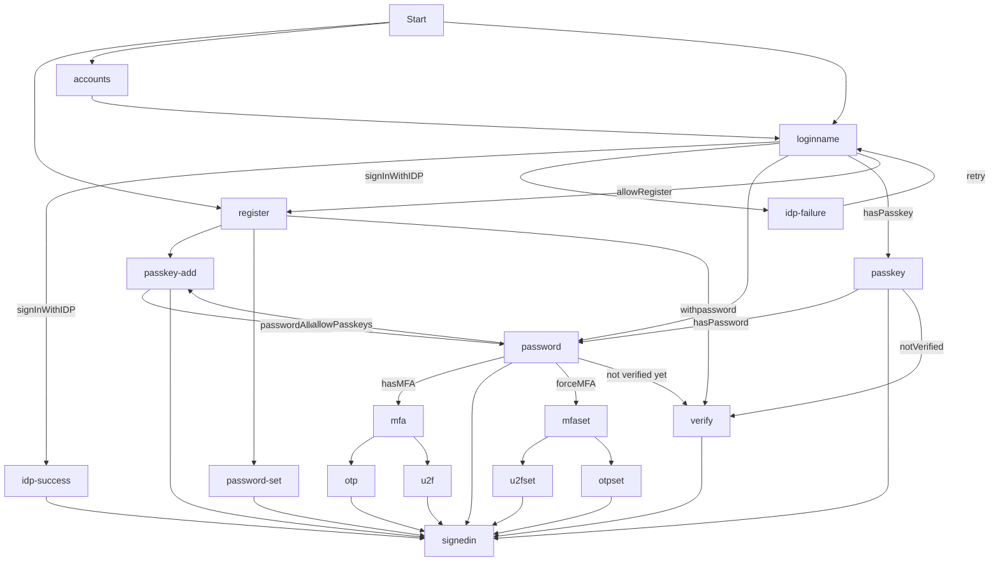

# ZITADEL Login UI

This is going to be our next UI for the hosted login. It's based on Next.js 13 and its introduced `app/` directory.

## Flow Diagram

### /loginname

This page shows a loginname field and Identity Providers to login or register.
If `loginSettings(org?).allowRegister` is `true`, if will also show a link to jump to /register

Requests to the APIs made:

- `getLoginSettings(org?)`
- `getLegalAndSupportSettings(org?)`
- `getIdentityProviders(org?)`
- `getBrandingSettings(org?)`
- `getActiveIdentityProviders(org?)`
- `startIdentityProviderFlow`
- `listUsers(org?)`
- `listAuthenticationMethodTypes`

After a loginname is entered, a `listUsers` request is made using the loginName query to identify already registered users.

If only one user is found, we query `listAuthenticationMethodTypes` to identify future steps.
If no authentication methods are found, we render an error stating: _User has no available authentication methods._ (exception see below.)
Now if only one method is found, we continue with the corresponding step (/password, /passkey/login).
If multiple methods are set, we prefer passkeys over any other method, so we redirect to /passkey, second option is IDP, and third is password.
If password is the next step, we check `loginSettings.passkeysType` for PasskeysType.ALLOWED, and prompt the user to setup passkeys afterwards.

If no user is found, we check whether registering is allowed using `loginSettings.allowRegister`.
If `loginSettings?.allowUsernamePassword` is not allowed we continue to check for available IDPs. If a single IDP is available, we directly redirect the user to signup.

If no single IDP is set, we check for `loginSettings.allowUsernamePassword` and redirect the user to /register page.
If no previous condition is met we throw an error stating the user was not found.

If the outcome after this order produces a no authentication methods found, or user not found, we check whether `loginSettings?.ignoreUnknownUsernames` is set to `true` as in this case we redirect to the /password page regardless (to not leak information about a registered user).

> NOTE: We ignore `loginSettings.allowExternalIdp` as the information whether IDPs are available comes as response from `getActiveIdentityProviders(org?)`.
