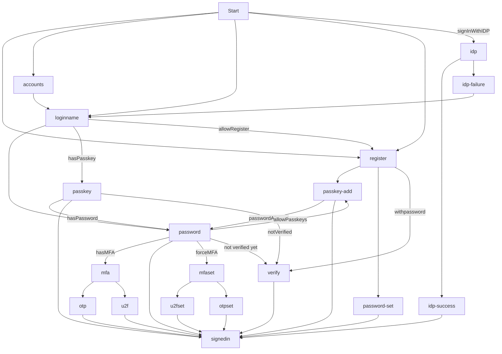

# ZITADEL Login UI

This is going to be our next UI for the hosted login. It's based on Next.js 13 and its introduced `app/` directory.

## Flow Diagram

```mermaid
    flowchart TD
    A[Start] --> register
    A[Start] --> accounts
    A[Start] --> loginname
    A[Start] --> register
    A[Start] -- signInWithIDP --> idp
    idp --> idp-success
    idp --> idp-failure
    idp-success --> B[signedin]
    idp-failure --> loginname
    loginname --> password
    loginname -- hasPasskey --> passkey
    loginname -- allowRegister --> register
    passkey-add --passwordAllowed --> password
    passkey -- hasPassword --> password
    passkey --> B[signedin]
    password -- hasMFA --> mfa
    password -- allowPasskeys --> passkey-add
    mfa --> otp
    otp --> B[signedin]
    mfa--> u2f
    u2f -->B[signedin]
    register --> passkey-add
    register --> password-set
    password-set --> B[signedin]
    passkey-add --> B[signedin]
    password --> B[signedin]
    password-- forceMFA -->mfaset
    mfaset --> u2fset
    mfaset --> otpset
    u2fset --> B[signedin]
    otpset --> B[signedin]
    accounts--> loginname
    password -- not verified yet -->verify
    register-- withpassword -->verify
    passkey-- notVerified --> verify
    verify --> B[signedin]
```
