# ZITADEL Login UI

This is going to be our next UI for the hosted login. It's based on Next.js 13 and its introduced `app/` directory.

## Flow Diagram

This diagram shows the available pages and flows.

> Note that back navigation or retries are not displayed.

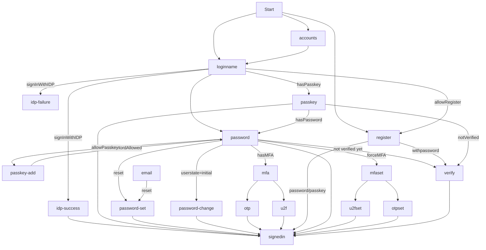

### /loginname

This page shows a loginname field and Identity Providers to login or register.
If `loginSettings(org?).allowRegister` is `true`, it also shows a link to jump to /register

Requests to the APIs made:

- `getLoginSettings(org?)`
- `getLegalAndSupportSettings(org?)`
- `getIdentityProviders(org?)`
- `getBrandingSettings(org?)`
- `getActiveIdentityProviders(org?)`
- `startIdentityProviderFlow`
- `listUsers(org?)`
- `listAuthenticationMethodTypes`
- `getOrgsByDomain`
- `createSession()`
- `getSession()`

After a loginname is entered, a `listUsers` request is made using the loginName query to identify already registered users.

**USER FOUND:** If only one user is found, we query `listAuthenticationMethodTypes` to identify future steps.
If no authentication methods are found, we render an error stating: _User has no available authentication methods._ (exception see below.)
Now if only one method is found, we continue with the corresponding step (/password, /passkey).
If multiple methods are set, we prefer passkeys over any other method, so we redirect to /passkey, second option is IDP, and third is password.
If password is the next step, we check `loginSettings.passkeysType` for PasskeysType.ALLOWED, and prompt the user to setup passkeys afterwards.

**NO USER FOUND:** If no user is found, we check whether registering is allowed using `loginSettings.allowRegister`.
If `loginSettings?.allowUsernamePassword` is not allowed we continue to check for available IDPs. If a single IDP is available, we directly redirect the user to signup.

If no single IDP is set, we check for `loginSettings.allowUsernamePassword` and if no organization is set as context, we check whether we can discover a organization from the loginname of the user (using: `getOrgsByDomain`). Then if an organization is found, we check whether domainDiscovery is allowed on it and redirect the user to /register page including the discovered domain or without.

If no previous condition is met we throw an error stating the user was not found.

**EXCEPTIONS:** If the outcome after this order produces a no authentication methods found, or user not found, we check whether `loginSettings?.ignoreUnknownUsernames` is set to `true` as in this case we redirect to the /password page regardless (to prevent username guessing).

> NOTE: This page at this stage beeing ignores local sessions and executes a reauthentication. This is a feature which is not implemented yet.

> NOTE: We ignore `loginSettings.allowExternalIdp` as the information whether IDPs are available comes as response from `getActiveIdentityProviders(org?)`. If a user has a cookie for the same loginname, a new session is created regardless and overwrites the old session. The old session is not deleted from the login as for now.

> NOTE: `listAuthenticationMethodTypes()` does not consider different domains for u2f methods or passkeys. The check whether a user should be redirected to one of the pages `/passkey` or `/u2f`, should be extended to use a domain filter (https://github.com/zitadel/zitadel/issues/8615)

### /password

This page shows a password field to hydrate the current session with password as a factor.
Below the password field, a reset password link is shown which allows to send a reset email.

Requests to the APIs made:

- `getLoginSettings(org?)`
- `getBrandingSettings(org?)`
- `listAuthenticationMethodTypes`
- `getSession()`
- `updateSession()`
- `listUsers()`
- `getUserById()`

**MFA AVAILABLE:** After the password has been submitted, additional authentication methods are loaded.
If the user has set up an additional **single** second factor, it is redirected to add the next factor. Depending on the available method he is redirected to `/otp/time-based`,`/otp/sms?`, `/otp/email?` or `/u2f?`. If the user has multiple second factors, he is redirected to `/mfa` to select his preferred method to continue.

**NO MFA, USER STATE INITIAL** If the user has no MFA methods and is in an initial state, we redirect to `/password/change` where a new password can be set.

**NO MFA, FORCE MFA:** If no MFA method is available, and the settings force MFA, the user is sent to `/mfa/set` which prompts to setup a second factor.

**PROMPT PASSKEY** If the settings do not enforce MFA, we check if passkeys are allowed with `loginSettings?.passkeysType == PasskeysType.ALLOWED` and redirect the user to `/passkey/set` if no passkeys are setup. This step can be skipped.

If none of the previous conditions apply, we continue to sign in.

> NOTE: `listAuthenticationMethodTypes()` does not consider different domains for u2f methods or passkeys. The check whether a user should be redirected to one of the pages `/passkey` or `/u2f`, should be extended to use a domain filter (https://github.com/zitadel/zitadel/issues/8615)

### /password/change

This page allows to change the password. It is used after a user is in an initial state and is required to change the password, or it can be directly invoked with an active session.

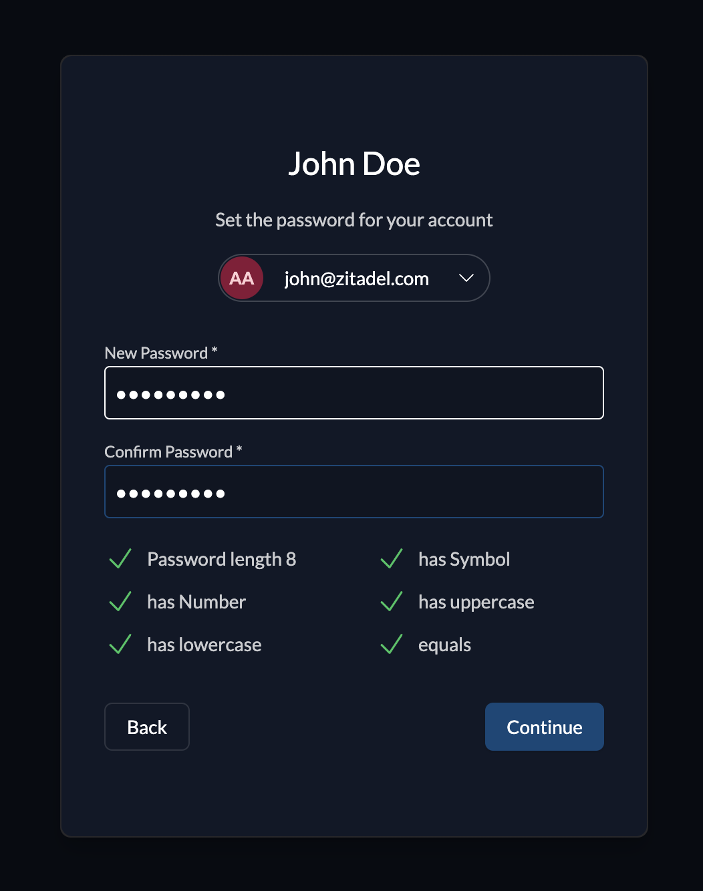

Requests to the APIs made:

- `getLoginSettings(org?)`
- `getPasswordComplexitySettings(user?)`
- `getBrandingSettings(org?)`
- `getSession()`
- `setPassword()`

> NOTE: The request to change the password is using the session of the user itself not the service user, therefore no code is required.

### /password/set

This page allows to set a password. It is used after a user has requested to reset the password on the `/password` page.

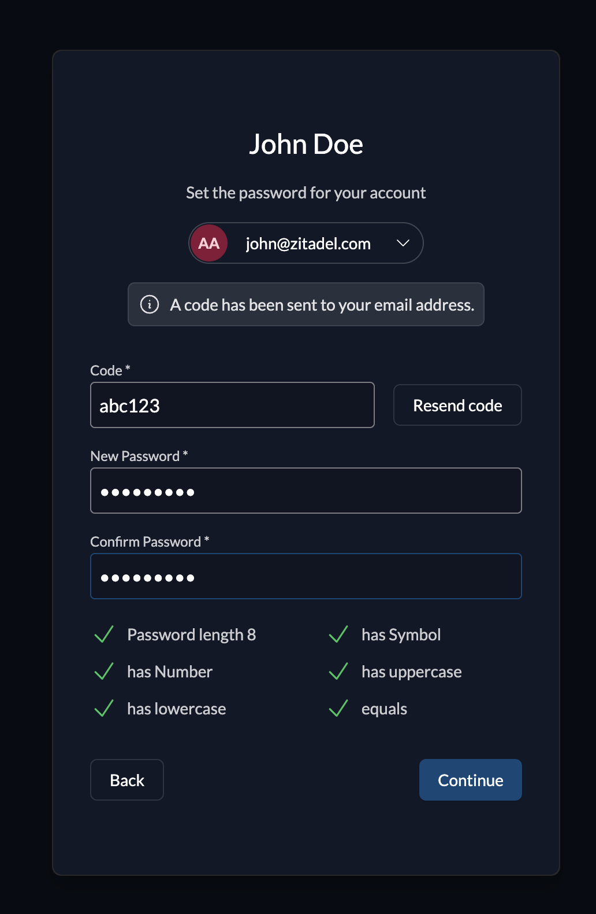

Requests to the APIs made:

- `getLoginSettings(org?)`
- `getPasswordComplexitySettings(user?)`
- `getBrandingSettings(org?)`
- `getUserByID()`
- `setPassword()`

The page allows to enter a code or be invoked directly from a email link which prefills the code. The user can enter a new password and submit.

### /otp/[method]

This page shows a code field to check an otp method. The session of the user is then hydrated with the respective factor. Supported methods are `time-based`, `sms` and `email`.

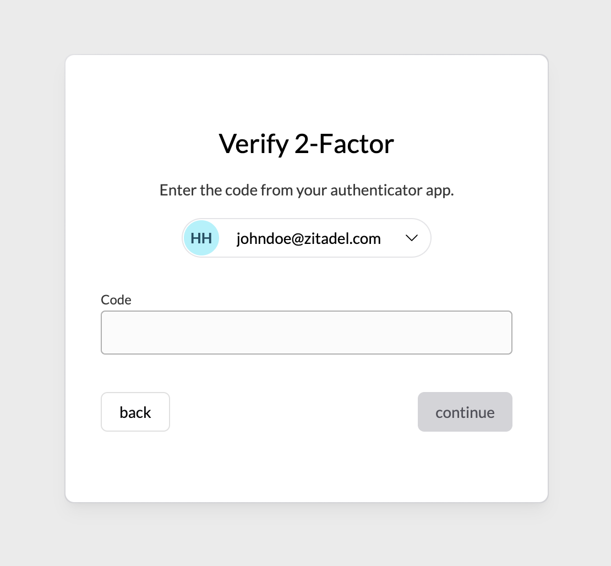

Requests to the APIs made:

- `getBrandingSettings(org?)`
- `getSession()`
- `updateSession()`

If `email` or `sms` is requested as method, the current session of the user is updated to request the challenge. This will trigger an email or sms which can be entered in the code field.
The `time-based` (TOTP) method does not require a trigger, therefore no `updateSession()` is performed and no resendLink under the code field is shown.

The submission of the code updates the session and continues to sign in the user.

### /u2f

This page requests a webAuthN challenge for the user and updates the session afterwards.

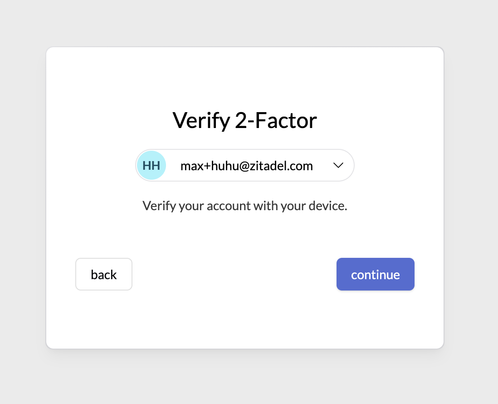

Requests to the APIs made:

- `getBrandingSettings(org?)`
- `getSession()`
- `updateSession()`

When updating the session for the webAuthN challenge, we set `userVerificationRequirement` to `UserVerificationRequirement.DISCOURAGED` as this will request the webAuthN method as second factor and not as primary method.
After updating the session, the user is **always** signed in. :warning: required as this page is a follow up for setting up a u2f method.

### /passkey

This page requests a webAuthN challenge for the user and updates the session afterwards.
It is invoked directly after setting up a passkey `/passkey/set` or when loggin in a user after `/loginname`.

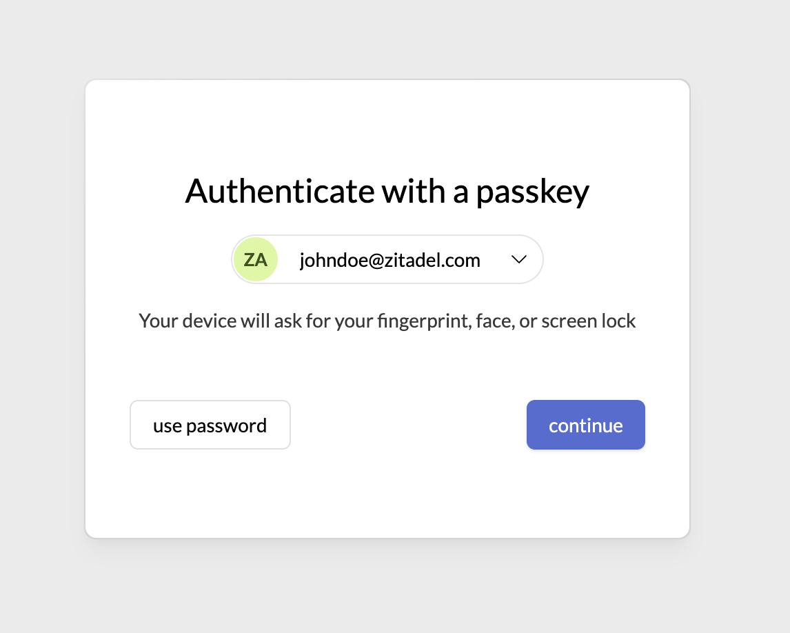

Requests to the APIs made:

- `getBrandingSettings(org?)`
- `getSession()`
- `updateSession()`

When updating the session for the webAuthN challenge, we set `userVerificationRequirement` to `UserVerificationRequirement.REQUIRED` as this will request the webAuthN method as primary method to login.
After updating the session, the user is **always** signed in. :warning: required as this page is a follow up for setting up a passkey

> NOTE: This page currently does not check whether a user contains passkeys. If this method is not available, this page should not be used.

### /mfa/set

This page loads login settings and the authentication methods for a user and shows setup options.

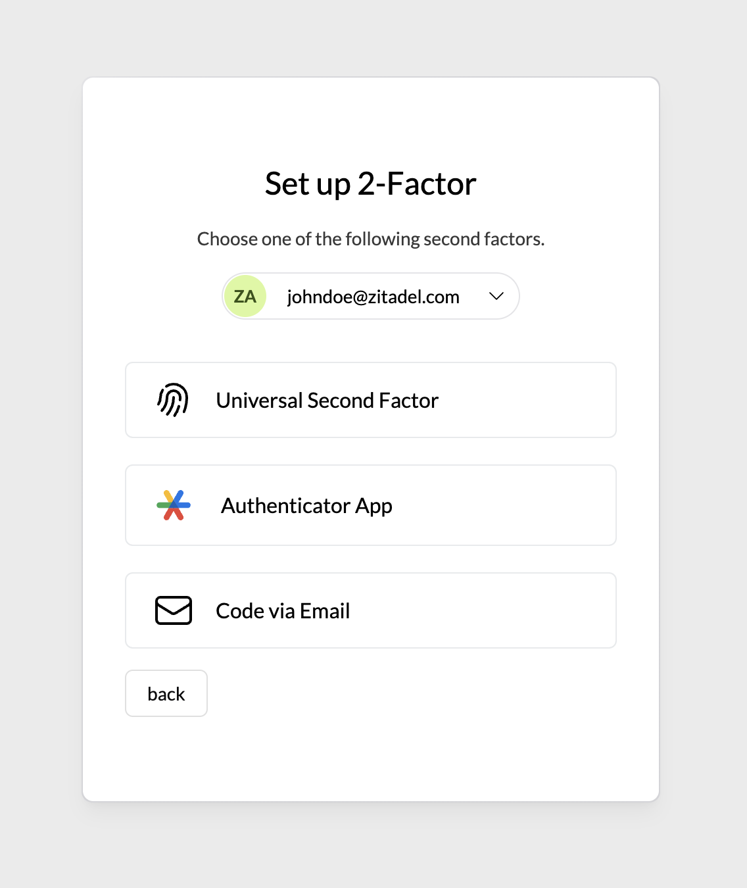

Requests to the APIs made:

- `getBrandingSettings(org?)`
- `getLoginSettings(user.org)` :warning: context taken from session
- `getSession()`
- `listAuthenticationMethodTypes()`
- `getUserByID()`

If a user has already setup a certain method, a checkbox is shown alongside the button and the button is disabled.
OTP Email and OTP SMS only show up if the user has verified email or phone.
If the user chooses a method he is redirected to one of `/otp/time-based/set`, `/u2f/set`, `/otp/email/set`, or `/otp/sms/set`.
At the moment, U2F methods are hidden if a method is already added on the users resource. Reasoning is that the page should only be invoked for prompts. A self service page which shows up multiple u2f factors is implemented at a later stage.

> NOTE: The session and therefore the user factor defines which login settings are checked for available options.

> NOTE: `listAuthenticationMethodTypes()` does not consider different domains for u2f or passkeys. The check whether a user should be redirected to one of the pages `/passkey/set` or `/u2f/set`, should be extended to use a domain filter (https://github.com/zitadel/zitadel/issues/8615)

### /passkey/set

This page sets a passkey method for a user. This page can be either enforced, or optional depending on the Login Settings.

<!-- screen is the same -->
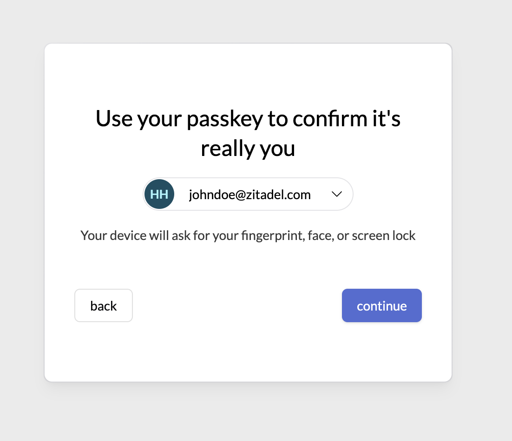

Requests to the APIs made:

- `getBrandingSettings(org?)`
- `getSession()`
- `createPasskeyRegistrationLink()` TODO: check if this can be used with the session token (mfa required (AUTHZ-Kl3p0))
- `registerPasskey()`
- `verifyPasskey()`

If the loginname decides to redirect the user to this page, a button to skip appears which will sign the user in afterwards.
After a passkey is registered, we redirect the user to `/passkey` to verify it again and sign in with the new method. The `createPasskeyRegistrationLink()` uses the token of the session which is determined by the flow.

> NOTE: this page allows passkeys to be created only if the current session is valid (self service), or no authentication method is set (register). TODO: to be implemented.

> NOTE: Redirecting the user to `/passkey` will not be required in future and the currently used session will be hydrated directly after registering. (https://github.com/zitadel/zitadel/issues/8611)

### /otp/time-based/set

This page registers a time based OTP method for a user.

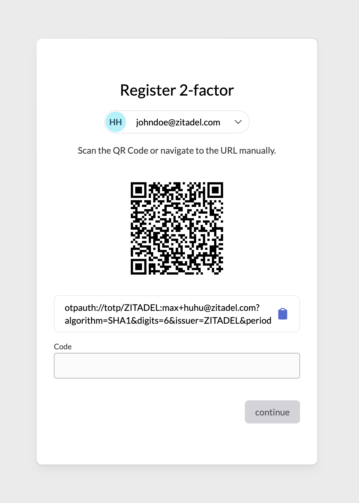

Requests to the APIs made:

- `getBrandingSettings(org?)`
- `getSession()`
- `registerTOTP()`
- `verifyTOTP()`

After the setup is done, the user is redirected to verify the TOTP method on `/otp/time-based`.

> NOTE: Redirecting the user to `/otp/time-based` will not be required in future and the currently used session will be hydrated directly. (https://github.com/zitadel/zitadel/issues/8611)

### /otp/email/set /otp/sms/set

This page registers either an Email OTP method or SMS OTP method for a user.

Requests to the APIs made:

- `getBrandingSettings(org?)`
- `getSession()`
- `addOTPEmail()` / `addOTPSMS()`

This page directly calls `addOTPEmail()` or `addOTPSMS()` when invoked and shows a success message.
Right afterwards, redirects to verify the method.

### /u2f/set

This page registers a U2F method for a user.

Requests to the APIs made:

- `getBrandingSettings(org?)`
- `getSession()`
- `registerU2F()` :warning: TODO: check if this can be used with the session token (mfa required (AUTHZ-Kl3p0))
- `verifyU2FRegistration()`

After a u2f method is registered, we redirect the user to `/passkey` to verify it again and sign in with the new method. The `createPasskeyRegistrationLink()` uses the token of the session which is determined by the flow.

> NOTE: Redirecting the user to `/passkey` will not be required in future and the currently used session will be hydrated directly after registering. (https://github.com/zitadel/zitadel/issues/8611)

### /register

This page shows a register page, which gets firstname and lastname of a user as well as the email. It offers to setup a user, using password or passkeys.

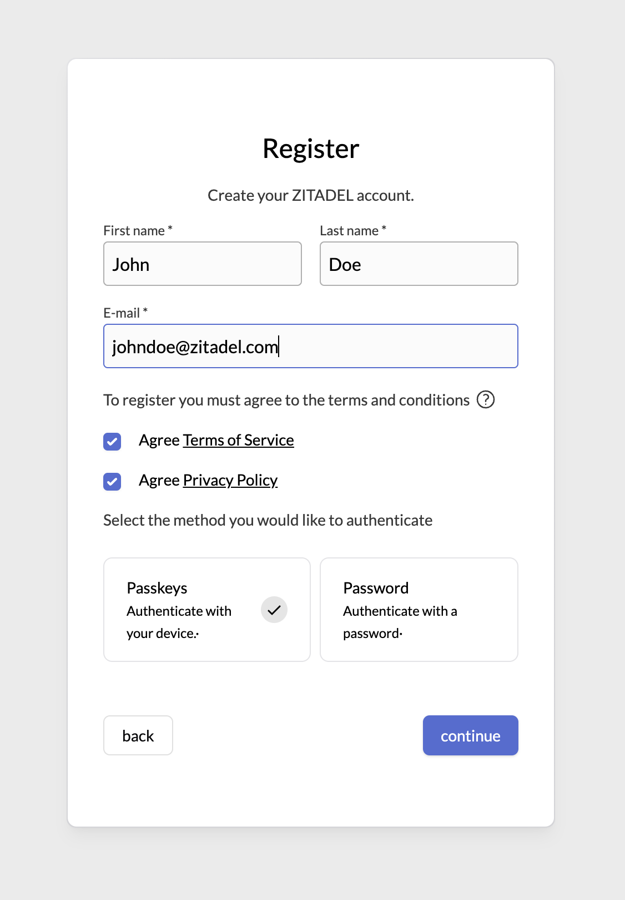

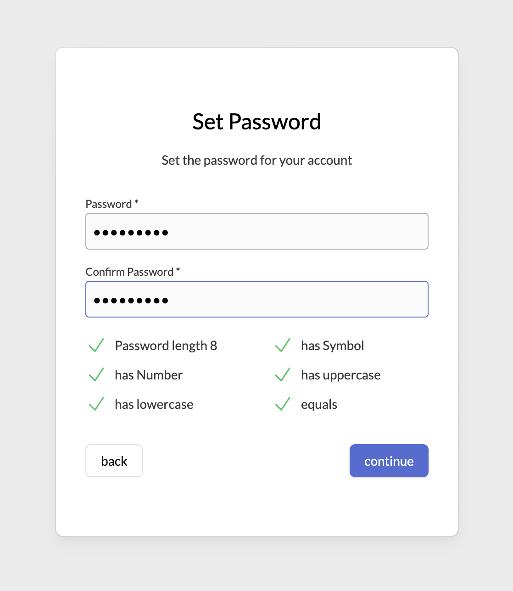

Requests to the APIs made:

- `listOrganizations()` :warning: TODO: determine the default organization if no context is set
- `getLegalAndSupportSettings(org)`
- `getPasswordComplexitySettings()`
- `getBrandingSettings()`
- `addHumanUser()`
- `createSession()`
- `getSession()`

To register a user, the organization where the resource will be created is determined first. If no context is provided via url, we fall back to the default organization of the instance.

**PASSWORD:** If a password is set, the user is created as a resource, then a session using the password check is created immediately. After creating the session, the user is directly logged in and eventually redirected back to the application.

**PASSKEY:** If passkey is selected, the user is created as a resource first, then a session using the userId is created immediately. This session does not yet contain a check, we therefore redirect the user to setup a passkey at `/passkey/set`. As the passkey set page verifies the passkey right afterwards, the process ends with a signed in user.

> NOTE: https://github.com/zitadel/zitadel/issues/8616 to determine the default organization of an instance must be implemented in order to correctly use the legal-, login-, branding- and complexitysettings.

> NOTE: TODO: check which methods are allowed in the login settings, loginSettings.allowUsernamePassword / check for passkey

### /idp

This page doubles as /loginname but limits it to choose from IDPs

Requests to the APIs made:

- `getBrandingSettings(org?)`
- `getActiveIdentityProviders(org?)`
- `startIdentityProviderFlow()`

### /idp/[method]/success /idp/[method]/failure

Both /success and /failure pages are designed to intercept the responses from the IDPs and decide on how to continue with the process.

### /verify

This page verifies the email to be valid. It page of the login can also be invoked without an active session.
The context of the user is taken from the url and is set in the email template.

Requests to the APIs made:

- `getBrandingSettings(org?)`
- `getLoginSettings(org?)`
- `verifyEmail()`

If the page is invoked with an active session (right after a register with password), the user is signed in or redirected to the loginname if no context is known.

> NOTE: This page will be extended to support invitations. In such case, authentication methods of the user are loaded and if none available, shown as possible next step (`/passkey/set`, `password/set`).

### /accounts

This page shows an overview of all current sessions.
Sessions with invalid token show a red dot on the right side, Valid session a green dot, and its last verified date.

This page is a starting point for self management, reauthentication, or can be used to clear local sessions.
This page is also shown if used with OIDC and `prompt: select_account`.

On all pages, where the current user is shown, you can jump to this page. This way, a session can quickly be reused if valid.

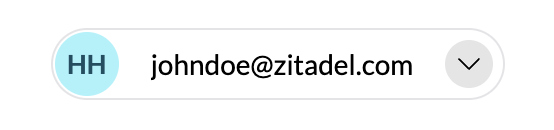

### /signedin

This is a success page which shows a completed login flow for a user, which did navigate to the login without a OIDC auth requrest. From here device authorization flows are completed. It checks if the requestId param of starts with `device_` and then executes the `authorizeOrDenyDeviceAuthorization` command.

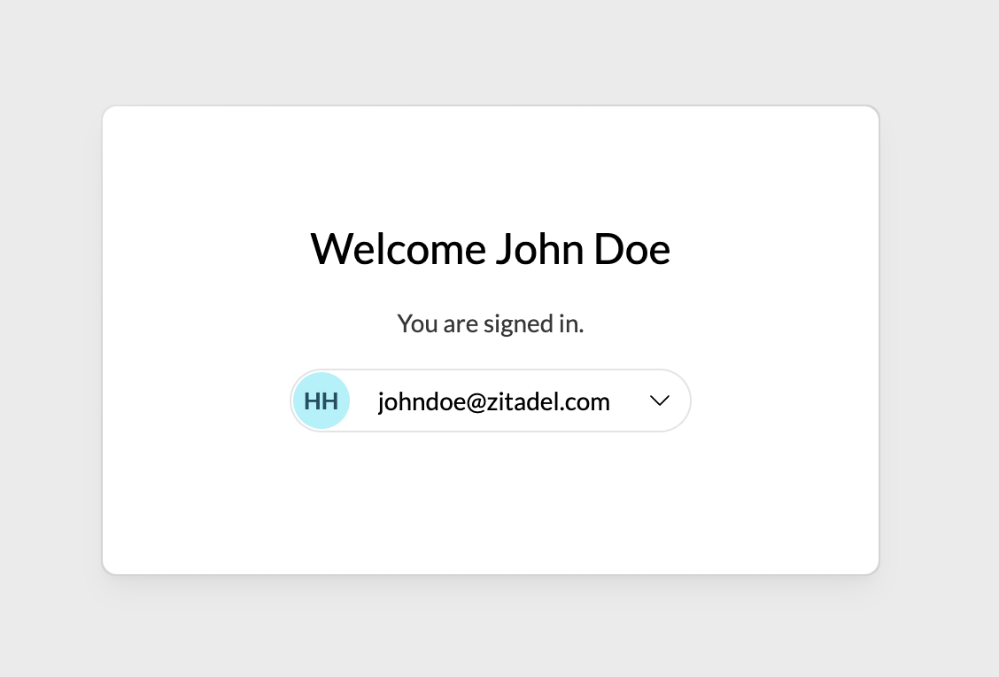

In future, self service options to jump to are shown below, like:

- change password
- setup passkeys
- setup mfa
- change profile
- logout

> NOTE: This page has to be explicitly enabled or act as a fallback if no default redirect is set.

## Currently NOT Supported

- forceMFA on login settings is not checked for IDPs

Also note that IDP logins are considered as valid MFA. An additional MFA check will be implemented in future if enforced.
