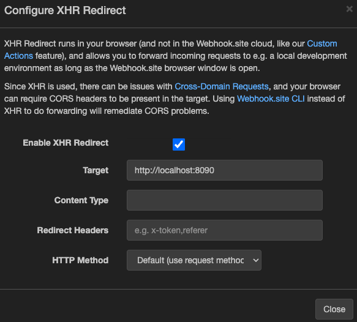
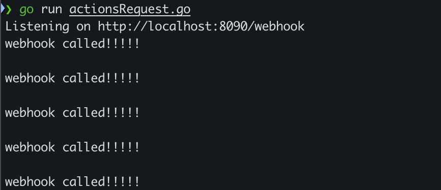
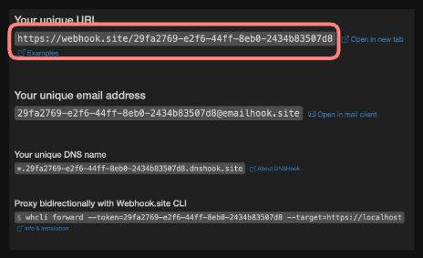
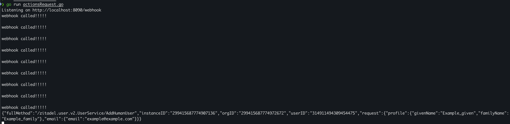
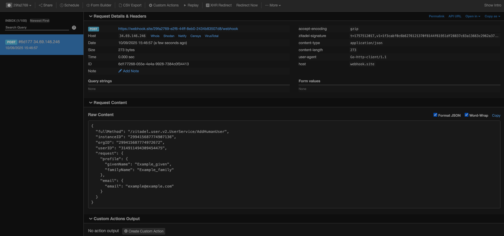

## 1. Introduction

This guide explains how to test **ZITADEL Actions V2** locally using [Webhook.site](https://webhook.site).  
We will use Webhook.site’s **XHR Redirect** feature to forward requests from ZITADEL to your local machine.


**What you will learn in this guide:**

- How to add the required CORS headers to your local listener
- How to configure Webhook.site with XHR Redirect
- How to create a target in ZITADEL and link it to your Action
- How to verify forwarded requests in your terminal

---

## 2. Prerequisites

### 2.1. Local Listener


You should already have a local HTTP server (for example, the Go example listener from [Testing a Request](./testing-request)) running at `http://localhost:8090/webhook`.

### 2.2. CORS Headers


Because Webhook.site’s XHR redirect runs in your browser, your listener must allow CORS.
Add the following headers in your handler:

```go
w.Header().Set("Access-Control-Allow-Origin", "*")
w.Header().Set("Access-Control-Allow-Methods", "*")
w.Header().Set("Access-Control-Allow-Headers", "Content-Type, Authorization")

if req.Method == http.MethodOptions {
    w.WriteHeader(http.StatusOK)
    return
}
```

---

## 3. Configure Webhook.site XHR Redirect

1. Open your unique Webhook.site URL.
2. Click **Configure XHR Redirect**.
3. Enable **XHR Redirect**.
4. Enter your local endpoint in **Target**, e.g.:

   ```
   http://localhost:8090/webhook
   ```


5. Leave other fields empty unless you need custom headers.
6. Keep the Webhook.site browser tab open while testing.



---

## 4. Run Your Listener

Start your local listener:

```sh
go run actionsRequest.go
```

You should see output in your console whenever the listener is called.



---

## 5. Create Target in ZITADEL


As shown in the example above, the target is created with HTTP and port '8090'. If you want to use it as a webhook, the target can be created as follows:


See [Create a target](/apis/resources/action_service_v2/action-service-create-target) for more detailed information. Notice that the `endpoint` is your Webhook.site URL.

```shell
curl -L -X POST 'https://$CUSTOM-DOMAIN/v2beta/actions/targets' \
-H 'Content-Type: application/json' \
-H 'Accept: application/json' \
-H 'Authorization: Bearer <TOKEN>' \
--data-raw '{
  "name": "local webhook",
  "restWebhook": {
    "interruptOnError": true    
  },
  "endpoint": "https://webhook.site/29fa2769-e2f6-44ff-8eb0-2434b83507d8/webhook",
  "timeout": "10s"
}'
```



---


Save the returned ID to use in the execution step. A sample response looks like this:

```json
{
    "id": "337246363446151234",
    "creationDate": "2025-09-10T13:21:36.959699Z",
    "signingKey": "OpUHaCtEqh8swdJ5xUYbQ2bhej1abcXYZ"
}
```

## 6. Set execution


To configure ZITADEL to call the target when an API endpoint is called, set an execution and define the request condition.

See [Set an execution](/apis/resources/action_service_v2/action-service-set-execution) for more detailed information.


Here, `<TargetID returned>` is the `id` from the previous step.

```shell
curl -L -X PUT 'https://$CUSTOM-DOMAIN/v2beta/actions/executions' \
-H 'Content-Type: application/json' \
-H 'Accept: application/json' \
-H 'Authorization: Bearer <TOKEN>' \
--data-raw '{
    "condition": {
        "request": {
            "method": "/zitadel.user.v2.UserService/AddHumanUser"
        }
    },
    "targets": [
        "<TargetID returned>"
    ]
}'
```

---

## 7. Example Call


Now that you have set up the target and execution, you can test it by creating a user through the Console UI or by calling the ZITADEL API to create a human user.

Here, we are creating a user via the API:

```shell
curl -L -X PUT 'https://$CUSTOM-DOMAIN/v2/users/human' \
-H 'Content-Type: application/json' \
-H 'Accept: application/json' \
-H 'Authorization: Bearer <TOKEN>' \
--data-raw '{
    "profile": {
        "givenName": "Example_given",
        "familyName": "Example_family"
    },
    "email": {
        "email": "example@example.com"
    }
}'
```


Both your Webhook.site and your local listener should now print out something like the following. See the [Sent information Request](./usage#sent-information-request) payload description for details.

Your local listener should look like this:


Your Webhook.site should look like this:


---

## 8. Done


You now have a fully working setup for testing ZITADEL Actions V2 with Webhook.site. This allows you to forward requests securely from ZITADEL to your local environment without needing a public IP address or domain.