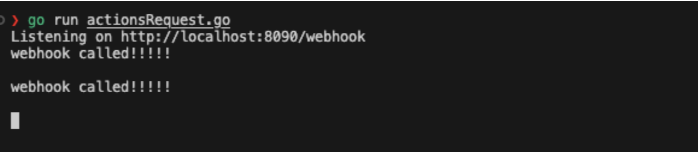
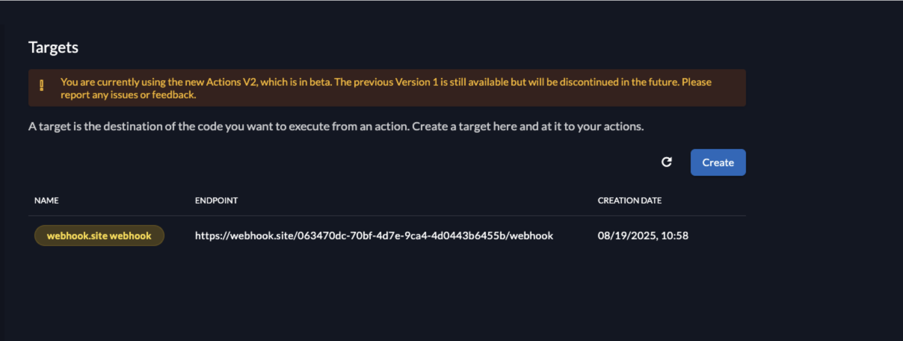
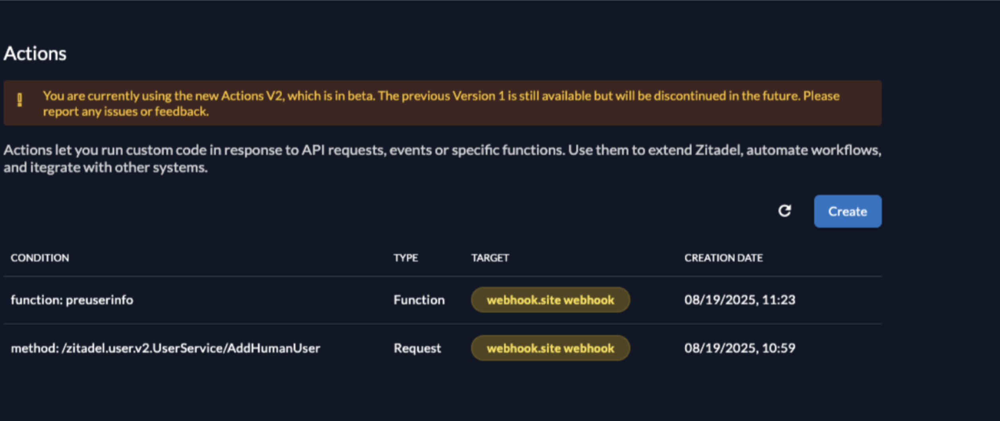
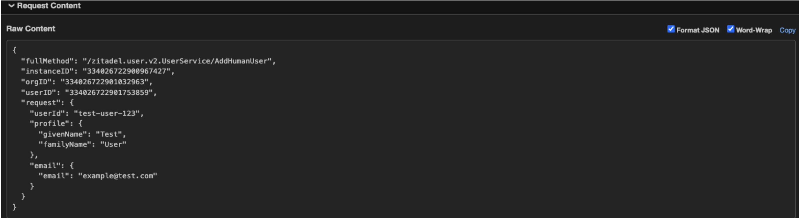

## 1. Introduction

This guide explains how to test **ZITADEL Actions V2** locally using [Webhook.site](https://webhook.site).  
We’ll use Webhook.site’s **XHR Redirect** feature to forward requests from ZITADEL to your local machine.

**What you'll learn with this guide**

* How to add the required CORS headers to your local listener
* How to configure Webhook.site with XHR Redirect
* How to create a target in ZITADEL and link it to your Action
* How to verify forwarded requests in your terminal

---

## 2. Prerequisites

### 2.1. Local Listener

You should already have a local HTTP server (for example, the Go example listener from [Testing a Request](./testing-request)) running on `http://localhost:8090/webhook`.

### 2.2. CORS Headers

Because Webhook.site’s XHR redirect runs in your browser, your listener must allow CORS.  
Make sure to add the following headers in your handler:

```sh
w.Header().Set("Access-Control-Allow-Origin", "*")
w.Header().Set("Access-Control-Allow-Methods", "*")
w.Header().Set("Access-Control-Allow-Headers", "Content-Type, Authorization")

if req.Method == http.MethodOptions {
    w.WriteHeader(http.StatusOK)
    return
}
```

---

## 3. Configure Webhook.site XHR Redirect

1. Open your unique Webhook.site URL.
2. Click **Configure XHR Redirect**.
3. Enable **XHR Redirect**.
4. Enter your local endpoint in **Target**, e.g.:

   ```
   http://localhost:8090/webhook
   ```

5. Leave other fields empty unless you need custom headers.
6. Keep the Webhook.site browser tab open while testing.


---

## 4. Run Your Listener

Start your local listener:

```sh
go run actionsRequest.go
```

You should see output in your console whenever the listener is called.



---

## 5. Create Target in ZITADEL

1. In the ZITADEL Console, go to **Actions → Targets**.
2. Create a new target and enter your Webhook.site URL (e.g. `https://webhook.site/063470dc-xxxx/webhook`).
3. Save it.



---

## 6. Assign Target to an Action

1. Go to **Actions** in the ZITADEL Console.
2. Select the Action you want to test (e.g. `AddHumanUser` or `preuserinfo`).
3. Assign the Webhook.site target you created earlier.



---

## 7. Verify Requests

1. Trigger the Action in ZITADEL.
2. Requests will hit your Webhook.site endpoint and be redirected to your local server.
3. You should see the JSON payload printed in your terminal.



---

## 8. Done!

You now have a fully working setup for testing ZITADEL Actions V2 with Webhook.site.  
This allows you to forward requests securely from ZITADEL to your local environment without needing