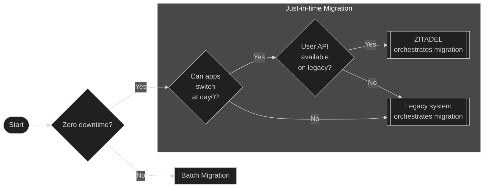
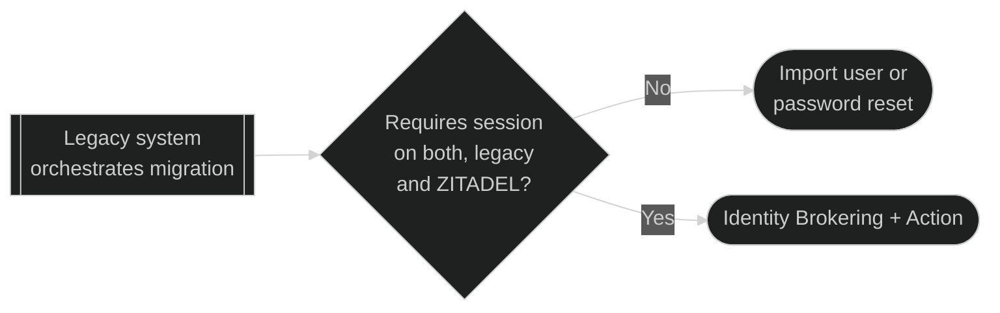
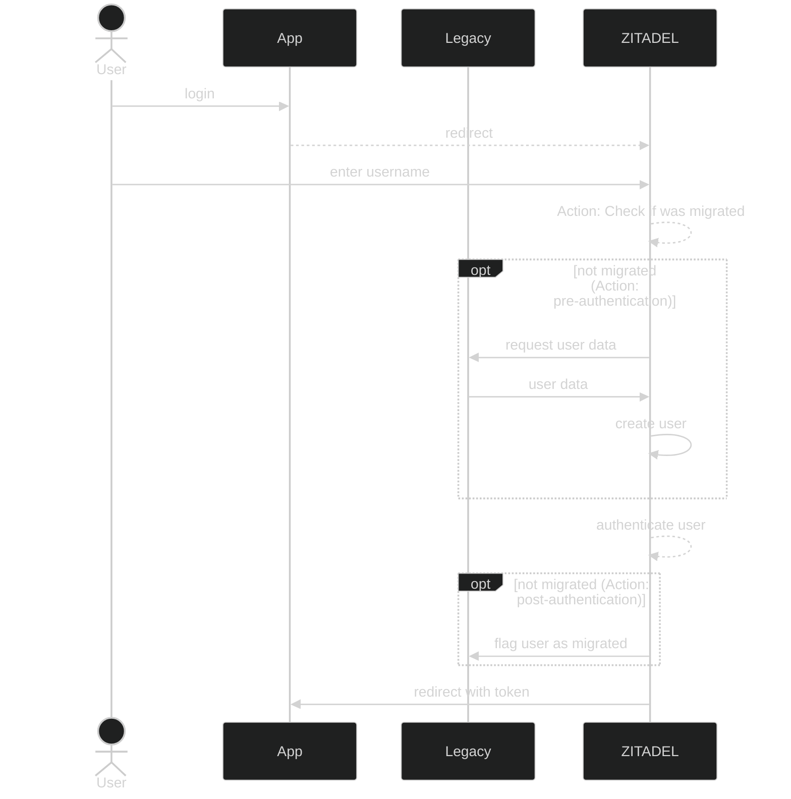
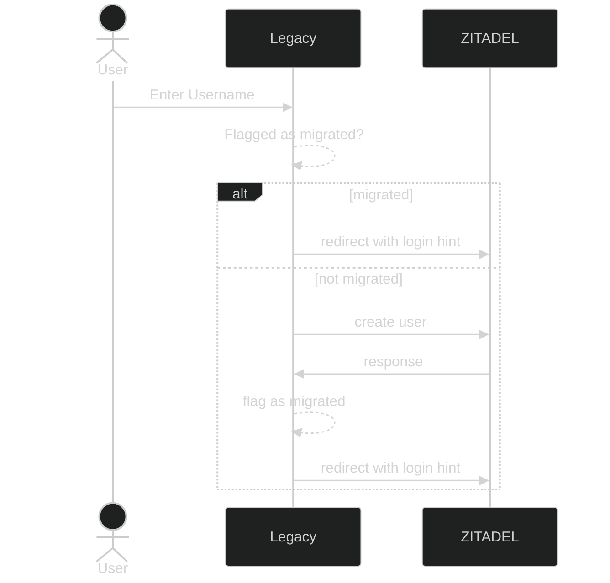
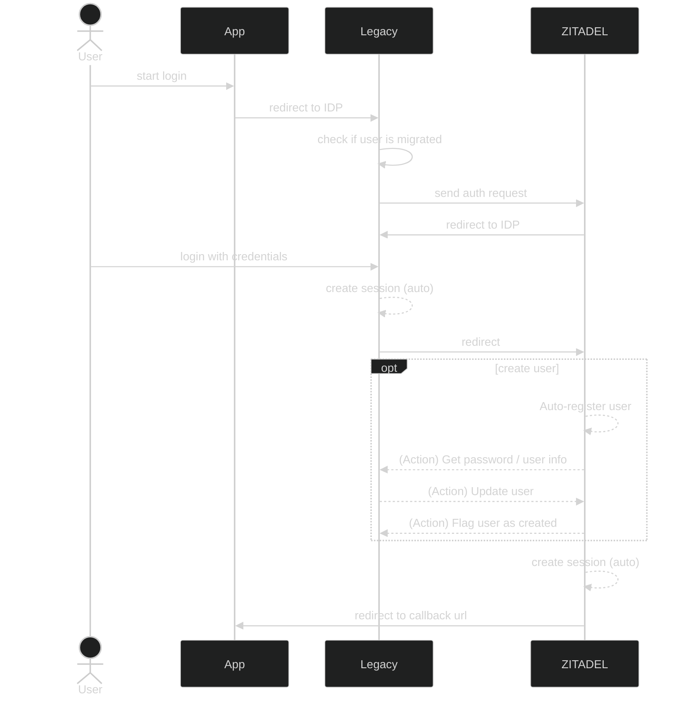

Migrating users from an existing system, while minimizing impact on said users, can be a challenging task.
This guide gives you an overview of technical considerations, explains the most common patterns for migrating users and gives you some implementation details.

We will also offer more detailed guides how to migrate users from a specific auth provider to ZITADEL.

## User data and secrets

### Import users

Creating individual users can be done with this endpoint: [ImportHumanUser](/docs/apis/mgmt/management-service-import-human-user).
Please also consult our [guide](/docs/guides/manage/user/reg-create-user) on how to create users.

```json
{
  "userName": "test9@test9",
  "profile": {
    "firstName": "Road",
    "lastName": "Runner",
    "displayName": "Road Runner",
    "preferredLanguage": "en"
  },
  "email": {
    "email": "test@test.com",
    "isEmailVerified": false
  },
  "hashedPassword": {
    "value": "$2a$14$aPbwhMVJSVrRRW2NoM/5.esSJO6o/EIGzGxWiM5SAEZlGqCsr9DAK",
    "algorithm": "bcrypt"
  },
  "passwordChangeRequired": false,
  "otpCode": "testotp",
  "requestPasswordlessRegistration": false,
  "idps": [
    {
      "configId": "124425861423228496",
      "externalUserId": "roadrunner@mailonline.com",
      "displayName": "name"
    }
  ]
}
```

For bulk import use the [import endpoint](https://zitadel.com/docs/apis/admin/admin-service-import-data) on the admin API:

```json
{
  "timeout": "10m",
  "data_orgs": {
    "orgs": [
      {
        "orgId": "104133391254874632",
        "org": {
          "name": "TestFabi"
        },
        "humanUsers": [
          {
            "userId": "104133391271651848",
            "user": {
              "userName": "fabienne",
              "profile": {
                "firstName": "Fabienne",
                "lastName": "Gerschwiler",
                "displayName": "Fabienne Gerschwiler",
                "preferredLanguage": "und"
              },
              "email": {
                "email": "fabienne@caos.ch",
                "isEmailVerified": true
              },
              "hashedPassword": {
                "value": "$2a$14$aPbwhMVJSVrRRW2NoM/5.esSJO6o/EIGzGxWiM5SAEZlGqCsr9DAK",
                "algorithm": "bcrypt"
              }
            }
          },
          {
            "userId": "120080115081209416",
            "user": {
              "userName": "testuser",
              "profile": {
                "firstName": "Test",
                "lastName": "User",
                "displayName": "Test User",
                "preferredLanguage": "und"
              },
              "email": {
                "email": "fabienne@caos.ch",
                "isEmailVerified": true
              },
              "hashedPassword": {
                "value": "$2a$14$785Fcdbpo9rn5L7E21nIAOJvGCPgWFrZhIAIfDonYXzWuZIKRAQkO",
                "algorithm": "bcrypt"
              }
            }
          },
          {
            "userId": "145195347319252359",
            "user": {
              "userName": "test1",
              "profile": {
                "firstName": "Fabienne",
                "lastName": "Gerschwiler",
                "displayName": "Fabienne Gerschwiler",
                "preferredLanguage": "und"
              },
              "email": {
                "email": "fabienne@gmail.com"
              }
            }
          }
        ]
      }
    ]
  }
}
```

### Migrate secrets

Besides user data you need to migrate secrets, such as password hashes, OTP seeds, and public keys for passkeys (FIDO2).

#### Passwords

Passwords are stored only as hash.
You can transfer the hashes as long as ZITADEL [supports the same hash algorithm](/docs/concepts/architecture/secrets#hashed-secrets).
Password change on the next sign-in can be enforced.

```json
{
  "userName": "test9@test9",
    ...,
    "hashedPassword": {
        "value": "$2a$14$aPbwhMVJSVrRRW2NoM/5.esSJO6o/EIGzGxWiM5SAEZlGqCsr9DAK",
        "algorithm": "bcrypt"
    },
    "passwordChangeRequired": false,
    ...,
}
```

In case the hashes can't be transferred directly, you always have the option to create a user in ZITADEL without password and prompt users to create a new password.

If your legacy system receives the passwords in clear text (eg, login form) you could also directly create users via ZITADEL API. We will explain this pattern in more detail in this guide.

:::info
In case the hash algorithm you are using is not supported by ZITADEL, please let us know after searching our discussions, issues, and chat for similar requests.
:::

#### One-time-passwords (OTP)

You can pass the OTP secret when creating users:

```json
{
  "userName": "test9@test9",
    ...,
    "otpCode": "testotp",
    ...,
}
```

### Passkeys

When creating new users, you can trigger a workflow that prompts the users to setup a passkey authenticator.

```json
{
  "userName": "test9@test9",
    ...,
    "requestPasswordlessRegistration": false,
    ...,
}
```

For passkeys to work on the new system you need to make sure that the new auth server has the same domain as the legacy auth server.

:::info
Currently it is not possible to migrate passkeys directly from another system.
:::

### Users linked to an external IDP

A users `sub` is bound to the external [IDP's Client ID](https://zitadel.com/docs/guides/manage/console/instance-settings#identity-providers).
This means that the IDP Client ID configured in ZITADEL must be the same ID as in the legacy system.

Users should be imported with their `externalUserId`.

```json
{
  "userName": "test9@test9",
    ...,
    "idps": [
        {
        "configId": "124425861423228496",
        "externalUserId": "roadrunner@mailonline.com",
        "displayName": "name"
        }
    ...,
}
```

You can use an Action with [post-creation flow](https://zitadel.com/docs/apis/actions/external-authentication#post-creation) to pull information such as roles from the old system and apply them to the user in ZITADEL.

### Metadata

You can store arbitrary key-value information on a user (or Organization) in ZITADEL.
Use metadata to store additional attributes of the users, such as organizational unit, backend-id, etc.

:::info
Metadata must be added to users after the users were created. Currently metadata can't be added during user creation.
:::

Request metadata from the userinfo endpoint by passing the required [reserved scope](/docs/apis/openidoauth/scopes#reserved-scopes) in your auth request.

With the [complement token flow](/docs/apis/actions/complement-token), you can also transform metadata (or roles) to custom claims.

## Technical Considerations

There will be multiple ways for migrating users from your existing auth system ("legacy") to ZITADEL.
Which migration pattern to use depends on your requirements.

This section should help you to get an overview of the different migration patterns and help you design an ideal solution for your use case. Your solution might require adjustments from the presented baseline patterns.

### Batch vs. Just-In-Time



[Batch migration](#batch-migration) is the easiest way, if you can afford some minimal downtime to move all users and applications over to ZITADEL.

In case all your applications depend on ZITADEL after the migration date, and ZITADEL is able to retrieve the required user information, including secrets, from the legacy system, then the recommended way is to let [ZITADEL orchestrate the user migration](#just-in-time-zitadel).

### Legacy System Orchestrates Migration

For all other cases, we recommend that the [legacy system orchestrates the migration](#legacy-system-orchestrates-migration) of users to ZITADEL for more flexibility.
In this case the migration can also be done as an import job or also allowing to create user session in both the legacy auth solution and ZITADEL in parallel.



### Parallel Sessions

JWT IDP

TODO: 

## Migration Patterns

### Batch migration

TODO: Chart
TODO: Example API Call - import user
TODO: Example API Call - password reset

### Just-in-time: ZITADEL




TODO: Chart
TODO: Example Action (HTTP, Metadata)?

### Just-in-time: Legacy

#### Provision users from legacy to ZITADEL



#### Identity Brokering and Action (parallel sessions)

TODO: Normal SSO with sessions in Legacy and ZITADEL (user already migrated)

TODO:
- IDP can be OIDC compliant / LDAP; or
- JWT IDP

