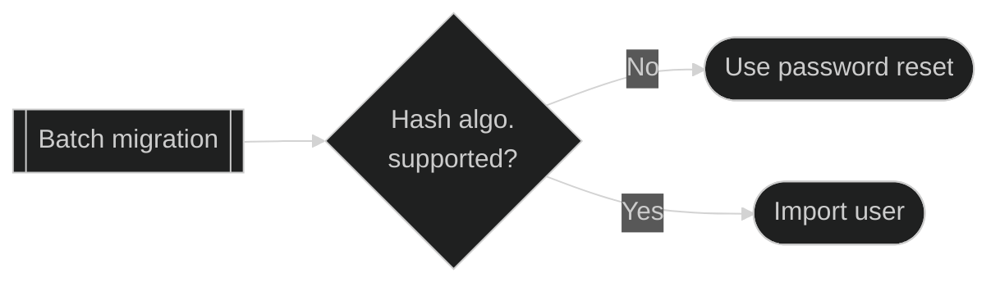
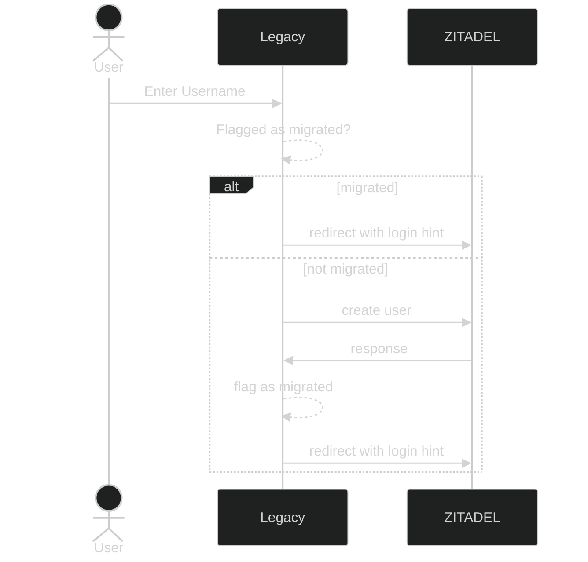
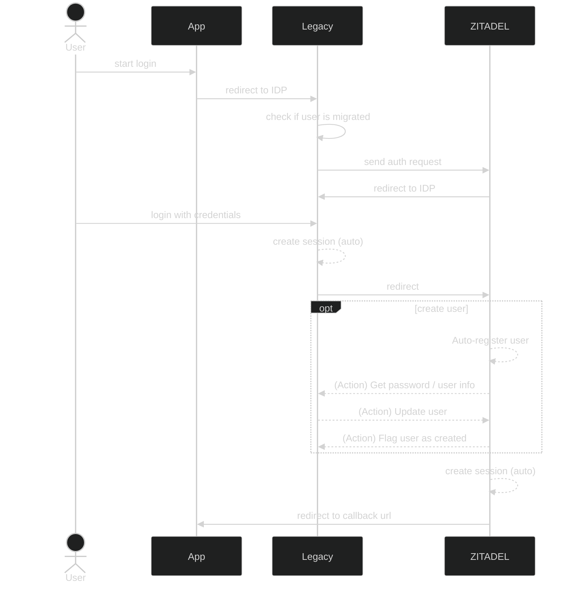

Migrating users from an existing system, while minimizing impact on said users, can be a challenging task.
This guide gives you an overview of technical considerations, explains the most common patterns for migrating users and gives you some implementation details.

We will also offer more detailed guides how to migrate users from a specific auth provider to ZITADEL.

## Technical Considerations

### Evaluating migration patterns

There will be multiple ways for migrating users from your existing auth system ("legacy") to ZITADEL.
Which migration pattern to use depends on your requirements.

This section should help you to get an overview of the different migration patterns and help you design an ideal solution for your use case. Your solution might require adjustments from the presented baseline patterns.

#### Batch vs. Just-in-time Migration

[Batch migration](#batch-migration) is the easiest way, if you can afford some minimal downtime to move all users and applications over to ZITADEL.

In case all your applications depend on ZITADEL after the migration date, and ZITADEL is able to retrieve the required user information, including secrets, from the legacy system, then the recommended way is to let [ZITADEL orchestrate the user migration](#just-in-time-zitadel).

For all other cases, the legacy system needs to orchestrate the migration of users to ZITADEL for most flexibility.

#### Legacy System orchestrates migration

### Migrating Secrets

- Hashes
- Passkeys
- OTP
- For simplicity only once mentioned: If the hash algorithm is not available or the password can't be migrated, then use password reset flow; or
- Can also capture credentials behind login and provision user to ZITADEL

### Users linked to an external IDP

TODO: https://github.com/zitadel/zitadel/issues/5176

### JWT IDP

TODO: 

## Migration Patterns

### Batch migration

TODO: Chart
TODO: Example API Call - import user
TODO: Example API Call - password reset

### Just-in-time: ZITADEL

TODO: Chart
TODO: Example Action (HTTP, Metadata)?

### Just-in-time: Legacy

#### Provision users from legacy to ZITADEL

#### Identity Brokering and Action (parallel sessions)

TODO: Normal SSO with sessions in Legacy and ZITADEL (user already migrated)

TODO:
- IDP can be OIDC compliant / LDAP; or
- JWT IDP

