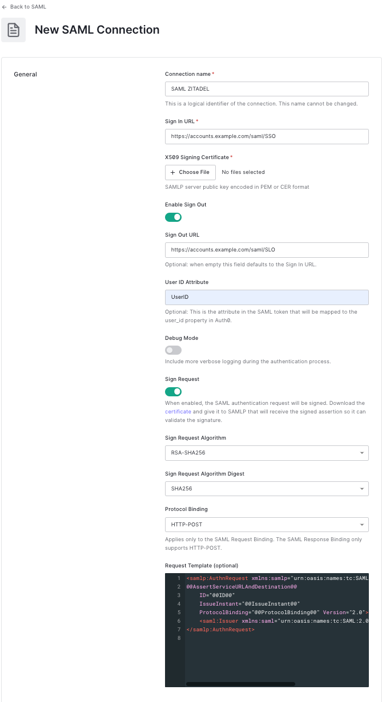

Prerequisite is to have a tenant on Auth0, as described [here](https://auth0.com/docs/get-started/auth0-overview/create-tenants)

Then you can go unter Authentication -> Enterprise 

As one of the possible connections you can create SAML:

To create the SAML Connection you can fill out the fields as follows:

This includes:
- a unique "Connection name"
- the "Sign In URL"
- the "Sign Out URL"
- used "User ID Attribute"
- the definition how the request should be signed
- which binding should be used to call ZITADEL

All the information is filled out as an example, and to connect with any other environment you only have to change the used domain, for example "example.com" with "zitadel.ch". 
Lastly, upload the certificate used to sign the reponses, provided for you under the URL [https://accounts.zitadel.ch/saml/certificate](https://accounts.zitadel.ch/saml/certificate).

Then just press the button "Create" and the connection on Auth0 is configured.

To then test the connection you only have to press "Try" on the created connection in the Authentication -> Enterprise screen.

To further customize the requests you can also customize the SAML communication as described [here](https://auth0.com/docs/authenticate/protocols/saml/saml-configuration/customize-saml-assertions)

So that ZITADEL also recognises the now created SAML connection, [here](https://auth0.com/docs/authenticate/protocols/saml/saml-identity-provider-configuration-settings) are all necessary information to correctly fill out the metadata or download the metadata-file directly under the URL https://YOUR_DOMAIN/samlp/metadata?connection=YOUR_CONNECTION_NAME, which in this example would be https://example.auth0.com/samlp/metadata?connection=SAML-ZITADEL .

