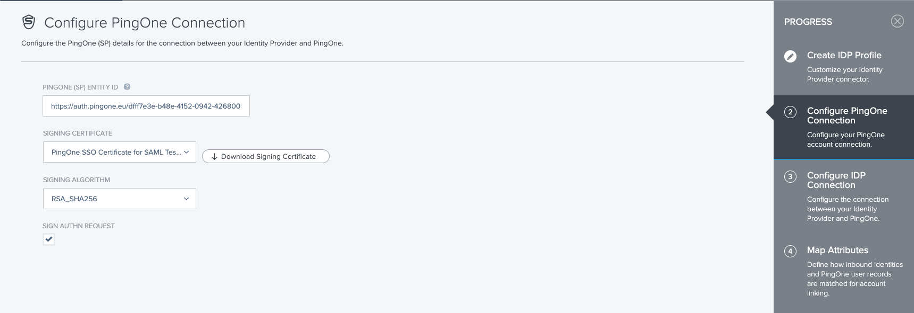
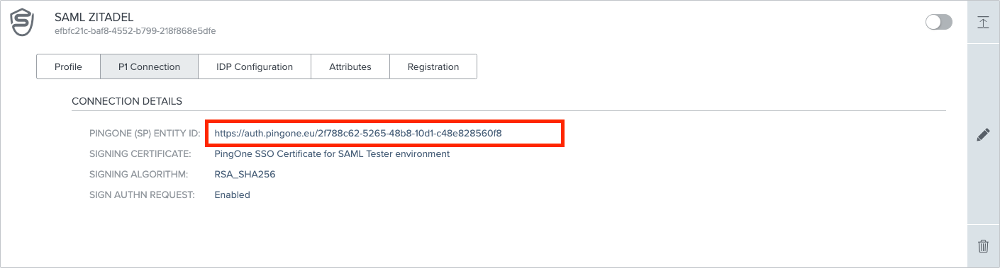

To add an additional [external identity provider](https://docs.pingidentity.com/bundle/pingone/page/jvz1567784210191.html), you
can follow the instructions [here](https://docs.pingidentity.com/bundle/pingone/page/ovy1567784211297.html)

As described you have to create a new provider, with a unique identifier:


We recommend activating signing the auth request whenever possible:



Manually enter the necessary information:

- SSO Endpoint, for example https://accounts.example.com/saml/SSO
- IDP EntityID, for example https://accounts.example.com/saml/metadata
- Binding, which is a decision which you can take yourself, we recommend HTTP POST as it has fewer restrictions
- Import certificate, provided from the certificate endpoint


Everything you need to know about the attribute mapping you can find
in [Ping Identity's documentation](https://docs.pingidentity.com/bundle/pingone/page/pwv1567784207915.html)

With this you have defined to connection to ZITADEL as an external IDP, next is the policy to use ZITADEL as an IDP to
connect to an application. The "How to" for that can be
found [here](https://docs.pingidentity.com/bundle/pingone/page/zqd1616600404402.html).

To add the connection to ZITADEL you have to build the metadata, which should minimalisticly look like this, the necessary information can be found on the External IDPs page under "P1Connection" and "IDP Configuration" :
```xml
ENTITYID="PINGONE (SP) ENTITY ID"
ACSURL="ACS ENDPOINT"
<?xml version="1.0"?>
<md:EntityDescriptor xmlns:md="urn:oasis:names:tc:SAML:2.0:metadata" entityID="${ENTITYID}">
    <md:SPSSODescriptor protocolSupportEnumeration="urn:oasis:names:tc:SAML:2.0:protocol urn:oasis:names:tc:SAML:1.1:protocol">
        <md:AssertionConsumerService Binding="urn:oasis:names:tc:SAML:2.0:bindings:HTTP-POST" Location="${ACSURL}" index="0"/>
    </md:SPSSODescriptor>
</md:EntityDescriptor>
```


