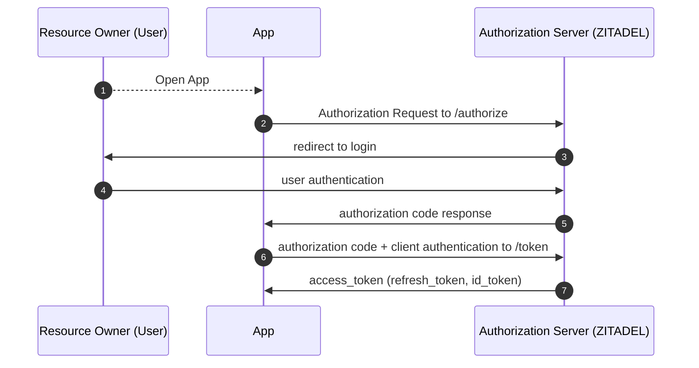

```mermaid
sequenceDiagram
    autonumber
    participant RO as Resource Owner (User)
    participant App
    participant AS as Authorization Server (ZITADEL)
    RO-->>App: Open App
    App->>AS: Authorization Request to /authorize
    AS->>RO: redirect to login
    RO->>AS: user authentication
    AS->>App: authorization code response
    App->>AS: authorization code + client authentication to /token
    AS->>App: access_token (refresh_token, id_token)
```