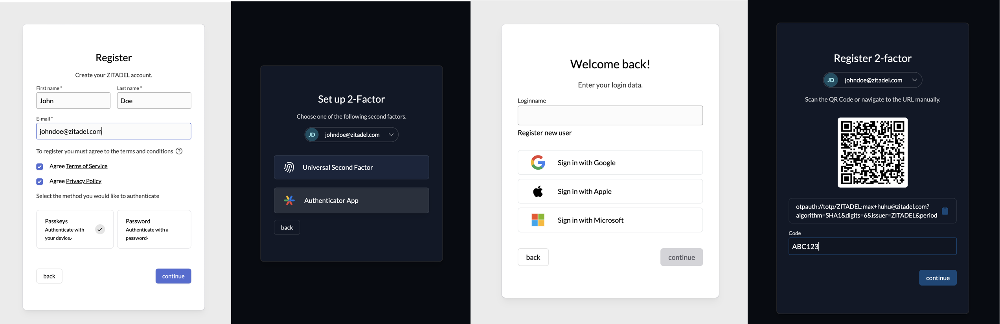
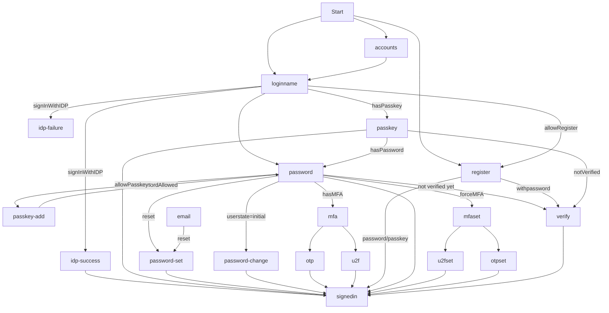

# ZITADEL TypeScript with Turborepo

This repository contains all TypeScript and JavaScript packages and applications you need to create your own ZITADEL
Login UI.



[](https://www.npmjs.com/package/@zitadel/proto)
[](https://www.npmjs.com/package/@zitadel/client)

**⚠️ This repo and packages are in beta state and subject to change ⚠️**

The scope of functionality of this repo and packages is under active development.

The `@zitadel/client` package is using [@connectrpc/connect](https://github.com/connectrpc/connect-es#readme).

You can read the [contribution guide](/CONTRIBUTING.md) on how to contribute.
Questions can be raised in our [Discord channel](https://discord.gg/erh5Brh7jE) or as
a [GitHub issue](https://github.com/zitadel/typescript/issues).

## Developing Your Own ZITADEL Login UI

We think the easiest path of getting up and running, is the following:

1. Fork and clone this repository
1. [Run the ZITADEL Cloud login UI locally](#run-login-ui)
1. Make changes to the code and see the effects live on your local machine
1. Study the rest of this README.md and get familiar and comfortable with how everything works.
1. Decide on a way of how you want to build and run your login UI.
   You can reuse ZITADEL Clouds way.
   But if you need more freedom, you can also import the packages you need into your self built application.

## Included Apps And Packages

- `login`: The login UI used by ZITADEL Cloud, powered by Next.js
- `@zitadel/client`: shared client utilities for node and browser environments
- `@zitadel/proto`: Protocol Buffers (proto) definitions used by ZITADEL projects
- `@zitadel/tsconfig`: shared `tsconfig.json`s used throughout the monorepo
- `@zitadel/eslint-config`: ESLint preset

Each package and app is 100% [TypeScript](https://www.typescriptlang.org/).

### Login

The login is currently in a work in progress state.
The goal is to implement a login UI, using the session API of ZITADEL, which also implements the OIDC Standard and is
ready to use for everyone.

In the first phase we want to have a MVP login ready with the OIDC Standard and a basic feature set. In a second step
the features will be extended.

This list should show the current implementation state, and also what is missing.
You can already use the current state, and extend it with your needs.

#### Features list

- [x] Local User Registration (with Password)
- [x] User Registration and Login with external Provider
  - [x] Google
  - [x] GitHub
  - [x] GitHub Enterprise
  - [x] GitLab
  - [x] GitLab Enterprise
  - [x] Azure
  - [x] Apple
  - [x] Generic OIDC
  - [x] Generic OAuth
  - [x] Generic JWT
  - [ ] LDAP
  - [ ] SAML SP
- Multifactor Registration an Login
  - [x] Passkeys
  - [x] TOTP
  - [x] OTP: Email Code
  - [x] OTP: SMS Code
- [x] Password Change/Reset
- [x] Domain Discovery
- [x] Branding
- OIDC Standard

  - [x] Authorization Code Flow with PKCE
  - [x] AuthRequest `hintUserId`
  - [x] AuthRequest `loginHint`
  - [x] AuthRequest `prompt`
    - [x] Login
    - [x] Select Account
    - [ ] Consent
    - [x] Create
  - Scopes
    - [x] `openid email profile address``
    - [x] `offline access`
    - [x] `urn:zitadel:iam:org:idp:id:{idp_id}`
    - [x] `urn:zitadel:iam:org:project:id:zitadel:aud`
    - [x] `urn:zitadel:iam:org:id:{orgid}`
    - [x] `urn:zitadel:iam:org:domain:primary:{domain}`
  - [ ] AuthRequest UI locales

  #### Flow diagram

  This diagram shows the available pages and flows.

  > Note that back navigation or retries are not displayed.



You can find a more detailed documentation of the different pages [here](./apps/login/readme.md).

## Tooling

- [TypeScript](https://www.typescriptlang.org/) for static type checking
- [ESLint](https://eslint.org/) for code linting
- [Prettier](https://prettier.io) for code formatting

## Useful Commands

- `pnpm generate` - Build proto stubs for server and client package
- `pnpm build` - Build all packages and the login app
- `pnpm test` - Test all packages and the login app
- `pnpm test:watch` - Rerun tests on file change
- `pnpm dev` - Develop all packages and the login app
- `pnpm lint` - Lint all packages
- `pnpm changeset` - Generate a changeset
- `pnpm clean` - Clean up all `node_modules` and `dist` folders (runs each package's clean script)

## Versioning And Publishing Packages

Package publishing has been configured using [Changesets](https://github.com/changesets/changesets).
Here is their [documentation](https://github.com/changesets/changesets#documentation) for more information about the
workflow.

The [GitHub Action](https://github.com/changesets/action) needs an `NPM_TOKEN` and `GITHUB_TOKEN` in the repository
settings. The [Changesets bot](https://github.com/apps/changeset-bot) should also be installed on the GitHub repository.

Read the [changesets documentation](https://github.com/changesets/changesets/blob/main/docs/automating-changesets.md)
for more information about this automation

### Run Login UI

To run the application make sure to install the dependencies with

```sh
pnpm install
```

then generate the GRPC stubs with

```sh
pnpm generate
```

To run the application against a local ZITADEL instance, run the following command:

```sh
pnpm run-zitadel
```

This sets up ZITADEL using docker compose and writes the configuration to the file `apps/login/.env.local`.

<details>
<summary>Alternatively, use another environment</summary>
You can develop against any ZITADEL instance in which you have sufficient rights to execute the following steps.
Just create or overwrite the file `apps/login/.env.local` yourself.
Add your instances base URL to the file at the key `ZITADEL_API_URL`.
Go to your instance and create a service user for the login application.
The login application creates users on your primary organization and reads policy data.
For the sake of simplicity, just make the service user an instance member with the role `IAM_OWNER`.
Create a PAT and copy it to the file `apps/login/.env.local` using the key `ZITADEL_SERVICE_USER_TOKEN`.

The file should look similar to this:

```
ZITADEL_API_URL=https://zitadel-tlx3du.us1.zitadel.cloud
ZITADEL_SERVICE_USER_TOKEN=1S6w48thfWFI2klgfwkCnhXJLf9FQ457E-_3H74ePQxfO3Af0Tm4V5Xi-ji7urIl_xbn-Rk
```

</details>

Start the login application in dev mode:

```sh
pnpm dev
```

Open the login application with your favorite browser at `localhost:3000`.
Change the source code and see the changes live in your browser.

Make sure the application still behaves as expected by running all tests

```sh
pnpm test
```

To satisfy your unique workflow requirements, check out the package.json in the root directory for more detailed scripts.

### Run Login UI Acceptance tests

To run the acceptance tests you need a running ZITADEL environment and a component which receives HTTP requests for the emails and sms's.
This component should also be able to return the content of these notifications, as the codes and links are used in the login flows.
There is a basic implementation in Golang available under [the sink package](./acceptance/sink).

To setup ZITADEL with the additional Sink container for handling the notifications:

```sh
pnpm run-sink
```

Then you can start the acceptance tests with:

```sh
pnpm test:acceptance
```

### Deploy to Vercel

To deploy your own version on Vercel, navigate to your instance and create a service user.
Then create a personal access token (PAT), copy and set it as ZITADEL_SERVICE_USER_TOKEN, then navigate to your instance
settings and make sure it gets IAM_OWNER permissions.
Finally set your instance url as ZITADEL_API_URL. Make sure to set it without trailing slash.

[](https://vercel.com/new/clone?repository-url=https%3A%2F%2Fgithub.com%2Fzitadel%2Ftypescript&env=ZITADEL_API_URL,ZITADEL_SERVICE_USER_TOKEN&root-directory=apps/login&envDescription=Setup%20a%20service%20account%20with%20IAM_LOGIN_CLIENT%20membership%20on%20your%20instance%20and%20provide%20its%20personal%20access%20token.&project-name=zitadel-login&repository-name=zitadel-login)
